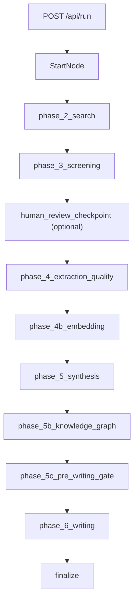

# Pipeline Lifecycle Contract

## Stage Model

This repository uses an explicit agent lifecycle:

1. Think
2. Plan
3. Build
4. Review
5. Test
6. Ship

Use this lifecycle for routing requests and selecting `.cursor/skills`.

## Runtime Checkpoint Order

Canonical backend order in `src/orchestration/resume.py`:

- `phase_2_search`
- `phase_3_screening`
- `phase_4_extraction_quality`
- `phase_4b_embedding`
- `phase_5_synthesis`
- `phase_5b_knowledge_graph`
- `phase_5c_pre_writing_gate`
- `phase_6_writing`
- `finalize`

`phase_7_audit` is removed from canonical runtime checkpoint contracts.
Any historical rows with that phase key are treated as legacy artifacts, not
active resume targets.

## End-to-End Runtime Map

## Checkpoint Taxonomy

- Runtime resume checkpoints (backend truth): `src/orchestration/resume.py` `PHASE_ORDER`
- Frontend resume contract: `frontend/src/lib/constants.ts` `RESUME_PHASE_ORDER` (must match backend)
- Frontend display flow: `frontend/src/lib/constants.ts` `PHASE_ORDER` (may include UI-only stages)
- Rewind and cleanup semantics: `src/db/repositories.py` `rollback_phase_data`
- API entry/resume lifecycle: `src/web/app.py`

## Stage-to-Artifact Contract

- Think -> assumptions and scope constraints
- Plan -> phase intent, risks, and acceptance checks
- Build -> code and typed model updates
- Review -> bug/risk findings and regression impact
- Test -> replay, parity, and target module verification
- Ship -> commit hygiene and deploy readiness

## Human Review Checkpoint

Screening can pause in `awaiting_review`.
Resume behavior and approval controls are API-driven in `src/web/app.py` and workflow nodes in `src/orchestration/workflow.py`.
