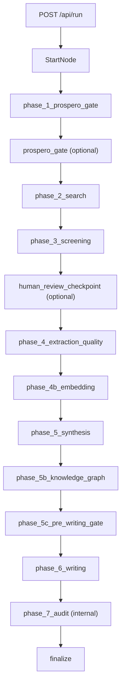

# Pipeline Lifecycle Contract

## Stage Model

This repository uses an explicit agent lifecycle:

1. Think
2. Plan
3. Build
4. Review
5. Test
6. Ship

Use this lifecycle for routing requests and selecting `.cursor/skills`.

## Runtime Checkpoint Order

Canonical backend order in `src/orchestration/phase_catalog.py` (`PHASE_ORDER`):

- `phase_1_prospero_gate`
- `phase_2_search`
- `phase_3_screening`
- `phase_4_extraction_quality`
- `phase_4b_embedding`
- `phase_5_synthesis`
- `phase_5b_knowledge_graph`
- `phase_5c_pre_writing_gate`
- `phase_6_writing`
- `phase_7_audit`
- `finalize`

`phase_7_audit` is an internal orchestration checkpoint (manuscript audit). It remains in `PHASE_ORDER` but is excluded from `USER_RESUMABLE_PHASE_ORDER` and frontend resume controls. Historical checkpoint rows with this phase key are valid runtime artifacts, not legacy drift.

## End-to-End Runtime Map

```mermaid
flowchart TD
    postRun["POST /api/run"] --> startNode["StartNode"]
    startNode --> phase1["phase_1_prospero_gate"]
    phase1 --> prosperoGate["prospero_gate (optional)"]
    prosperoGate --> phase2["phase_2_search"]
    phase2 --> phase3["phase_3_screening"]
    phase3 --> reviewGate["human_review_checkpoint (optional)"]
    reviewGate --> phase4["phase_4_extraction_quality"]
    phase4 --> phase4b["phase_4b_embedding"]
    phase4b --> phase5["phase_5_synthesis"]
    phase5 --> phase5b["phase_5b_knowledge_graph"]
    phase5b --> phase5c["phase_5c_pre_writing_gate"]
    phase5c --> phase6["phase_6_writing"]
    phase6 --> phase7["phase_7_audit (internal)"]
    phase7 --> finalize["finalize"]
```

## Checkpoint Taxonomy

- Canonical phase order: `src/orchestration/phase_catalog.py` (`PHASE_ORDER`); re-exported from `src/orchestration/resume.py`
- User-resumable subset: `USER_RESUMABLE_PHASE_ORDER` (excludes internal `phase_7_audit`)
- Frontend resume contract: `frontend/src/lib/constants.ts` `RESUME_PHASE_ORDER` (must match `USER_RESUMABLE_PHASE_ORDER`)
- Frontend display flow: `frontend/src/lib/constants.ts` `PHASE_ORDER` (may include UI-only stages)
- Rewind and cleanup semantics: `src/db/repositories.py` `rollback_phase_data`
- API entry/resume lifecycle: `src/web/app.py`

## Stage-to-Artifact Contract

- Think -> assumptions and scope constraints
- Plan -> phase intent, risks, and acceptance checks
- Build -> code and typed model updates
- Review -> bug/risk findings and regression impact
- Test -> replay, parity, and target module verification
- Ship -> commit hygiene and deploy readiness

## Human Review Checkpoint

Screening can pause in `awaiting_review`.
Resume behavior and approval controls are API-driven in `src/web/app.py` and workflow nodes in `src/orchestration/workflow.py`.

## PROSPERO Registration Gate

When protocol registration is required before search, the workflow parks in `awaiting_prospero` after `phase_1_prospero_gate`.
Resume is API-driven via `POST /api/run/{run_id}/submit-prospero` in `src/web/routers/prospero_gate.py`.
