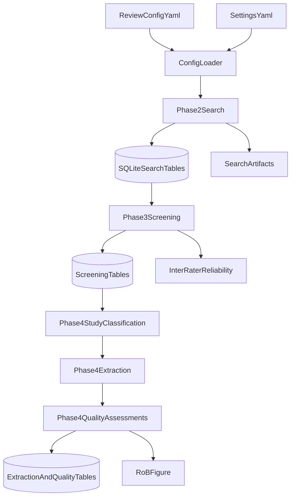

# Systematic Review Automation Tool (v2 Build)

Typed, async, SQLite-backed workflow for systematic review automation.

Current implementation is through Phase 5 baseline synthesis foundations. Full end-to-end manuscript export is not complete yet.

## Current Status

- Phase 1 foundation: implemented
- Phase 2 search infrastructure: implemented
- Phase 3 screening foundations: implemented
- Phase 4 extraction and quality foundations: implemented
- Phase 5 synthesis foundations: implemented
- Resume: implemented (topic-based and workflow-id lookup, mid-phase resume, topic-based auto-resume on run)
- Phases 6-8: pending

## Implemented Modules

- `src/models/` typed Pydantic contracts for config, papers, screening, extraction, quality, workflow
- `src/db/` SQLite schema, async DB manager, typed repositories, workflow_registry (central registry for resume discovery)
- `src/orchestration/` gates, resume (state loading, next-phase logic), state (ReviewState dataclass)
- `src/search/` connectors + strategy + dedup
- `src/screening/` dual reviewer, adjudication flow, reliability metrics
- `src/extraction/` study classifier + extraction service
- `src/quality/` RoB2, ROBINS-I, CASP, GRADE, study router
- `src/synthesis/` feasibility, effect sizes, meta-analysis wrapper, narrative fallback
- `src/visualization/rob_figure.py` RoB traffic-light rendering
- `src/visualization/forest_plot.py` + `funnel_plot.py` synthesis figures
- `src/llm/provider.py` model profile selection, rate limiting, cost logging hook

## Search Sources (Current)

Primary/academic connectors:
- `openalex`
- `pubmed`
- `arxiv`
- `ieee_xplore`
- `semantic_scholar`
- `crossref`

Auxiliary connector:
- `perplexity_search` (other-source discovery only)

## Command Maturity

| Command   | Status   | Notes                                      |
|-----------|----------|--------------------------------------------|
| `run`     | Available| Full pipeline: search -> screening -> extraction/quality -> synthesis |
| `resume`  | Available| Resume by --topic or --workflow-id; topic-based auto-resume on run |
| `validate`| Blocked  | Not yet implemented                        |
| `export`  | Blocked  | Not yet implemented                        |
| `status`  | Blocked  | Not yet implemented                        |

## Runtime Commands

- `uv run python -m src.main --help`
- `uv run python -m src.main run --config config/review.yaml --settings config/settings.yaml --log-root logs --output-root data/outputs`
- `uv run python -m src.main resume --topic "your research question"` (or `--workflow-id wf-xxx`)

Resume uses a central workflow registry (`logs/workflows_registry.db`) to find which run db to open by topic or workflow-id. If the registry is missing, resume scans `run_summary.json` files under the log root.

## Tests

- `uv run pytest tests/unit -q`
- `uv run pytest tests/integration -q`

## Current Flow

## SSL / Certificate Issues

If connectors fail with `CERTIFICATE_VERIFY_FAILED` (e.g. behind corporate proxy):

- **macOS (python.org)**: Run `Install Certificates.command` from your Python.app
- **Corporate proxy**: Add your org CA to trust store, or set `SSL_CERT_FILE` to a bundle that includes it
- **Dev only**: `RESEARCH_AGENT_SSL_SKIP_VERIFY=1` disables verification (insecure; use only for local debugging)

## Configuration

- `config/review.yaml`: per-review topic and eligibility config
- `config/settings.yaml`: agent model profiles and system thresholds
- `.env`: API keys and runtime secrets (local only, never commit)

## Specification

See `docs/research-agent-v2-spec.md` for phased architecture, contracts, and acceptance criteria.
