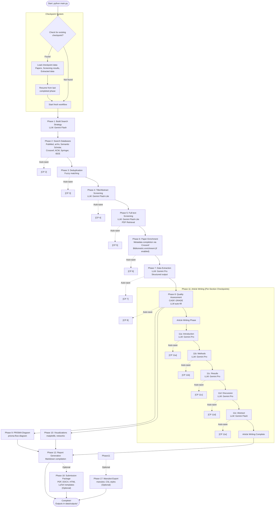

# Literature Review Assistant - Agentic AI System


## What is this?

An end-to-end agentic AI system that automates systematic literature reviews from database search to publication-ready articles, including PRISMA 2020-compliant flow diagrams and visualizations.

### Why should I care?

**Problem**: Conducting systematic literature reviews is time-consuming, requiring hours of manual work across multiple databases, paper screening, data extraction, and article writing.

**Solution**: This system automates the entire process using AI agents that search databases, screen papers, extract data, assess quality, and generate complete review articles with proper citations and visualizations.

**Who it's for**: Researchers, students, and professionals conducting systematic reviews who want to save time while maintaining PRISMA 2020 compliance and academic rigor.

### Can I trust it?

- **PRISMA 2020 Compliant**: Automatically generates PRISMA-compliant reports and flow diagrams
- **Robust Error Handling**: Graceful handling of database access issues with automatic fallback
- **Checkpoint System**: Automatic checkpointing allows resuming from any phase if interrupted
- **Quality Assurance**: Built-in screening safeguards, quality assessment tools, and structured data extraction
- **Open Source**: MIT licensed, transparent codebase

### Can I use it?

**Yes!** You only need:
- Python 3.8+ and `uv` package manager
- Google Gemini API key (free tier available)
- 5 minutes to get started

The system works with free academic databases by default and includes comprehensive documentation.

---

## Table of Contents

- [What is this?](#what-is-this)
- [Prerequisites](#prerequisites)
  - [System Requirements](#system-requirements)
- [Quick Start](#quick-start)
- [What You Get](#what-you-get)
- [Examples & Use Cases](#examples--use-cases)
- [Workflow Overview](#workflow-overview)
- [How Checkpoints Work](#how-checkpoints-work)
- [API Keys Required](#api-keys-required)
- [Configuration](#configuration)
- [Features](#features)
- [Documentation](#documentation)
- [Testing](#testing)
- [Available Scripts](#available-scripts)
- [Development](#development)
- [Contributing](#contributing)
- [Troubleshooting](#troubleshooting)
- [License](#license)
- [Recent Changes](#recent-changes)

## Prerequisites

Before you begin, ensure you have the following installed:

- **Python >=3.8** - Required runtime
- **uv** - Package manager (install from [https://github.com/astral-sh/uv](https://github.com/astral-sh/uv))
- **Pandoc** - System-level dependency for PDF/DOCX/HTML generation
  - macOS: `brew install pandoc`
  - Linux: `apt-get install pandoc` or `yum install pandoc`
  - Windows: Download from [https://pandoc.org/installing.html](https://pandoc.org/installing.html)
- **LLM API key** - Required for core functionality (see [API Keys Required](#api-keys-required) section)
  - Google GenAI (Gemini) - Primary LLM provider (free tier available)
  - Perplexity - Alternative provider for specific use cases

Optional but recommended:
- **Manubot** - For citation resolution (`uv pip install manubot` or `uv pip install -e ".[manubot-full]"`)
- **Bibliometric dependencies** - For enhanced Scopus/Google Scholar features (`uv pip install -e ".[bibliometrics]"`)

### System Requirements

**Operating System**: macOS, Linux, or Windows (WSL recommended for Windows)

**Memory**: 
- Minimum: 4 GB RAM
- Recommended: 8 GB RAM for larger reviews (200+ papers)

**Disk Space**:
- Minimum: 500 MB for installation
- Additional: ~10-50 MB per workflow run (depends on number of papers and checkpoints)

**Network**:
- Internet connection required for database searches and LLM API calls
- Stable connection recommended for large reviews

**Python Environment**:
- Python 3.8 or higher
- Virtual environment recommended (created automatically with `uv venv`)

## Quick Start

> **Note**: Typical workflow duration: 30-60 minutes for a small review (50-100 papers), 2-4 hours for comprehensive reviews (200+ papers).

### Step 1: Setup Environment

```bash
# Create virtual environment and install dependencies
uv venv && source .venv/bin/activate  # On Windows: .venv\Scripts\activate
uv pip install -e .

# Optional: Install manuscript pipeline dependencies (recommended)
uv pip install -e ".[manubot-full]"
```

### Step 2: Get Your API Key (Recommended: Google Gemini)

**Quick Start**: Get a free Google Gemini API key in 2 minutes:
1. Visit https://aistudio.google.com/app/apikey
2. Sign in with your Google account
3. Click "Create API Key"
4. Copy your key

Then configure it:

```bash
# Copy example environment file
cp .env.example .env

# Add your API key to .env file
echo "GOOGLE_API_KEY=your-key-here" >> .env
echo "LLM_PROVIDER=google" >> .env
```

> **Alternative Provider**: See [API Keys Required](#api-keys-required) for Perplexity setup.

### Step 3: Configure Your Research Topic (Required)

Edit `config/workflow.yaml` to set your research topic. **Everything you need for a new study is in the `topic` section**:

```yaml
topic:
  topic: "Your Research Topic"
  keywords: ["keyword1", "keyword2"]  # Search terms - only place needed
  domain: "your domain"
  scope: "your scope"
  research_question: "Your research question?"
  context: "Background context"
  
  # Inclusion/Exclusion Criteria (right here in topic section)
  inclusion:
    - "Your inclusion criteria"
  exclusion:
    - "Your exclusion criteria"
  
  # Protocol Registration (optional)
  protocol:
    registered: false
    registry: "PROSPERO"
  
  # Funding Information (optional)
  funding:
    source: "No funding received"
  
  # Conflicts of Interest (optional)
  conflicts_of_interest:
    statement: "The authors declare no conflicts of interest."
```

See [Configuration](#configuration) for complete options.

### Step 4: Run the Workflow

```bash
# Basic run (automatically resumes from latest checkpoint if available)
python main.py

# Explicitly resume from latest checkpoint
python main.py --resume

# Quick test: Verify setup works
python main.py --test-databases
```

> **Note**: The workflow automatically saves checkpoints after each phase. If interrupted, simply run `python main.py` (or `python main.py --resume`) to automatically resume from the latest checkpoint.

### Step 5: Check Your Outputs

Results are saved to `data/outputs/workflow_{topic}_{timestamp}/`:
- `final_report.md` - Complete systematic review article
- `prisma_diagram.png` - PRISMA 2020 flow diagram
- `references.bib` - BibTeX citation file
- Visualizations (publication timeline, network graphs, geographic distribution)
- `workflow_state.json` - Workflow metadata

### Step 6: Next Steps

- **View outputs**: Check `data/outputs/workflow_{topic}_{timestamp}/final_report.md`
- **Customize configuration**: Edit `config/workflow.yaml` for your research needs
- **Export to journal format**: Run `python main.py --build-package --journal ieee` (requires Step 1 optional dependencies)
- **Learn more**: See [Examples & Use Cases](#examples--use-cases) for common workflows

## What You Get

After running the workflow, you'll find a complete systematic review package in `data/outputs/workflow_{topic}_{timestamp}/`:

```
data/outputs/workflow_{topic}_{timestamp}/
├── final_report.md              # Complete systematic review article (Markdown)
├── prisma_diagram.png           # PRISMA 2020 flow diagram
├── references.bib               # BibTeX citation file
├── workflow_state.json           # Workflow metadata and statistics
├── visualizations/
│   ├── publication_timeline.png # Publication timeline chart
│   ├── citation_network.html    # Interactive citation network graph
│   └── geographic_distribution.png  # Geographic distribution map
└── quality_assessments/          # Quality assessment data (if enabled)
    └── assessments.json
```

**Key Outputs**:
- **`final_report.md`**: Complete article with introduction, methods, results, discussion, and abstract sections
- **`prisma_diagram.png`**: PRISMA 2020-compliant flow diagram showing paper selection process
- **`references.bib`**: BibTeX file with all cited papers, ready for LaTeX compilation
- **Visualizations**: Charts and graphs showing publication trends, citation networks, and geographic distribution

> **Optional Outputs**: With `--manubot-export` and `--build-package`, you'll also get journal-specific submission packages (PDF, DOCX, HTML) in LaTeX templates.

## Examples & Use Cases

### Basic Literature Review

Run a complete systematic review with default settings:

```bash
# 1. Set your research topic in config/workflow.yaml
# 2. Run the workflow
python main.py

# Output: Complete review article in data/outputs/workflow_{topic}_{timestamp}/final_report.md
```

**Expected Output**: Full systematic review article with PRISMA diagram, typically takes 30-60 minutes for 50-100 papers.

### Multi-Database Search

Search across multiple academic databases simultaneously:

```yaml
# In config/workflow.yaml
workflow:
  databases: ["PubMed", "arXiv", "Semantic Scholar", "Crossref", "ACM", "IEEE"]
  max_results_per_db: 100
```

```bash
python main.py
```

**Expected Output**: Papers from all configured databases, deduplicated and screened.

### PRISMA-Compliant Report

Generate a PRISMA 2020-compliant systematic review:

```bash
# The system automatically generates PRISMA diagrams
python main.py

# Check outputs
ls data/outputs/workflow_*/prisma_diagram.png
```

**Expected Output**: `prisma_diagram.png` showing the complete PRISMA flow diagram with counts at each stage.

### Journal Submission Package

Generate a complete submission package for a specific journal:

```bash
# Generate IEEE submission package
python main.py --build-package --journal ieee

# Output location
ls data/outputs/workflow_*/submission_packages/ieee/
```

**Expected Output**: Complete submission package with PDF, DOCX, HTML, figures, tables, and supplementary materials formatted for the specified journal.

> **More Examples**: See Advanced Features section above for bibliometric features, Git integration, and manuscript pipeline usage.

## Workflow Overview

### In Plain English

The workflow follows these main steps:

1. **Search Databases** → Searches multiple academic databases (PubMed, arXiv, Semantic Scholar, etc.) using your research topic
2. **Deduplicate** → Removes duplicate papers using fuzzy matching
3. **Screen Papers** → Uses AI to screen papers based on title/abstract, then full-text
4. **Extract Data** → Extracts key information (methods, results, conclusions) from eligible papers
5. **Assess Quality** → Performs quality assessments (CASP, GRADE) with optional AI auto-fill
6. **Generate Visualizations** → Creates PRISMA diagrams, publication timelines, citation networks
7. **Write Article** → Generates complete review article (introduction, methods, results, discussion, abstract)
8. **Compile Report** → Assembles final markdown report with citations and visualizations

**What happens at each phase?**
- **Phases 1-8**: Sequential processing with automatic checkpointing after each phase
- **Phases 9-11**: Run in parallel (PRISMA diagram, visualizations, article writing)
- **Phases 12+**: Optional export and submission package generation

> **For visual learners**: See the detailed workflow diagram below showing all phases, checkpoints, and dependencies.

### Complete Workflow Diagram



**Key Features:**
- **Automatic checkpointing**: Phases 2-8 save checkpoints automatically (Phase 1 always rebuilds)
- **Per-section checkpointing**: Article writing phase (Phase 11) saves checkpoints after each section (introduction, methods, results, discussion, abstract), enabling resume from last completed section
- **Resume capability**: Restarting automatically detects and resumes from last checkpoint or last completed section
- **Retry logic**: Section writing includes immediate retry logic (configurable retry count, default: 2 attempts)
- **Parallel execution**: Phases 9-11 run simultaneously after phase 8 completes
- **Optional phases**: Manubot export (after Phase 11) and submission package (after Phase 12) are optional
- **Topic matching**: Checkpoints are matched by research topic name, allowing separate workflows per topic

**Note**: If the diagram doesn't render properly, view it on GitHub or use a Mermaid viewer like [mermaid.live](https://mermaid.live).

### Technology Stack

**LLM Provider**:
- Google GenAI (Gemini models: gemini-2.5-pro, gemini-2.5-flash, gemini-2.5-flash-lite)
- Optimized model selection per phase for cost efficiency and quality

**Academic Databases**:
- PubMed (free, optional API key)
- arXiv (free)
- Semantic Scholar (free, optional API key)
- Crossref (free, email recommended)
- ACM (free, web scraping)
- Google Scholar (optional, requires proxy)
- Scopus (optional, requires API key)

**Core Libraries**:
- LangChain & LangGraph - Agent orchestration
- pandas - Data manipulation
- matplotlib & networkx - Visualizations
- pydantic - Structured data validation
- PyPDF2 & pdfplumber - PDF processing
- manubot - Citation resolution
- pandoc - Document conversion (system dependency)

## How Checkpoints Work

Checkpoints are saved snapshots of your workflow's progress after each phase completes. Think of them like save points - if something interrupts your workflow, you can resume exactly where you left off.

**How It Works:**
1. **Automatic Saving**: After phases 2-8 complete, the system automatically saves checkpoint files containing all papers, screening results, extracted data, and current phase number
2. **Per-Section Checkpointing**: During article writing (Phase 11), checkpoints are saved after each section completes (introduction, methods, results, discussion, abstract). This allows resuming from the last completed section without re-running expensive LLM calls.
3. **Automatic Resumption**: When you run `python main.py` with the same topic, the system detects existing checkpoints, loads previous results, and continues from the next phase or section
4. **Topic Matching**: Checkpoints are matched by topic name, so different research topics have separate checkpoint chains

**Checkpoint File Structure:**
- **Standard phases**: `{phase_name}_state.json` (e.g., `search_databases_state.json`, `data_extraction_state.json`)
- **Article writing sections**: `article_writing_{section}_state.json` (e.g., `article_writing_introduction_state.json`, `article_writing_methods_state.json`)

**Example:**
```bash
# First run - completes phases 1-5, saves checkpoints
python main.py  # Topic: "Financial Trading Systems"

# Later run - automatically resumes from phase 6 (default behavior)
python main.py  # Detects existing checkpoints, resumes from phase 6

# Explicit resume flag (same as default, but makes intent clear)
python main.py --resume  # Finds latest checkpoint and resumes

# Article writing example - resumes from last completed section
# If introduction and methods are complete, workflow will:
# - Skip introduction (already exists)
# - Skip methods (already exists)
# - Continue with results section
python main.py --resume  # Automatically detects and skips completed sections
```

**Checkpoint Location**: `data/checkpoints/workflow_{topic}_{timestamp}/`

**Force Fresh Start**: To ignore checkpoints and start from scratch:
```bash
python main.py --force-fresh  # Ignores all checkpoints, starts from phase 1
```

**Checkpoint Configuration**: Configure checkpoint behavior in `config/workflow.yaml`:
```yaml
writing:
  checkpoint_per_section: true  # Save checkpoint after each article section (default: true)
  retry_count: 2                 # Number of retry attempts for section writing (default: 2)
```

Checkpoint behavior is configured in `config/workflow.yaml` (see Configuration section below).

## API Keys Required

### Quick Start: Getting Your First API Key

**Recommended: Google Gemini** (easiest to get started, free tier available)

1. Visit https://aistudio.google.com/app/apikey
2. Sign in with your Google account
3. Click "Create API Key"
4. Copy your key and add it to `.env`:
   ```bash
   GOOGLE_API_KEY=your-key-here
   LLM_PROVIDER=google
   ```

> **Why Gemini?** Free tier with generous quotas, fast API responses, and cost-effective pricing. Perfect for getting started quickly.

### Required for LLM Features

The system requires a Google Gemini API key:

**Google GenAI (Gemini)** ⭐ Recommended & Primary Provider
```bash
GOOGLE_API_KEY=your-key-here
# OR
GEMINI_API_KEY=your-key-here
LLM_PROVIDER=google
```
- **Get API key**: https://aistudio.google.com/app/apikey
- **Best for**: All LLM tasks (screening, extraction, writing)
- **Why Gemini?** Free tier with generous quotas, fast API responses, cost-effective pricing, and optimized for research workflows
- **Models**: Uses gemini-2.5-pro for quality-critical tasks, gemini-2.5-flash for balanced tasks, gemini-2.5-flash-lite for high-volume screening

**Alternative Providers**:
Perplexity support is primarily for academic search (via `PERPLEXITY_SEARCH_API_KEY`), not for LLM tasks. Gemini is currently the fully-supported and recommended LLM provider.

> **Note**: If no API keys are provided, the system will use fallback keyword-based methods (limited functionality).

### Database API Keys (Recommended)

> **Important**: Database API keys provide access to **actual real data** from academic databases. Without them, the system uses free/public APIs which may have limited data or rate restrictions.

**Why use database API keys?**
- **Access to real, complete data**: Full metadata, abstracts, citations, and bibliographic information
- **Higher rate limits**: More searches per minute/hour
- **Better data quality**: Complete author lists, affiliations, subject classifications
- **Reliable access**: Reduced risk of rate limiting or blocked requests

**Recommended API Keys**:

- **PubMed/NCBI**: `PUBMED_API_KEY` and `PUBMED_EMAIL` - Get complete PubMed data with full abstracts and metadata
- **Semantic Scholar**: `SEMANTIC_SCHOLAR_API_KEY` - Access citation networks and paper relationships
- **Crossref**: `CROSSREF_EMAIL` - Get comprehensive bibliographic data and DOI resolution
- **Scopus**: `SCOPUS_API_KEY` - Access Scopus database (requires pybliometrics: `pip install pybliometrics` or `pip install -e ".[bibliometrics]"`)
- **IEEE Xplore**: `IEEE_API_KEY` - Access IEEE Xplore via official API (recommended). Get API key from https://developer.ieee.org/. Without API key, uses web scraping (less reliable)
- **Perplexity**: `PERPLEXITY_SEARCH_API_KEY` - Academic search with scholarly source filtering (separate from LLM API key)
  - **Important**: This is ONLY for database search. Set `PERPLEXITY_SEARCH_API_KEY` to use Perplexity for academic paper discovery.
  - The LLM provider uses `PERPLEXITY_API_KEY` (only if `LLM_PROVIDER=perplexity` is set).
  - **Domain Filtering Options** (set via `PERPLEXITY_DOMAIN_FILTER_MODE`):
    - `allowlist` (default): Include only top 20 academic domains. Fast but may miss some academic sources.
    - `denylist`: Exclude non-academic domains (YouTube, tutorials, etc.). Captures ALL academic sources while filtering noise.
    - `none`: No domain filtering. Returns all sources (may include tutorials, videos, etc.).
- **Google Scholar**: Requires `scholarly` library (`pip install scholarly` or `pip install -e ".[bibliometrics]"`). For reliable operation, set `SCRAPERAPI_KEY` for proxy support to avoid CAPTCHAs and IP blocking

> **Note**: The system works with free databases by default, but API keys significantly improve data quality and reliability. See Advanced Features section below for bibliometric features setup.

## Configuration

The system uses a unified YAML configuration file (`config/workflow.yaml`) for all settings.

> **Good News**: Defaults work well for most use cases! You only need to customize what's essential for your research.

### Essential Configuration

**What you must change** for your research:

**Research Topic** (Required - Everything in one place):
```yaml
topic:
  topic: "Your Research Topic"
  keywords: ["keyword1", "keyword2"]  # Only search terms needed - no separate search_terms section
  domain: "your domain"
  scope: "your scope"
  research_question: "Your research question?"
  context: "Background context"
  
  # Inclusion/Exclusion Criteria (in topic section)
  inclusion:
    - "Your inclusion criteria"
  exclusion:
    - "Your exclusion criteria"
  
  # Protocol Registration (optional, in topic section)
  protocol:
    registered: false
    registry: "PROSPERO"
    registration_number: ""
    url: ""
  
  # Funding Information (optional, in topic section)
  funding:
    source: "No funding received"
    grant_number: ""
    funder: ""
  
  # Conflicts of Interest (optional, in topic section)
  conflicts_of_interest:
    statement: "The authors declare no conflicts of interest."
```

> **Note**: All study-specific configuration is unified in the `topic` section. There's no separate `criteria`, `protocol`, `funding`, or `search_terms` sections needed - everything is in one place for easy configuration.

### Optional Configuration

**What you can customize** (defaults are reasonable):

**Workflow Settings**:
```yaml
workflow:
  databases: ["PubMed", "arXiv", "Semantic Scholar", "Crossref", "ACM"]  # Default works well
  date_range:
    start: null  # No start date limit
    end: 2025    # End year
  max_results_per_db: 100  # Adjust based on your needs
```

**Writing Configuration** (checkpointing and retry):
```yaml
writing:
  checkpoint_per_section: true  # Save checkpoint after each section (default: true)
  retry_count: 2                 # Retry attempts for section writing (default: 2)
```

**Advanced Configuration Options**:
- Agent settings (LLM models, temperature, max tokens)
- Quality assessment (auto-fill, assessment types)
- Text humanization (style extraction, naturalness scoring)
- Bibliometric features (author metrics, citation networks)
- See `config/workflow.yaml` for all available options

## Features

### Search & Discovery

- **Multi-Database Search**: Search across PubMed, arXiv, Semantic Scholar, Crossref, ACM, Perplexity, Google Scholar, and more
- **Intelligent Search Strategy**: LLM-powered search query optimization
- **Automatic Deduplication**: Fuzzy matching to remove duplicate papers across databases
- **Paper Enrichment**: Automatic metadata completion via Crossref and bibliometric enrichment (author metrics, subject areas) when enabled

### Screening & Quality

- **LLM-Powered Screening**: Intelligent title/abstract and full-text screening with cost optimization
- **Screening Safeguards**: Automatic detection of low inclusion rates with borderline paper identification
- **Structured Data Extraction**: Pydantic schemas for type-safe extraction with optional fields support
- **Quality Assessment**: CASP (Critical Appraisal Skills Programme) checklists for RCTs, cohort studies, and qualitative research, plus GRADE assessments with automatic LLM-based filling
  - **Auto-Detection**: LLM automatically detects study type and selects appropriate CASP checklist
  - **Comprehensive Criteria**: Validated checklists with 10-12 questions covering validity, results, and applicability
  - **Quality Ratings**: Automatic scoring (High/Moderate/Low) based on percentage of criteria met
  - **GRADE Integration**: Maintains GRADE assessment for overall evidence certainty

### Writing & Generation

- **Complete Article Generation**: Automatically generates introduction, methods, results, discussion, and abstract sections
- **Text Humanization**: Style pattern extraction from eligible papers and LLM-based naturalness refinement
- **PRISMA 2020 Compliance**: Automatic PRISMA-compliant reports and flow diagrams
- **Bibliometric Visualizations**: Charts, publication timelines, and interactive citation network graphs

### Export & Submission

- **Citation Management**: IEEE-formatted references, BibTeX export, and automatic citation resolution
- **Export Formats**: LaTeX, Word, PDF, HTML document export
- **Multi-Journal Support**: Generate submission packages for multiple journals (IEEE, Nature, PLOS, etc.)
- **CSL Citation Styles**: Support for IEEE, APA, Nature, PLOS, and more
- **Manubot Integration**: Export to Manubot structure for collaborative writing

### System Features

- **Phase Registry Architecture**: Declarative phase management with automatic dependency resolution
- **Automatic Checkpointing**: Resume from any phase, force fresh start with `--force-fresh`
- **Per-Section Checkpointing**: Article writing phase saves checkpoints after each section, enabling resume from last completed section without re-running expensive LLM calls
- **Retry Logic**: Configurable retry attempts for section writing (default: 2 retries) with immediate retry on failure
- **Robust Error Handling**: Graceful handling of database access issues with automatic fallback

## Advanced Features

**Bibliometric Features** (optional):
```bash
uv pip install -e ".[bibliometrics]"  # Install Scopus/Google Scholar support (pybliometrics + scholarly)
```
Enable in `config/workflow.yaml`:
```yaml
workflow:
  databases: ["PubMed", "arXiv", "Semantic Scholar", "Google Scholar", "Scopus"]
  bibliometrics:
    enabled: true  # Enable bibliometric enrichment during paper enrichment phase
    include_author_metrics: true  # Include h-index, citation counts
    include_citation_networks: false  # Build citation networks (optional)
    include_subject_areas: true  # Include subject area classifications
```

**What bibliometric enrichment adds:**
- Author metrics (h-index, citation counts) during paper enrichment phase
- Subject area classifications from Scopus
- Enhanced paper metadata from pybliometrics and scholarly libraries

**Manuscript Pipeline** (optional):
```bash
uv pip install -e ".[manubot-full]"  # Install Manubot and Pandoc support
python main.py --manubot-export  # Export to Manubot structure
python main.py --build-package --journal ieee  # Generate journal submission package
```

**Journal Templates**: IEEE, Nature, PLOS templates included. Generate submission packages with `--build-package --journal <name>`.

## Maintenance

### Cleanup Old Workflow Folders

Over time, the system creates timestamped workflow folders for each run. Use the cleanup command to remove old folders and free up disk space:

```bash
# Preview what would be deleted (dry-run mode)
python main.py --cleanup --dry-run

# Delete old folders (keeps most recent per topic)
python main.py --cleanup

# Keep 3 most recent folders instead of 1
python main.py --cleanup --keep-n 3

# Clean up specific topic only
python main.py --cleanup --topic "financial_trading_system_integ"
```

**How it works:**
- Scans both `data/checkpoints/` and `data/outputs/` directories
- Groups folders by research topic
- Keeps the N most recent folders per topic (default: 1)
- Deletes all older folders for each topic
- The most recent folder always has the complete checkpoint chain

**Example output:**
```
Workflow Folder Cleanup Report
================================

Topic: financial_trading_system_integ
  Latest folder: workflow_financial_trading_system_integ_20260122_164150
  Folders to delete: 70
  Space to free: 450.5 MB
  
  Checkpoint folders (70):
    - workflow_financial_trading_system_integ_20260120_144424 (2.1 MB)
    - workflow_financial_trading_system_integ_20260120_151806 (2.3 MB)
    ... (68 more)

================================
Total Topics: 1
Total Folders to Delete: 140 (70 checkpoints + 70 outputs)
Total Space to Free: 900.5 MB
```

**Safety:**
- Use `--dry-run` to preview before deleting
- Latest folder per topic is always preserved
- Detailed logging to `logs/cleanup_{timestamp}.log`


## Testing

Run tests to verify your installation:

```bash
# Run all tests
pytest tests/ -v

# Test database connectors
python main.py --test-databases

# Test full workflow
python scripts/test_full_workflow.py
```


## Available Scripts

The project includes utility scripts in the `scripts/` directory for testing, validation, and development:

**Commonly Used:**
- `scripts/test_database_health.py` - Test database connector health
- `scripts/test_full_workflow.py` - Run end-to-end workflow test
- `scripts/validate_workflow_outputs.py` - Validate workflow outputs


## Development

**Install in Development Mode:**
```bash
uv pip install -e .
```

**Format Code:**
```bash
make lint
# or
ruff check --fix src/ main.py
ruff format src/ main.py
```

**Run Tests:**
```bash
pytest tests/ -v
```

**Dependencies**: Managed via `uv` (see `pyproject.toml`)

## Contributing

Contributions are welcome! Please follow these guidelines:

### Reporting Issues

- Use the GitHub issue tracker to report bugs or request features
- Include: clear description, steps to reproduce, expected vs actual behavior, environment details, relevant error messages

### Submitting Pull Requests

1. **Fork the repository** and create a feature branch
2. **Follow code style**: The project uses `ruff` for linting and formatting
   ```bash
   ruff check --fix src/ main.py
   ruff format src/ main.py
   ```
3. **Write tests**: Add tests for new features or bug fixes
   ```bash
   pytest tests/ -v
   ```
4. **Update documentation**: Update README.md or relevant docs if needed
5. **Test your changes**: Ensure all tests pass before submitting

### Code Style Guidelines

- Follow PEP 8 style guide
- Use `ruff` for automatic formatting and linting
- Type hints are encouraged for new code
- Document complex functions and classes with docstrings

## Troubleshooting

**Common Issues:**

- **"No papers found"** - Check search query is not too specific, verify databases are enabled in `config/workflow.yaml`, try broader keywords
- **"LLM API Error"** - Verify LLM API key is set in `.env` file and valid, check API key has credits/quotas available
- **"ACM 403 Forbidden Error"** - Expected behavior, system automatically handles and continues with other databases (no action needed)
- **"Rate limit exceeded"** - Wait a few minutes and retry, set API keys for higher rate limits, or use caching
- **"Pandoc not found"** - Install Pandoc system dependency (see [Prerequisites](#prerequisites))
- **"Checkpoint not found"** - Verify checkpoint directory exists, check topic name matches in `config/workflow.yaml`
- **"SSL Certificate Error"** - Corporate proxy issue: Install certifi (`uv pip install certifi`) or configure SSL certificates
- **"Quality assessment auto-fill failed"** - Verify `GEMINI_API_KEY` is set, workflow falls back to manual assessment
- **"Export failed"** - Ensure Pandoc is installed (`brew install pandoc` on macOS) and optional dependencies installed

**Quick Diagnostic:**

```bash
# Test database connectivity and API keys
python main.py --test-databases

# Check configuration
python -c "from src.config.config_loader import ConfigLoader; print(ConfigLoader().load_config())"
```

> **Still stuck?** Open an issue on GitHub with error details and logs.

## License

MIT

## Recent Changes

### Version 0.1.0

**Unified Configuration System**
- All study-specific settings consolidated into `topic` section in `config/workflow.yaml`
- Single location for: topic, keywords, inclusion/exclusion criteria, protocol registration, funding, conflicts of interest
- Removed separate `search_terms`, `criteria`, `protocol`, `funding`, and `conflicts_of_interest` sections
- Simplified configuration: everything needed for a new study is in one place

**Bibliometric Features**
- Bibliometric enrichment enabled by default (requires `pip install -e ".[bibliometrics]"`)
- Automatic author metrics (h-index, citation counts) during paper enrichment phase
- Integration with pybliometrics (Scopus) and scholarly (Google Scholar) libraries
- Enhanced paper metadata with subject areas and bibliometric data

**Quality Assessment Auto-Fill**
- Automatic LLM-based quality assessment filling (enabled by default)
- CLI flags: `--no-auto-fill-qa` to disable, `--auto-fill-qa` to enable
- Configuration via `config/workflow.yaml` with `quality_assessment.auto_fill: true/false`
- Graceful fallback to manual assessment mode if auto-fill fails

**Enhanced Error Handling**
- Graceful handling of ACM Digital Library 403 errors with automatic fallback
- Improved error handling across all database connectors
- Fixed optional field handling for methodology and other optional extraction fields

**Improved Data Extraction**
- Optional fields support: Methodology and other fields properly optional in extraction schemas
- Better null handling for missing or null values in extracted data
