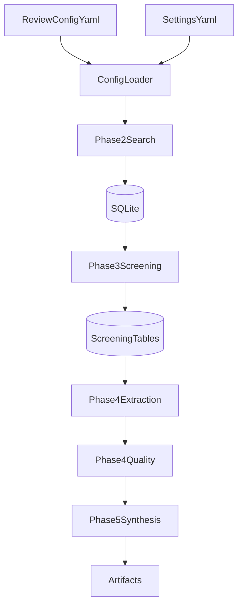

# Systematic Review Automation Tool (v2 Build)

Typed, async, SQLite-backed workflow for systematic review automation. Produces PRISMA 2020-compliant pipelines from research question through synthesis. Phases 1-8 implemented.

---

## For Researchers

### What It Does

Runs a systematic review pipeline: search (OpenAlex, PubMed, arXiv, IEEE, etc.) -> dual-reviewer screening -> extraction & quality assessment (RoB 2, ROBINS-I, GRADE) -> synthesis (meta-analysis or narrative) -> writing. Outputs protocol, search appendix, screening decisions, RoB figure (RoB 2 + ROBINS-I), PRISMA flow diagram, publication timeline, geographic distribution, forest/funnel plots, narrative synthesis.

### How to Run

```bash
uv run python -m src.main run --config config/review.yaml --settings config/settings.yaml
```

Edit `config/review.yaml` with your research question, PICO, keywords, and target databases. Put API keys in `.env` (see Configuration below).

### Resume

If a run stops (crash, Ctrl+C), resume with:

```bash
uv run python -m src.main resume --topic "your research question"
# or
uv run python -m src.main resume --workflow-id wf-xxx
```

Press Ctrl+C once during screening to proceed with already-screened papers; press twice to abort. When you run again with the same topic, you will be prompted to resume the existing workflow.

### Export (after run completes)

```bash
uv run python -m src.main export --workflow-id wf-xxx
uv run python -m src.main validate --workflow-id wf-xxx
uv run python -m src.main status --workflow-id wf-xxx
```

Produces `submission/` with manuscript.tex, manuscript.pdf, references.bib, figures/, supplementary/.

---

## For Developers

### Architecture

- **Stack:** Python 3.11+, PydanticAI Graph, SQLite, Google Gemini 2.5
- **Persistence:** Paper-level SQLite (each decision/extraction written immediately; mid-phase resume supported)
- **Registry:** Central `logs/workflows_registry.db` maps (topic, config_hash) to runtime.db; fallback scans `run_summary.json` if registry missing

### Key Modules

| Module | Purpose |
|--------|---------|
| `src/models/` | Pydantic contracts (config, papers, screening, extraction, quality) |
| `src/db/` | SQLite schema, repositories, workflow_registry |
| `src/orchestration/` | PydanticAI Graph, gates, resume, state |
| `src/search/` | Connectors (OpenAlex, PubMed, arXiv, IEEE, etc.), strategy, dedup |
| `src/screening/` | Dual reviewer, adjudication, reliability |
| `src/extraction/` | Study classifier, extraction service |
| `src/quality/` | RoB 2, ROBINS-I, CASP, GRADE, study router |
| `src/synthesis/` | Feasibility, effect sizes, meta-analysis, narrative |
| `src/writing/` | Section writer, humanizer, style extractor |
| `src/export/` | IEEE LaTeX, submission packager, validators |
| `src/visualization/` | Forest plot, funnel plot, RoB traffic-light, timeline, geographic |

### Pipeline Flow



Resume: interrupt or crash mid-run; use `resume --topic` to continue from last checkpoint.

### Tests

```bash
uv run pytest tests/unit -q
uv run pytest tests/integration -q
```

---

## Configuration

- `config/review.yaml`: per-review topic, PICO, eligibility, target databases
- `config/settings.yaml`: agent model profiles, thresholds
- `.env`: API keys (GEMINI_API_KEY, OPENALEX_API_KEY, etc.) -- never commit

## SSL / Certificate Issues

If connectors fail with `CERTIFICATE_VERIFY_FAILED`:

- **macOS (python.org):** Run `Install Certificates.command` from your Python.app
- **Corporate proxy:** Add org CA to trust store, or set `SSL_CERT_FILE`
- **Dev only:** `RESEARCH_AGENT_SSL_SKIP_VERIFY=1` (insecure)

## Specification

See `docs/research-agent-v2-spec.md` for full architecture, data contracts, and build phases.
