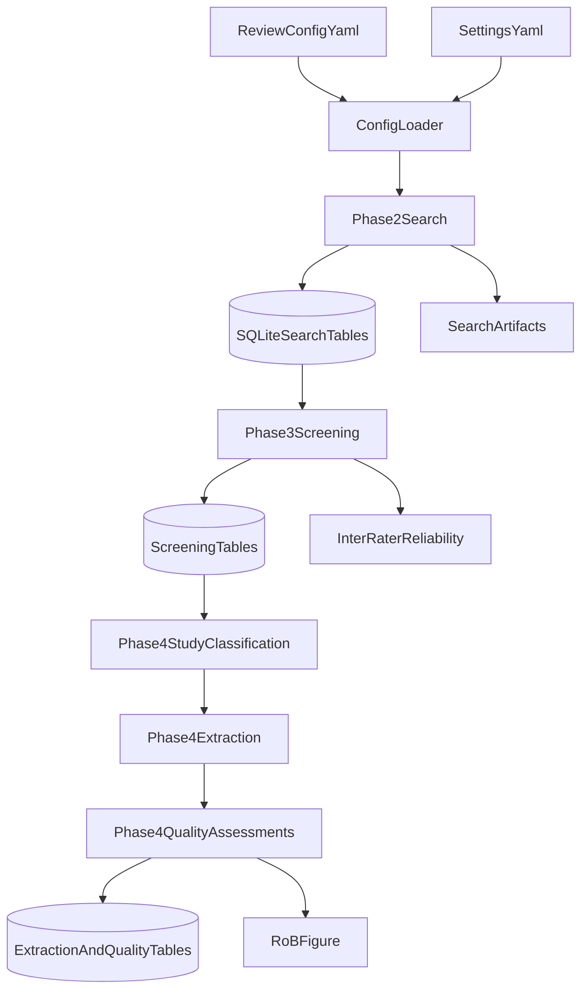

# Systematic Review Automation Tool (v2 Build)

Typed, async, SQLite-backed workflow for systematic review automation.

Current implementation is through Phase 4 foundations (with baseline extraction/quality logic), not full end-to-end manuscript export yet.

## Current Status

- Phase 1 foundation: implemented
- Phase 2 search infrastructure: implemented
- Phase 3 screening foundations: implemented
- Phase 4 extraction and quality foundations: implemented
- Phases 5-8: not implemented yet

## Implemented Modules

- `src/models/` typed Pydantic contracts for config, papers, screening, extraction, quality, workflow
- `src/db/` SQLite schema, async DB manager, typed repositories
- `src/orchestration/gates.py` six quality gates with persistence
- `src/search/` connectors + strategy + dedup + live validation
- `src/screening/` dual reviewer, adjudication flow, reliability metrics
- `src/extraction/` study classifier + extraction service
- `src/quality/` RoB2, ROBINS-I, CASP, GRADE, study router
- `src/visualization/rob_figure.py` RoB traffic-light rendering
- `src/llm/provider.py` model profile selection, rate limiting, cost logging hook

## Search Sources (Current)

Primary/academic connectors:
- `openalex`
- `pubmed`
- `arxiv`
- `ieee_xplore`
- `semantic_scholar`
- `crossref`

Auxiliary connector:
- `perplexity_search` (other-source discovery only)

## Runtime Commands

- `uv run python -m src.main --help`
- `uv run python -m src.main run --config config/review.yaml --settings config/settings.yaml`
- `uv run python -m src.main phase2-live --config config/review.yaml --settings config/settings.yaml --log-root logs`

Note: `resume`, `validate`, `export`, and `status` CLI commands are scaffolded and not fully implemented yet.

## Tests

- `uv run pytest tests/unit -q`
- `uv run pytest tests/integration -q`

## Current Flow

## Configuration

- `config/review.yaml`: per-review topic and eligibility config
- `config/settings.yaml`: agent model profiles and system thresholds
- `.env`: API keys and runtime secrets (local only, never commit)

## Specification

See `docs/research-agent-v2-spec.md` for phased architecture, contracts, and acceptance criteria.
