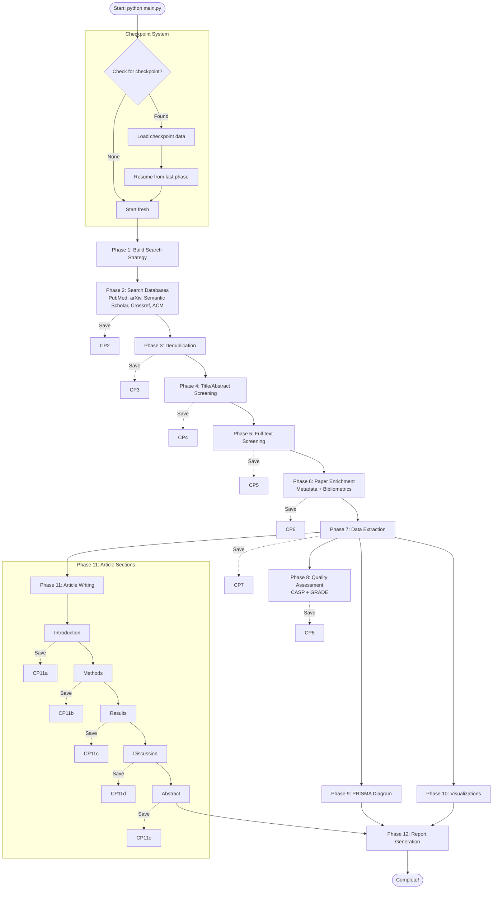

# Literature Review Assistant - Agentic AI System


## What is this?

An end-to-end agentic AI system that automates systematic literature reviews from database search to publication-ready articles, including PRISMA 2020-compliant flow diagrams and visualizations.

### Why should I care?

**Problem**: Conducting systematic literature reviews is time-consuming, requiring hours of manual work across multiple databases, paper screening, data extraction, and article writing.

**Solution**: This system automates the entire process using AI agents that search databases, screen papers, extract data, assess quality, and generate complete review articles with proper citations and visualizations.

**Who it's for**: Researchers, students, and professionals conducting systematic reviews who want to save time while maintaining PRISMA 2020 compliance and academic rigor.

### Can I trust it?

- **PRISMA 2020 Compliant**: Automatically generates PRISMA-compliant reports and flow diagrams
- **Robust Error Handling**: Graceful handling of database access issues with automatic fallback
- **Checkpoint System**: Automatic checkpointing allows resuming from any phase if interrupted
- **Quality Assurance**: Built-in screening safeguards, quality assessment tools, and structured data extraction
- **Open Source**: MIT licensed, transparent codebase

### Can I use it?

**Yes!** You only need:
- Python 3.8+ and `uv` package manager
- Google Gemini API key (free tier available)
- 5 minutes to get started

The system works with free academic databases by default and includes comprehensive documentation.

---

## Table of Contents

- [Quick Start](#quick-start)
- [What You Get](#what-you-get)
- [Workflow Overview](#workflow-overview)
- [How Checkpoints Work](#how-checkpoints-work)
- [Prerequisites](#prerequisites)
- [API Keys Setup](#api-keys-setup)
- [Configuration](#configuration)
- [Key Features](#key-features)
- [Project Structure](#project-structure)
- [Troubleshooting](#troubleshooting)
- [License](#license)

## Quick Start

> **Note**: Typical workflow duration: 30-60 minutes for a small review (50-100 papers), 2-4 hours for comprehensive reviews (200+ papers).

### Step 1: Setup Environment

```bash
# Create virtual environment and install dependencies
uv venv && source .venv/bin/activate  # On Windows: .venv\Scripts\activate
uv pip install -e .
```

### Step 2: Get Your API Key (Recommended: Google Gemini)

**Quick Start**: Get a free Google Gemini API key in 2 minutes:
1. Visit https://aistudio.google.com/app/apikey
2. Sign in with your Google account
3. Click "Create API Key"
4. Copy your key

Then configure it:

```bash
# Copy example environment file
cp .env.example .env

# Add your API key to .env file
echo "GOOGLE_API_KEY=your-key-here" >> .env
echo "LLM_PROVIDER=google" >> .env
```

### Step 3: Configure Your Research Topic (Required)

Edit `config/workflow.yaml` to set your research topic. **Everything you need for a new study is in the `topic` section**:

```yaml
topic:
  topic: "Your Research Topic"
  keywords: ["keyword1", "keyword2"]  # Search terms - only place needed
  domain: "your domain"
  scope: "your scope"
  research_question: "Your research question?"
  context: "Background context"
  
  # Inclusion/Exclusion Criteria (right here in topic section)
  inclusion:
    - "Your inclusion criteria"
  exclusion:
    - "Your exclusion criteria"
```

> See `config/workflow.yaml` for complete configuration options including protocol registration, funding information, and conflicts of interest.

### Step 4: Run the Workflow

```bash
# Basic run (automatically resumes from latest checkpoint if available)
python main.py

# Explicitly resume from latest checkpoint
python main.py --resume

# Quick test: Verify setup works
python main.py --test-databases
```

> **Note**: The workflow automatically saves checkpoints after each phase. If interrupted, simply run `python main.py` to automatically resume from the latest checkpoint.

### Step 5: Check Your Outputs

Results are saved to `data/outputs/workflow_{topic}_{timestamp}/`:
- `final_report.md` - Complete systematic review article
- `prisma_diagram.png` - PRISMA 2020 flow diagram
- `references.bib` - BibTeX citation file
- Visualizations (publication timeline, network graphs, geographic distribution)
- `workflow_state.json` - Workflow metadata

### Step 6: Next Steps

- **View outputs**: Check `data/outputs/workflow_{topic}_{timestamp}/final_report.md`
- **Customize configuration**: Edit `config/workflow.yaml` for your research needs
- **Review visualizations**: Explore PRISMA diagrams and publication charts in the output directory

## What You Get

After running the workflow, you'll find a complete systematic review package in `data/outputs/workflow_{topic}_{timestamp}/`:

```
data/outputs/workflow_{topic}_{timestamp}/
├── final_report.md              # Complete systematic review article (Markdown)
├── prisma_diagram.png           # PRISMA 2020 flow diagram
├── references.bib               # BibTeX citation file
├── workflow_state.json          # Workflow metadata and statistics
├── visualizations/
│   ├── publication_timeline.png # Publication timeline chart
│   ├── citation_network.html    # Interactive citation network graph
│   └── geographic_distribution.png  # Geographic distribution map
└── quality_assessments/         # Quality assessment data (if enabled)
    └── assessments.json
```

**Key Outputs**:
- **`final_report.md`**: Complete article with introduction, methods, results, discussion, and abstract sections
- **`prisma_diagram.png`**: PRISMA 2020-compliant flow diagram showing paper selection process
- **`references.bib`**: BibTeX file with all cited papers, ready for LaTeX compilation
- **Visualizations**: Charts and graphs showing publication trends, citation networks, and geographic distribution

## Workflow Overview

### In Plain English

The workflow follows these main steps:

1. **Search Databases** - Searches multiple academic databases (PubMed, arXiv, Semantic Scholar, etc.) using your research topic
2. **Deduplicate** - Removes duplicate papers using fuzzy matching
3. **Screen Papers** - Uses AI to screen papers based on title/abstract, then full-text
4. **Extract Data** - Extracts key information (methods, results, conclusions) from eligible papers
5. **Assess Quality** - Performs quality assessments (CASP, GRADE) with optional AI auto-fill
6. **Generate Visualizations** - Creates PRISMA diagrams, publication timelines, citation networks
7. **Write Article** - Generates complete review article (introduction, methods, results, discussion, abstract)
8. **Compile Report** - Assembles final markdown report with citations and visualizations

**What happens at each phase?**
- **Phases 1-7**: Sequential processing with automatic checkpointing after each phase
- **Phases 8-11**: Run in parallel after Phase 7 (quality assessment, PRISMA diagram, visualizations, article writing)
- **Phase 12**: Report generation (waits for phases 9-11)

### Complete Workflow Diagram



**Key Features:**
- **Automatic checkpointing**: Phases 2-8 save checkpoints automatically (Phase 1 always rebuilds)
- **Per-section checkpointing**: Article writing (Phase 11) saves after each section (intro, methods, results, discussion, abstract)
- **Resume capability**: Automatically detects and resumes from last checkpoint or completed section
- **Parallel execution**: Phases 8-11 run simultaneously after Phase 7 completes (quality assessment, PRISMA, visualizations, article writing)
- **Flexible generation**: Phase 12 waits only for phases 9-11 (not phase 8), allowing quality assessment to complete independently
- **Topic matching**: Checkpoints matched by topic name, enabling separate workflows per research topic

## How Checkpoints Work

Checkpoints are saved snapshots of your workflow's progress after each phase completes. Think of them like save points - if something interrupts your workflow, you can resume exactly where you left off.

**How It Works:**
1. **Automatic Saving**: After phases 2-8 complete, the system automatically saves checkpoint files containing all papers, screening results, extracted data, and current phase number
2. **Per-Section Checkpointing**: During article writing (Phase 11), checkpoints are saved after each section completes (introduction, methods, results, discussion, abstract). This allows resuming from the last completed section without re-running expensive LLM calls.
3. **Automatic Resumption**: When you run `python main.py` with the same topic, the system detects existing checkpoints, loads previous results, and continues from the next phase or section
4. **Topic Matching**: Checkpoints are matched by topic name, so different research topics have separate checkpoint chains

**Example:**
```bash
# First run - completes phases 1-5, saves checkpoints
python main.py  # Topic: "Financial Trading Systems"

# Later run - automatically resumes from phase 6 (default behavior)
python main.py  # Detects existing checkpoints, resumes from phase 6

# Force fresh start (ignoring all checkpoints)
python main.py --force-fresh
```

**Checkpoint Location**: `data/checkpoints/workflow_{topic}_{timestamp}/`

## Prerequisites

Before you begin, ensure you have:

- **Python >=3.8** - Required runtime
- **uv** - Package manager (install from [https://github.com/astral-sh/uv](https://github.com/astral-sh/uv))
- **Pandoc** - System-level dependency for PDF/DOCX/HTML generation
  - macOS: `brew install pandoc`
  - Linux: `apt-get install pandoc` or `yum install pandoc`
  - Windows: Download from [https://pandoc.org/installing.html](https://pandoc.org/installing.html)
- **LLM API key** - Required for core functionality (see [API Keys Setup](#api-keys-setup))

**System Requirements**:
- OS: macOS, Linux, or Windows (WSL recommended)
- RAM: 4 GB minimum, 8 GB recommended for large reviews (200+ papers)
- Disk: 500 MB for installation + ~10-50 MB per workflow run
- Network: Internet connection required for database searches and LLM API calls

Optional:
- **Bibliometric dependencies** - For enhanced Scopus/Google Scholar features (`uv pip install -e ".[bibliometrics]"`)

## API Keys Setup

### Required: Google Gemini (Recommended)

Get a free Google Gemini API key (free tier available):

1. Visit https://aistudio.google.com/app/apikey
2. Sign in with your Google account
3. Click "Create API Key"
4. Add to `.env`:
   ```bash
   GOOGLE_API_KEY=your-key-here
   LLM_PROVIDER=google
   ```

> **Why Gemini?** Free tier with generous quotas, fast API responses, and cost-effective pricing. Perfect for getting started quickly.

### Optional: Database API Keys

Database API keys provide access to complete data from academic databases. Without them, the system uses free/public APIs which may have limited data or rate restrictions.

**Recommended API Keys**:
- **PubMed/NCBI**: `PUBMED_API_KEY` and `PUBMED_EMAIL` - Full abstracts and metadata
- **Semantic Scholar**: `SEMANTIC_SCHOLAR_API_KEY` - Citation networks and paper relationships
- **Crossref**: `CROSSREF_EMAIL` - Comprehensive bibliographic data
- **Scopus**: `SCOPUS_API_KEY` - Requires pybliometrics (`uv pip install -e ".[bibliometrics]"`)
- **IEEE Xplore**: `IEEE_API_KEY` - Get from https://developer.ieee.org/
- **Perplexity Search**: `PERPLEXITY_SEARCH_API_KEY` - Academic paper discovery
- **Google Scholar**: Requires `scholarly` library and `SCRAPERAPI_KEY` for proxy support

> **Note**: The system works with free databases by default. API keys significantly improve data quality and reliability.

## Configuration

The system uses a unified YAML configuration file (`config/workflow.yaml`) for all settings.

> **Good News**: Defaults work well for most use cases! You only need to customize what's essential for your research.

### Essential Configuration

**Research Topic** (Required - Everything in one place):
```yaml
topic:
  topic: "Your Research Topic"
  keywords: ["keyword1", "keyword2"]  # Only search terms needed
  domain: "your domain"
  scope: "your scope"
  research_question: "Your research question?"
  context: "Background context"
  
  # Inclusion/Exclusion Criteria (in topic section)
  inclusion:
    - "Your inclusion criteria"
  exclusion:
    - "Your exclusion criteria"
  
  # Optional: Protocol Registration, Funding, Conflicts of Interest
  protocol:
    registered: false
    registry: "PROSPERO"
  funding:
    source: "No funding received"
  conflicts_of_interest:
    statement: "The authors declare no conflicts of interest."
```

### Optional Configuration

**Workflow Settings**:
```yaml
workflow:
  databases: ["PubMed", "arXiv", "Semantic Scholar", "Crossref", "ACM"]
  date_range:
    start: 2015  # Start year
    end: 2025    # End year
  max_results_per_db: 100
```

**Writing Configuration**:
```yaml
writing:
  checkpoint_per_section: true  # Save checkpoint after each section (default: true)
  retry_count: 1                # Retry attempts for section writing (default: 1)
```

> See `config/workflow.yaml` for complete configuration options including agent settings, quality assessment, bibliometric features, and more.

## Key Features

**Search & Discovery**:
- Multi-database search (PubMed, arXiv, Semantic Scholar, Crossref, ACM, IEEE, Scopus, Perplexity, Google Scholar)
- LLM-powered search query optimization
- Automatic deduplication with fuzzy matching
- Paper enrichment with metadata completion and bibliometric data

**Screening & Quality**:
- AI-powered title/abstract and full-text screening with cost optimization
- Screening safeguards with borderline paper identification
- Structured data extraction using Pydantic schemas
- CASP quality assessment (RCTs, cohort studies, qualitative research) with automatic study type detection
- GRADE evidence certainty assessment
- Automatic LLM-based quality assessment filling

**Writing & Generation**:
- Complete article generation (introduction, methods, results, discussion, abstract)
- Text humanization with style pattern extraction
- PRISMA 2020-compliant reports and flow diagrams
- Publication timelines, citation networks, and geographic visualizations
- BibTeX reference export for citation management

**System Features**:
- Phase registry architecture with automatic dependency resolution
- Automatic checkpointing (resume from any phase)
- Per-section checkpointing for article writing
- Configurable retry logic
- Robust error handling with automatic fallback

## Project Structure

The codebase is organized into focused modules:

**Core Workflow** (`src/orchestration/`):
- `workflow_manager.py` - Main orchestrator coordinating all workflow phases
- `phase_registry.py` - Declarative phase registration and dependency management
- `checkpoint_manager.py` - Checkpoint saving and loading
- `phase_executor.py` - Executes individual workflow phases

**Search & Discovery** (`src/search/`):
- `database_connectors.py` - Academic database connectors (PubMed, arXiv, Semantic Scholar, etc.)
- `search_strategy.py` - LLM-powered search query optimization
- `bibliometric_enricher.py` - Author metrics and citation data enrichment

**Paper Screening** (`src/screening/`):
- `title_abstract_agent.py` - Title/abstract screening with LLM
- `fulltext_agent.py` - Full-text screening with PDF retrieval

**Data Extraction & Quality** (`src/extraction/`, `src/quality/`):
- `data_extractor_agent.py` - Structured data extraction using Pydantic schemas
- `auto_filler.py` - Automatic LLM-based quality assessment filling
- `casp_prompts.py` - CASP assessment prompts
- `grade_assessor.py` - GRADE evidence quality assessment

**Article Writing** (`src/writing/`):
- `introduction_agent.py`, `methods_agent.py`, `results_agent.py`, `discussion_agent.py`, `abstract_agent.py`
- `humanization_agent.py` - Text naturalness refinement
- `style_pattern_extractor.py` - Extract writing styles from reference papers

**Visualization & PRISMA** (`src/visualization/`, `src/prisma/`):
- `charts.py` - Publication timelines, citation networks, geographic distribution
- `prisma_generator.py` - PRISMA 2020 flow diagram generation
- `checklist_generator.py` - PRISMA 2020 checklist validation

**Configuration**:
- `config/workflow.yaml` - Unified workflow configuration
- `config/journals.yaml` - Journal-specific submission requirements

**Entry Point**:
- `main.py` - CLI entry point with argument parsing

## Troubleshooting

**Common Issues:**

- **"No papers found"** - Check search query is not too specific, verify databases are enabled in `config/workflow.yaml`, try broader keywords
- **"LLM API Error"** - Verify LLM API key is set in `.env` file and valid, check API key has credits/quotas available
- **"ACM 403 Forbidden Error"** - Expected behavior, system automatically handles and continues with other databases (no action needed)
- **"Rate limit exceeded"** - Wait a few minutes and retry, set API keys for higher rate limits
- **"Pandoc not found"** - Install Pandoc system dependency (see [Prerequisites](#prerequisites))
- **"SSL Certificate Error"** - Corporate proxy issue: Install certifi (`uv pip install certifi`) or configure SSL certificates

**Quick Diagnostic:**

```bash
# Test database connectivity and API keys
python main.py --test-databases

# Check configuration
python -c "from src.config.config_loader import ConfigLoader; print(ConfigLoader().load_config())"
```

> **Still stuck?** Open an issue on GitHub with error details and logs.

## Future Enhancements

Based on PRISMA 2020 standards and analysis of reference systematic reviews, the following enhancements are planned for future releases:

### 1. Enhanced Table Generation
- **Study Characteristics Tables**: Automated generation of comprehensive study characteristics tables with sortable columns
- **Evidence Summary Tables**: GRADE evidence profile tables with certainty ratings
- **Custom Table Templates**: Support for journal-specific table formats (IEEE, Nature, BMJ, etc.)
- **Interactive Tables**: HTML tables with filtering and sorting capabilities

### 2. Meta-Analysis Support
- **Forest Plots**: Automated generation of forest plots for quantitative synthesis
- **Funnel Plots**: Publication bias assessment visualizations
- **Effect Size Calculations**: Support for odds ratios, risk ratios, and standardized mean differences
- **Heterogeneity Assessment**: I-squared statistics and forest plot annotations

### 3. Enhanced Risk of Bias Reporting
- **Risk of Bias Plots**: Traffic light plots and summary plots (ROB 2, ROBINS-I)
- **Domain-Specific Assessments**: Tailored assessments for different study designs
- **Interactive Visualizations**: Clickable risk of bias graphs with detailed justifications
- **Summary Statistics**: Automated calculation of overall bias distribution

### 4. PRISMA 2020 Abstract Compliance
- **Structured Abstract Generator**: Automated formatting following PRISMA 2020 abstract checklist
- **Word Count Optimization**: Automatic trimming to meet journal limits while preserving key information
- **Required Elements Validation**: Checks for all 12 PRISMA abstract items

### 5. Advanced Search Strategy Documentation
- **Search String Optimization**: Suggestions for improving sensitivity and precision
- **Database-Specific Syntax**: Automated translation between database search syntaxes
- **Search Validation**: Checks for common errors in Boolean operators and field codes
- **Grey Literature Integration**: Better support for preprint servers, trial registries, dissertations

### 6. Enhanced Discussion Structure
- **Implications Framework**: Structured subsections for practice, policy, and research implications
- **Strength of Evidence Assessment**: GRADE-style recommendations with certainty levels
- **Comparison Tables**: Side-by-side comparison with previous systematic reviews
- **Research Gaps Visualization**: Concept maps identifying understudied areas

### 7. Enhanced Export Formats
- **Multi-Format Export**: Export to LaTeX, Word (DOCX), PDF, and HTML formats
- **Citation Style Management**: Automatic conversion between Vancouver, APA, Chicago, Harvard styles
- **Journal-Specific Formatting**: Templates for top journals (Nature, Science, Lancet, BMJ, JAMA, etc.)
- **Pandoc Integration**: Leverage Pandoc for high-quality document conversion

### 8. Advanced Citation Management
- **Citation Network Analysis**: Identify key papers and citation relationships
- **Reference Mining**: Automatic extraction of additional relevant papers from reference lists
- **Citation Style Validation**: Check for consistency and completeness
- **DOI Resolution**: Automatic DOI lookup and metadata enrichment

### 9. Quality Assurance Tools
- **PRISMA Checklist Validation**: Automated checking of all 27 PRISMA 2020 items
- **Reporting Quality Scores**: Assess completeness of reporting (e.g., AMSTAR-2 for systematic reviews)
- **Consistency Checks**: Verify numbers match across abstract, PRISMA diagram, and main text
- **Language Quality**: Grammar and readability analysis

### 10. Collaboration Features
- **Multi-Author Support**: Conflict resolution for independent screening and data extraction
- **Review Protocols**: Generate and track protocol registration (PROSPERO format)
- **Change Tracking**: Version control for manuscript revisions
- **Commenting System**: Allow reviewers to annotate specific sections

### 11. Enhanced Visualizations
- **Geographical Heat Maps**: Publication distribution by country with interactive tooltips
- **Timeline Visualizations**: Publication trends with key events and milestones
- **Network Graphs**: Author collaboration and citation networks
- **Word Clouds**: Key themes and terminology from included studies

### 12. AI-Powered Features
- **Intelligent Summarization**: Extract key findings and synthesis across studies
- **Bias Detection**: AI-assisted identification of potential reporting biases
- **Gap Analysis**: Automated identification of research gaps and future directions
- **Recommendation Generation**: Evidence-based practice recommendations

## Contributing

Contributions are welcome! Please feel free to submit issues or pull requests for any of the enhancements listed above or other improvements.

## License

MIT

---

**Version**: 0.1.0

For advanced features, development setup, and contributing guidelines, see `config/workflow.yaml` and project documentation.
