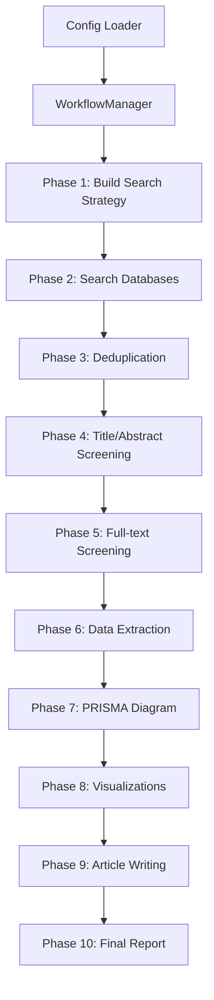

# Literature Review Assistant - Agentic AI System

End-to-end agentic system that automates systematic literature reviews from search to publication-ready articles, including PRISMA 2020-compliant flow diagrams and visualizations.

## Table of Contents

- [Quick Start](#quick-start)
- [Architecture Overview](#architecture-overview)
- [Workflow Details](#workflow-details)
- [API Keys Required](#api-keys-required)
- [Configuration](#configuration)
- [Project Structure](#project-structure)
- [Testing](#testing)
- [Development](#development)
- [Troubleshooting](#troubleshooting)

## Quick Start

### Step 1: Setup Environment

```bash
# Create virtual environment
uv venv
source .venv/bin/activate  # On Windows: .venv\Scripts\activate

# Install dependencies
uv pip install -e .
```

### Step 2: Configure Environment Variables

```bash
# Copy example environment file
cp .env.example .env

# Edit .env with your API keys
# At minimum, you need an LLM API key (see API Keys Required section)
```

### Step 3: Configure Workflow (Optional)

Edit `config/workflow.yaml` to customize:
- Research topic and research question
- Databases to search (default: PubMed, arXiv, Semantic Scholar, Crossref)
- Date ranges and filters
- Agent configurations (LLM models, temperature, tools)
- Inclusion/exclusion criteria

### Step 4: Run the Workflow

```bash
# Basic run
python main.py

# Or use Makefile
make setup    # Create venv
make install  # Install dependencies
make run      # Run workflow
```

### Step 5: Check Outputs

Results are saved to `data/outputs/`:
- `final_report.md` - Complete systematic review article
- `prisma_diagram.png` - PRISMA 2020 flow diagram
- `papers_per_year.png` - Publication timeline
- `network_graph.html` - Interactive citation/co-occurrence network
- `papers_by_country.png` - Geographic distribution
- `papers_by_subject.png` - Subject area distribution
- `workflow_state.json` - Workflow metadata

Search logs (PRISMA-compliant) are saved to `data/outputs/search_logs/`:
- `prisma_search_report_*.json` - PRISMA-S compliant search report
- `search_summary_*.csv` - CSV summary of all searches

## Architecture Overview

### High-Level Architecture

The system follows a **sequential multi-phase workflow** orchestrated by `WorkflowManager`:



### Core Components

**1. WorkflowManager** (`src/orchestration/workflow_manager.py`)
- Main orchestrator coordinating all 10 workflow phases
- Manages state transitions and error recovery
- Initializes all agents, connectors, and components

**2. Database Connectors** (`src/search/database_connectors.py`)
- Abstract base class `DatabaseConnector`
- Implementations: PubMed, arXiv, Semantic Scholar, Crossref, Scopus
- `MultiDatabaseSearcher` coordinates multiple connectors
- Rate limiting, caching, retry logic built-in

**3. Agents** (screening, extraction, writing)
- Base class: `BaseScreeningAgent`
- All agents use LLM providers (Gemini, Perplexity, OpenAI, Anthropic)
- Support tool calling (ReAct pattern)
- Structured outputs via Pydantic schemas

**4. Configuration System** (`src/config/config_loader.py`)
- Unified YAML configuration (`config/workflow.yaml`)
- Template replacement (`{topic}`, `{domain}`, etc.)
- Environment variable substitution

**5. State Management** (`src/state/`)
- `StateStore` (abstract) / `FileStateStore` (implementation)
- `CheckpointManager` for workflow persistence
- Currently underutilized (not actively used in workflow)

### Data Flow


### Key Design Patterns

- **Sequential Workflow Pattern**: Phases execute sequentially with dependencies
- **Agent Pattern**: Specialized agents for different tasks (search, screening, extraction, writing)
- **Factory Pattern**: Connector creation via factory methods
- **Strategy Pattern**: Database-specific query optimization
- **Template Method Pattern**: Base agent class with common functionality
- **Retry Pattern**: Exponential backoff retry for API calls
- **Circuit Breaker Pattern**: Prevents cascading failures
- **Caching Pattern**: SQLite-based persistent cache

## Workflow Details

### 10-Phase Workflow

The system executes 10 sequential phases:

1. **Build Search Strategy**
   - Constructs database-specific queries from keywords
   - Applies MeSH terms, field tags, and optimizations
   - **No LLM used** - pure query construction

2. **Search Databases**
   - Queries multiple databases (PubMed, arXiv, Semantic Scholar, Crossref, Scopus)
   - Rate limiting and retry logic ensure reliable API access
   - Results cached to avoid redundant requests
   - PRISMA-compliant search logging tracks all queries
   - **No LLM used** - API calls only

3. **Deduplication**
   - Multi-field matching (DOI, title, abstract, authors)
   - Intelligent record prioritization (prefers DOI, complete metadata, authoritative sources)
   - Fuzzy matching handles variations in titles and author names
   - **No LLM used** - fuzzy string matching algorithms

4. **Title/Abstract Screening**
   - Two-stage approach: keyword pre-filtering + LLM for borderline cases
   - Stage 1: Fast keyword-based filtering (no LLM)
   - Stage 2: LLM screening only for uncertain papers
   - **LLM used selectively** - reduces calls by 50-70%

5. **Full-text Screening**
   - Screens papers based on full-text content
   - Falls back to title/abstract if full text unavailable
   - **LLM used** - one call per paper (only papers that passed Phase 4)

6. **Data Extraction**
   - Extracts structured data (methodology, outcomes, findings) using Pydantic schemas
   - Domain-specific field extraction
   - **LLM used** - one call per paper (only final included papers)

7. **PRISMA Diagram Generation**
   - Generates PRISMA 2020 flow diagram from tracked counts
   - PRISMA-S compliant search reports generated automatically
   - **No LLM used** - diagram generation from counts

8. **Visualization Generation**
   - Creates bibliometric charts (papers/year, network graphs, country/subject charts)
   - Interactive HTML network graphs with Pyvis
   - **No LLM used** - data visualization

9. **Article Writing**
   - Generates article sections (Introduction, Methods, Results, Discussion, Abstract)
   - Each writer agent configured via YAML
   - Citation extraction and formatting (IEEE format)
   - **LLM used** - one call per section (5 sections total)

10. **Final Report Compilation**
    - Compiles all sections into markdown
    - Includes PRISMA diagram and search documentation
    - **No LLM used** - file compilation

### When LLM is Used vs Not Used

**LLM is Used For:**
- Title/Abstract screening (borderline cases only, after keyword pre-filtering)
- Full-text screening
- Data extraction (structured output)
- Article writing (Introduction, Methods, Results, Discussion, Abstract)

**LLM is NOT Used For:**
- Search strategy building
- Database searches
- Deduplication
- Initial keyword filtering
- PRISMA diagram generation
- Visualizations
- Report compilation

### Cost Optimization

The two-stage screening approach significantly reduces LLM costs:

**Without Optimization:**
- 94 papers × 1 LLM call each = 94 LLM calls for screening
- Cost: ~$0.10-0.50 per paper = $9-47 for screening alone

**With Two-Stage Screening:**
- Keyword filtering first (no LLM): Filters out 50-70% of papers
- LLM screening second: Only 20-30 papers need LLM calls
- Cost: ~$0.02-0.10 for screening (50% savings)

**Total Estimated Costs:**
- Screening: $0.02-0.10 (with optimization)
- Full-text screening: $0.01-0.05
- Data extraction: $0.01-0.05
- Article writing: $0.04-0.20
- **Total: ~$0.08-0.40 per workflow run**

## API Keys Required

### Required for LLM Features

The system requires at least one LLM provider API key:

**Option 1: OpenAI**
```bash
OPENAI_API_KEY=sk-your-key-here
LLM_PROVIDER=openai
```

**Option 2: Anthropic**
```bash
ANTHROPIC_API_KEY=sk-ant-your-key-here
LLM_PROVIDER=anthropic
```

**Option 3: Google GenAI (Gemini)**
```bash
# Use GOOGLE_API_KEY (preferred) or GEMINI_API_KEY
GOOGLE_API_KEY=your-key-here
# OR
GEMINI_API_KEY=your-key-here
LLM_PROVIDER=google
# OR
LLM_PROVIDER=gemini
```
Get API key from: https://aistudio.google.com/app/apikey

**Option 4: Perplexity**
```bash
PERPLEXITY_API_KEY=your-key-here
LLM_PROVIDER=perplexity
```
Get API key from: https://www.perplexity.ai/settings/api

**Note**: If no API keys are provided, the system will use fallback keyword-based methods (limited functionality).

### Optional: Research Tool API Keys

**Exa** (Optional - for enhanced web search):
```bash
EXA_API_KEY=your-key-here
```
Get API key from: https://dashboard.exa.ai/

**Tavily** (Optional - for enhanced web search and content extraction):
```bash
TAVILY_API_KEY=your-key-here
```
Get API key from: https://tavily.com/

### Optional: Database API Keys

The system works with free databases by default (PubMed, arXiv, Semantic Scholar, Crossref), but API keys improve rate limits and access:

**PubMed/NCBI** (Optional but recommended):
```bash
PUBMED_API_KEY=your_key
PUBMED_EMAIL=your_email@example.com
```
Get API key from: https://www.ncbi.nlm.nih.gov/account/settings/

**Semantic Scholar** (Optional but recommended for higher rate limits):
```bash
SEMANTIC_SCHOLAR_API_KEY=your_key
```
Request API key from: https://www.semanticscholar.org/product/api

**Crossref** (Email recommended for better service):
```bash
CROSSREF_EMAIL=your_email@example.com
```
No API key required, but email helps with rate limits.

**Scopus** (Requires institutional access):
```bash
SCOPUS_API_KEY=your_key
```
Get API key from: https://dev.elsevier.com/

**IEEE Xplore** (Requires institutional access):
```bash
IEEE_API_KEY=your_key
```
Get API key from: https://developer.ieee.org/

**Note**: arXiv works without any API key. PubMed, Semantic Scholar, and Crossref work without API keys but have lower rate limits.

**Testing Database Connectors**:

After setting up API keys, test your database connectors:
```bash
# Quick health check
python main.py --test-databases

# Or run the standalone script
python scripts/test_database_health.py

# Run comprehensive integration tests
pytest tests/integration/test_real_database_connectors.py -v
```

The workflow will automatically use real connectors when API keys are available, falling back to mock connectors with warnings when keys are missing.

## Configuration

### Workflow Configuration

The system uses a unified YAML configuration file (`config/workflow.yaml`) for all settings:

**Research Topic**:
```yaml
topic:
  topic: "LLM-Powered Health Literacy Chatbots for Low-Income Communities"
  keywords: ["health literacy", "chatbots", "LLM", "low-income"]
  domain: "public health"
  scope: "Focus on LLM-powered chatbots designed to improve health literacy"
  research_question: "What is the effectiveness of LLM-powered health literacy chatbots?"
```

**Agent Configurations** (all agents configured in YAML):
```yaml
agents:
  search_agent:
    role: "{topic} Literature Search Specialist"
    llm_model: "gemini-2.5-flash"
    tools: ["database_search", "query_builder", "exa_search", "tavily_search"]
    temperature: 0.1
    max_iterations: 5
  
  title_abstract_screener:
    role: "{topic} Title/Abstract Screening Specialist"
    llm_model: "gemini-2.5-pro"
    tools: ["title_screener"]
    temperature: 0.2
    max_iterations: 10
  
  fulltext_screener:
    role: "{topic} Full-text Screening Specialist"
    llm_model: "gemini-2.5-flash-lite"
    tools: ["fulltext_screener"]
    temperature: 0.2
    max_iterations: 5
  
  extraction_agent:
    role: "{topic} Data Extraction Specialist"
    llm_model: "gemini-2.5-pro"
    tools: ["data_extractor"]
    temperature: 0.1
    max_iterations: 5
  
  introduction_writer:
    role: "{topic} Introduction Writer"
    llm_model: "gemini-2.5-pro"
    tools: []
    temperature: 0.2
    max_iterations: 3
  
  # ... more agents (methods_writer, results_writer, discussion_writer)
```

**Workflow Settings**:
```yaml
workflow:
  databases: ["PubMed", "arXiv", "Semantic Scholar", "Crossref"]
  date_range:
    start: null  # null means no start limit
    end: 2025
  language: "English"
  max_results_per_db: 100
  similarity_threshold: 85  # For deduplication
  
  # Database-specific settings
  database_settings:
    PubMed:
      enabled: true
      max_results: 100
      rate_limit: 3  # requests per second
      requires_api_key: false
  
  # Caching settings
  cache:
    enabled: true
    ttl_hours: 24  # Time-to-live for cached results
    cache_dir: "data/cache"
  
  # PRISMA-compliant search logging
  search_logging:
    enabled: true
    log_dir: "data/outputs/search_logs"
    generate_prisma_report: true
    generate_csv_summary: true
```

**Inclusion/Exclusion Criteria**:
```yaml
criteria:
  inclusion:
    - "Studies on LLM/chatbot interventions for health literacy"
    - "Focus on low-income/underserved populations"
    - "Published in English and peer-reviewed journals or conferences"
  exclusion:
    - "Non-LLM chatbots (rule-based or simple keyword matching)"
    - "General health apps without chatbot component"
    - "Opinion pieces or non-peer-reviewed sources"
```

**Search Terms**:
```yaml
search_terms:
  health_literacy: ["health literacy", "health information seeking", "patient education"]
  chatbots: ["chatbot", "conversational agent", "virtual assistant"]
  llm: ["large language model", "LLM", "GPT", "generative AI"]
  low_income: ["low-income", "underserved", "vulnerable populations"]
```

All agent configurations are in the YAML file - no code changes needed to modify agent behavior!

### Debug and Verbose Modes

**Verbose mode** (detailed logging):
```bash
python main.py --verbose
```

**Debug mode** (full logging with all details):
```bash
python main.py --debug
```

**Custom verbose level**:
```bash
python main.py --verbose-level detailed  # Options: minimal, normal, detailed, full
```

**Log to file**:
```bash
python main.py --verbose --log-to-file --log-file logs/workflow.log
```

**Disable metrics/costs**:
```bash
python main.py --verbose --no-metrics --no-costs
```

## Project Structure

```
literature-review-assistant/
├── src/
│   ├── config/                # Configuration management
│   │   ├── config_loader.py   # YAML config loader with template replacement
│   │   └── debug_config.py    # Debug configuration management
│   ├── deduplication.py       # Paper deduplication logic
│   ├── extraction/           # Structured data extraction agents
│   │   └── data_extractor_agent.py
│   ├── observability/        # Metrics, cost tracking, tracing
│   │   ├── cost_tracker.py   # Tracks LLM API costs
│   │   ├── metrics.py        # Metrics collection
│   │   └── tracing.py        # Distributed tracing (optional)
│   ├── orchestration/         # Workflow orchestration
│   │   ├── workflow_manager.py  # Main orchestrator (1,130+ lines)
│   │   ├── workflow_graph.py    # LangGraph-based workflow (NOT USED)
│   │   ├── topic_propagator.py  # Topic context propagation
│   │   └── handoff_protocol.py  # Handoff protocol between phases
│   ├── prisma/               # PRISMA diagram generation
│   │   └── prisma_generator.py
│   ├── schemas/              # Pydantic schemas for structured outputs
│   │   ├── extraction_schemas.py
│   │   └── screening_schemas.py
│   ├── search/               # Database connectors & search strategy
│   │   ├── database_connectors.py  # PubMed, arXiv, Semantic Scholar, Crossref, Scopus
│   │   ├── search_strategy.py      # Database-specific query builders
│   │   ├── rate_limiter.py         # Rate limiting and retry logic
│   │   ├── cache.py                # Persistent caching layer
│   │   ├── exceptions.py           # Custom exceptions
│   │   └── search_logger.py        # PRISMA-compliant logging
│   ├── screening/            # Title/abstract & full-text screening agents
│   │   ├── base_agent.py         # Base screening agent (834 lines)
│   │   ├── title_abstract_agent.py
│   │   └── fulltext_agent.py
│   ├── state/                # State management and checkpoints
│   │   ├── state_store.py        # State persistence (underutilized)
│   │   └── checkpoint_manager.py # Workflow checkpoint management
│   ├── tools/                # Tool registry and tool definitions
│   │   ├── tool_registry.py      # Tool registry and management
│   │   ├── database_search_tool.py
│   │   ├── query_builder_tool.py
│   │   ├── exa_tool.py
│   │   └── tavily_tool.py
│   ├── utils/                # Utilities
│   │   ├── logging_config.py    # Logging configuration
│   │   ├── log_context.py        # Logging context managers
│   │   ├── retry_strategies.py   # Retry logic with exponential backoff
│   │   └── circuit_breaker.py   # Circuit breaker pattern
│   ├── visualization/        # Bibliometric charts & network graphs
│   │   └── charts.py
│   ├── writing/             # Article section writing agents
│   │   ├── introduction_agent.py
│   │   ├── methods_agent.py
│   │   ├── results_agent.py
│   │   ├── discussion_agent.py
│   │   └── abstract_agent.py
│   ├── citations/           # Citation extraction and formatting
│   │   ├── citation_manager.py
│   │   └── ieee_formatter.py
│   ├── enrichment/          # Paper metadata enrichment
│   │   └── paper_enricher.py
│   ├── export/              # Export to LaTeX/Word formats
│   │   ├── latex_exporter.py
│   │   └── word_exporter.py
│   └── testing/             # Testing utilities
│       ├── stage_loader.py
│       └── stage_validators.py
├── tests/
│   ├── unit/                 # Unit tests
│   ├── integration/          # Integration tests
│   ├── e2e/                  # End-to-end tests
│   └── fixtures/             # Test fixtures and mocks
├── scripts/                  # Utility scripts
│   ├── test_database_health.py    # Test database connectors
│   ├── test_full_workflow.py      # Test complete workflow
│   ├── validate_workflow_outputs.py  # Validate generated outputs
│   └── list_papers.py              # List papers from workflow state
├── config/
│   └── workflow.yaml         # Workflow configuration
├── data/
│   ├── cache/                # Search result cache (SQLite)
│   ├── raw/                  # Raw search results
│   ├── processed/            # Processed/screened data
│   └── outputs/              # Final outputs (PRISMA, charts, report)
│       └── search_logs/      # PRISMA-compliant search logs
├── main.py                   # Entry point (CLI)
├── pyproject.toml           # Dependencies
├── Makefile                 # Build automation
├── .env.example             # Environment variable template
└── README.md                # This file
```

### Key Files

**Entry Point:**
- `main.py` - CLI interface with argument parsing, environment variable loading, logging setup

**Core Orchestration:**
- `src/orchestration/workflow_manager.py` - Main workflow coordinator (1,130+ lines)
- `src/orchestration/workflow_graph.py` - LangGraph-based workflow (NOT CURRENTLY USED)

**Search Layer:**
- `src/search/database_connectors.py` - Database connectors (840 lines)
- `src/search/search_strategy.py` - Database-specific query builders
- `src/search/cache.py` - SQLite-based caching
- `src/search/rate_limiter.py` - Rate limiting

**Screening:**
- `src/screening/base_agent.py` - Base screening agent (834 lines)
- `src/screening/title_abstract_agent.py` - Title/abstract screening
- `src/screening/fulltext_agent.py` - Full-text screening

**Writing:**
- `src/writing/introduction_agent.py` - Introduction section writer
- `src/writing/methods_agent.py` - Methods section writer
- `src/writing/results_agent.py` - Results section writer
- `src/writing/discussion_agent.py` - Discussion section writer
- `src/writing/abstract_agent.py` - Abstract generator

**Citations & Export:**
- `src/citations/citation_manager.py` - Citation extraction and mapping
- `src/citations/ieee_formatter.py` - IEEE citation formatting
- `src/export/latex_exporter.py` - LaTeX export for journal submission
- `src/export/word_exporter.py` - Word document export

**Enrichment:**
- `src/enrichment/paper_enricher.py` - Enriches papers with missing metadata (affiliations, etc.)

**Configuration:**
- `config/workflow.yaml` - Unified YAML configuration
- `src/config/config_loader.py` - Config loader with template replacement

## Testing

### Quick Start Testing

**Run All Tests:**
```bash
# Run all tests
pytest tests/ -v

# Run with coverage
pytest tests/ --cov=src --cov-report=html --cov-report=term

# View coverage report
open htmlcov/index.html  # macOS
```

**Test Categories:**
```bash
# Unit tests (fast, isolated)
pytest tests/unit/ -v

# Integration tests (component interactions)
pytest tests/integration/ -v

# End-to-end tests (full workflow)
pytest tests/e2e/ -v
```

**Test Specific Components:**
```bash
# Database connectors
pytest tests/unit/test_database_connectors.py -v

# Deduplication logic
pytest tests/unit/test_deduplication.py -v

# Rate limiting
pytest tests/unit/test_rate_limiter.py -v

# Agent screening
pytest tests/integration/test_agent_screening.py -v

# Full workflow
pytest tests/e2e/test_full_workflow.py -v
```

### Test Scripts

**Database Health Check:**
```bash
# Test all database connectors
python scripts/test_database_health.py

# Or use main.py
python main.py --test-databases
```

**Full Workflow Test:**
```bash
# Test complete workflow with real databases
python scripts/test_full_workflow.py
```

**Output Validation:**
```bash
# Validate workflow outputs
python scripts/validate_workflow_outputs.py

# Or specify custom output directory
python scripts/validate_workflow_outputs.py --output-dir data/outputs/my_run
```

### Running Tests with Mock Data

Tests use mock connectors by default, so no API keys are required:
```bash
# All database connector tests use MockConnector
pytest tests/unit/test_database_connectors.py -v
```

### Testing Real Database Connectors

**Integration Tests** (tests real API calls):
```bash
# Test all real database connectors (skips if API keys not available)
pytest tests/integration/test_real_database_connectors.py -v

# Test specific connector
pytest tests/integration/test_real_database_connectors.py::TestPubMedConnector -v
```

**Using Real Connectors in Workflow:**

The workflow manager automatically uses real connectors when API keys are available:
- **PubMed**: Works without API key, but `PUBMED_API_KEY` and `PUBMED_EMAIL` improve rate limits
- **arXiv**: No API key needed
- **Semantic Scholar**: Works without API key, but `SEMANTIC_SCHOLAR_API_KEY` increases rate limits
- **Crossref**: Works without email, but `CROSSREF_EMAIL` improves service
- **Scopus**: Requires `SCOPUS_API_KEY` (skipped if not set)

The system falls back to mock connectors with warnings when API keys are missing (except Scopus, which is skipped entirely).

### Expected Test Results

**Database Health Check:**
- At least 3/5 databases should work (PubMed, arXiv, Semantic Scholar, Crossref work without keys)
- Scopus requires API key (may show as not working)
- Quality metrics: >80% papers should have titles, >50% should have abstracts

**Full Workflow Test:**
- Should find papers from at least one database
- Deduplication should reduce paper count
- PRISMA diagram should be generated (PNG file)
- No critical errors (warnings acceptable)

**Output Validation:**
- All papers should have titles
- PRISMA diagram should be valid PNG (>800px wide)
- Final report should have Introduction, Methods, Results, Discussion sections
- Report should reference PRISMA diagram

### Test Markers

Tests are marked for different scenarios:
- `@pytest.mark.slow` - Tests that take longer (real API calls)
- `@pytest.mark.integration` - Integration tests requiring external services
- `@pytest.mark.e2e` - End-to-end workflow tests

Run specific test types:
```bash
# Skip slow tests
pytest -m "not slow"

# Run only integration tests
pytest -m integration

# Run only fast tests
pytest -m "not slow and not integration"
```

## Development

### Development Setup

```bash
# Install in development mode
uv pip install -e .

# Run tests
pytest tests/ -v

# Run with coverage
pytest tests/ --cov=src --cov-report=html

# Format code with Ruff
make lint
# Or manually
ruff check --fix src/ main.py
ruff format src/ main.py
```

### Architecture Highlights

- **Multi-Agent System**: Specialized agents for search, screening, extraction, writing
- **Structured Communication**: Pydantic schemas ensure type-safe data exchange
- **Tool Calling**: Agents use tools via OpenAI/Anthropic function calling format
- **Resilience Patterns**: Retry with exponential backoff, circuit breakers, graceful degradation
- **State Management**: Checkpoint system for workflow persistence with state serialization utilities
- **Observability**: Metrics, cost tracking, distributed tracing
- **Sequential Orchestration**: WorkflowManager executes phases sequentially (WorkflowGraph exists but not used)

### Dependencies

Managed via `uv` (see `pyproject.toml`):
- **Core**: pandas, numpy, matplotlib, networkx
- **LLM**: openai, anthropic, google-genai, perplexityai
- **Academic Search**: arxiv (official arXiv library)
- **Processing**: fuzzywuzzy, pdfplumber, beautifulsoup4
- **Validation**: pydantic, pydantic-settings
- **Resilience**: tenacity (retry with exponential backoff)
- **Testing**: pytest, pytest-cov, pytest-mock, pytest-asyncio
- **Utils**: python-dotenv, pyyaml, mdutils, rich, colorama
- **Visualization**: pyvis, pycountry (optional)

### Known Issues and Technical Debt

1. **WorkflowGraph Not Used**: Fully implemented but not integrated - would provide checkpointing and parallel execution
2. **State Management Underutilized**: StateStore exists but not actively used - no checkpoint/resume capability
3. **Large Files**: Some files are very large (workflow_manager.py: 1,130+ lines, database_connectors.py: 840 lines, base_agent.py: 834 lines)
4. **Sequential Execution**: Phases run sequentially - database searches could be parallelized
5. **Dependency Management**: All dependencies required even if not used - could use extras (e.g., `[openai]`, `[charts]`)

### Migration Notes

**Google GenAI SDK Migration:**

**Important**: This system uses the new `google-genai` SDK (General Availability as of May 2025), NOT the deprecated `google-generativeai` package.

- **Old (Deprecated)**: `google-generativeai` - deprecated as of November 30, 2025
- **New (Current)**: `google-genai` - Use this package

The new SDK uses a client-based API:
- Old: `import google.generativeai as genai; genai.configure(api_key=key); model = genai.GenerativeModel(model_name)`
- New: `from google import genai; client = genai.Client(api_key=key)`

Environment variables:
- Old: `GOOGLE_GENAI_API_KEY` (not standard)
- New: `GEMINI_API_KEY` or `GOOGLE_API_KEY` (standard, `GOOGLE_API_KEY` takes precedence)

See official docs: https://ai.google.dev/gemini-api/docs/libraries

## Troubleshooting

### SSL Certificate Errors

If you encounter SSL certificate errors when connecting to databases:

**Symptoms:**
- `SSLError: [SSL: CERTIFICATE_VERIFY_FAILED]`
- `requests.exceptions.SSLError`

**Solutions:**
1. **Network/WiFi Issues**: SSL certificate errors can be caused by network configuration. Try:
   - Switching to a different WiFi network
   - Using a VPN
   - Checking if your network has proxy settings

2. **Python Certificate Bundle**: Update certificates:
   ```bash
   # macOS
   /Applications/Python\ 3.x/Install\ Certificates.command
   
   # Or install certifi
   pip install --upgrade certifi
   ```

3. **Environment Variable**: Set certificate path:
   ```bash
   export SSL_CERT_FILE=$(python -m certifi)
   ```

### Database Connection Problems

**PubMed/NCBI Issues:**
- PubMed API is free but rate-limited
- Set `PUBMED_API_KEY` and `PUBMED_EMAIL` for higher limits
- Check if NCBI servers are accessible: `curl https://eutils.ncbi.nlm.nih.gov`

**Scopus Issues:**
- Requires institutional API key (not available for individual users)
- Check API key: `echo $SCOPUS_API_KEY`
- Verify key is valid: Run `scripts/test_database_health.py`

**Crossref Issues:**
- No API key required, but email recommended
- Set `CROSSREF_EMAIL` for better service
- Check rate limits: Crossref allows 50 requests/second with email

**Semantic Scholar Issues:**
- Works without API key (lower rate limits)
- Set `SEMANTIC_SCHOLAR_API_KEY` for higher limits
- Check API status: https://api.semanticscholar.org/health

### API Key Configuration

**Common Issues:**
1. **Keys not loaded**: Ensure `.env` file exists and is in project root
2. **Wrong variable names**: Check `.env.example` for correct names
3. **Keys in wrong format**: Some APIs require specific prefixes

**Verify API Keys:**
```bash
# Check which keys are set
python scripts/test_database_health.py

# Or manually check
python -c "from dotenv import load_dotenv; import os; load_dotenv(); print('PubMed:', bool(os.getenv('PUBMED_API_KEY')))"
```

### Common Error Messages

**"No papers found"**
- Check search query is not too specific
- Verify databases are enabled in `config/workflow.yaml`
- Check database connectors are working: `python scripts/test_database_health.py`

**"LLM API Error"**
- Verify LLM API key is set (`OPENAI_API_KEY`, `ANTHROPIC_API_KEY`, etc.)
- Check API key is valid and has credits
- Try a different LLM provider

**"PRISMA diagram generation failed"**
- Check `prisma-flow-diagram` library is installed: `pip install prisma-flow-diagram`
- Verify workflow has papers to generate diagram from
- Check output directory is writable

**"Rate limit exceeded"**
- Wait a few minutes and retry
- Set API keys for higher rate limits
- Enable caching to reduce API calls

### Debugging Tips

1. **Enable Debug Mode:**
   ```bash
   python main.py --debug
   ```

2. **Check Logs:**
   - Console output shows detailed phase information
   - Use `--log-to-file` to save logs

3. **Test Individual Components:**
   ```bash
   # Test database connectors
   python scripts/test_database_health.py
   
   # Test full workflow (small scale)
   python scripts/test_full_workflow.py
   
   # Validate outputs
   python scripts/validate_workflow_outputs.py
   ```

4. **Check Workflow State:**
   - Workflow state saved to `data/outputs/workflow_state.json`
   - Check PRISMA counts match expectations
   - Verify papers have required fields

## Features

- **Multi-Database Search**: PubMed, arXiv, Semantic Scholar, Crossref, Scopus (with Web of Science and IEEE Xplore support)
- **Intelligent Rate Limiting**: Database-specific rate limits with exponential backoff retry logic
- **Persistent Caching**: SQLite-based cache to reduce redundant API calls and improve performance
- **Enhanced Deduplication**: Multi-field matching (DOI, title, abstract, authors) with intelligent record prioritization
- **PRISMA-Compliant Logging**: Automatic search documentation and PRISMA-S compliant reports
- **Database-Specific Query Optimization**: Optimized search queries for each database (MeSH terms, field tags, etc.)
- **Two-Stage Screening**: Keyword pre-filtering reduces LLM calls by 50-70%
- **LLM-Powered Screening**: Title/abstract and full-text screening using LLMs with structured outputs
- **Structured Data Extraction**: Extract study characteristics, outcomes, key findings using Pydantic schemas
- **Tool Calling**: Agents can use tools (database search, query builder) via structured tool calling
- **Resilience**: Retry strategies, circuit breakers, graceful degradation
- **PRISMA Diagram Generation**: Automatic PRISMA 2020-compliant flow diagrams
- **Bibliometric Visualizations**: Papers per year, interactive network graphs, country/subject charts
- **Article Writing**: Generate Introduction, Methods, Results, Discussion, and Abstract sections
- **Citation Management**: Automatic citation extraction and IEEE-formatted references
- **Paper Enrichment**: Enriches papers with missing metadata (affiliations, countries) via Crossref API
- **Export Formats**: Export to LaTeX (for journal submission) and Word document formats
- **Observability**: Metrics tracking, cost monitoring, distributed tracing
- **Debug Mode**: Comprehensive logging for debugging agent operations

## Notes

- **Database Connectors**: 
  - Free databases (PubMed, arXiv, Semantic Scholar, Crossref) work without API keys
  - API keys improve rate limits (especially for Semantic Scholar)
  - Mock connectors available for testing without API keys
  - Rate limiting and caching are automatic

- **Agent Configuration**: 
  - All agents configured via `config/workflow.yaml`
  - No code changes needed to modify agent behavior, models, or tools
  - Template variables (`{topic}`, `{domain}`) are automatically replaced

- **LLM Features**: 
  - Require API keys (OpenAI, Anthropic, Gemini, or Perplexity)
  - Falls back to keyword matching if unavailable
  - Agent models and settings configurable in YAML

- **Caching**: 
  - Search results cached for 24 hours by default (configurable)
  - Cache stored in SQLite database (`data/cache/search_cache.db`)
  - Reduces redundant API calls significantly

- **PRISMA Compliance**: 
  - Automatic PRISMA-S compliant search logging
  - Search reports generated automatically
  - All search strategies documented for reproducibility

- **PDF Parsing**: 
  - Full-text extraction requires PDF parsing (not fully implemented)

- **PRISMA Diagrams**: 
  - Works with or without `prisma-flow-diagram` library (fallback included)

- **Debug Mode**: 
  - Use `--debug` or `--verbose` flags to see detailed agent operations, tool calls, and decisions
  - Search logs include detailed query information for PRISMA compliance

- **lib/ Directory**: 
  - Contains frontend libraries (vis-network, tom-select) for generated HTML network graphs
  - Referenced by generated HTML files but primarily uses CDN links
  - May be removed if not needed for local file serving

## License

MIT
