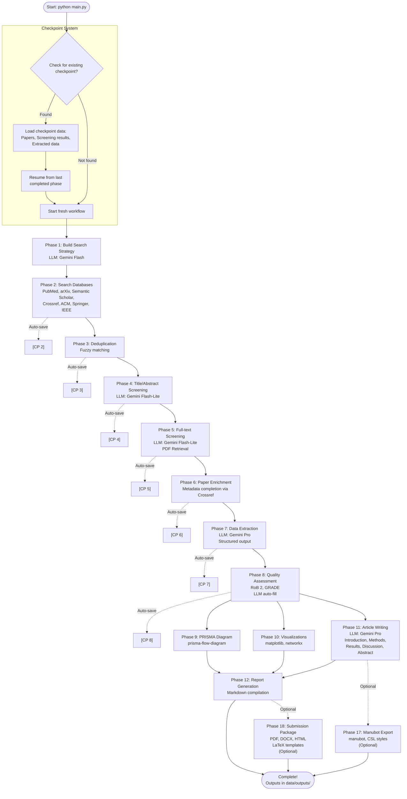

# Literature Review Assistant - Agentic AI System


End-to-end agentic system that automates systematic literature reviews from search to publication-ready articles, including PRISMA 2020-compliant flow diagrams and visualizations.

## Table of Contents

- [Prerequisites](#prerequisites)
- [Quick Start](#quick-start)
- [Workflow Overview](#workflow-overview)
- [How Checkpoints Work](#how-checkpoints-work)
- [API Keys Required](#api-keys-required)
- [Configuration](#configuration)
- [Features](#features)
- [Documentation](#documentation)
- [Testing](#testing)
- [Development](#development)
- [Contributing](#contributing)
- [Troubleshooting](#troubleshooting)
- [License](#license)
- [Recent Changes](#recent-changes)

## Prerequisites

Before you begin, ensure you have the following installed:

- **Python >=3.8** - Required runtime
- **uv** - Package manager (install from [https://github.com/astral-sh/uv](https://github.com/astral-sh/uv))
- **Pandoc** - System-level dependency for PDF/DOCX/HTML generation
  - macOS: `brew install pandoc`
  - Linux: `apt-get install pandoc` or `yum install pandoc`
  - Windows: Download from [https://pandoc.org/installing.html](https://pandoc.org/installing.html)
- **At least one LLM API key** - Required for core functionality (see [API Keys Required](#api-keys-required) section)
  - OpenAI, Anthropic, Google GenAI (Gemini), or Perplexity

Optional but recommended:
- **Manubot** - For citation resolution (`uv pip install manubot` or `uv pip install -e ".[manubot-full]"`)
- **Bibliometric dependencies** - For enhanced Scopus/Google Scholar features (`uv pip install -e ".[bibliometrics]"`)

## Quick Start

> **Note**: Ensure you have met all [Prerequisites](#prerequisites) before starting.

### Step 1: Setup Environment

```bash
# Create virtual environment
uv venv
source .venv/bin/activate  # On Windows: .venv\Scripts\activate

# Install dependencies
uv pip install -e .

# Install optional dependencies for manuscript pipeline (optional but recommended)
uv pip install -e ".[manubot-full]"
```

### Step 2: Configure Environment Variables

```bash
# Copy example environment file
cp .env.example .env

# Edit .env with your API keys
# At minimum, you need an LLM API key (see API Keys Required section)
```

### Step 3: Configure Workflow (Optional)

Edit `config/workflow.yaml` to customize:
- Research topic and research question
- Databases to search (default: PubMed, arXiv, Semantic Scholar, Crossref)
- Date ranges and filters
- Agent configurations (LLM models, temperature, tools)
- Inclusion/exclusion criteria

See [Configuration Reference](docs/CONFIGURATION.md) for complete configuration options.

### Step 4: Run the Workflow

```bash
# Basic run (automatically resumes from latest checkpoint if available)
python main.py

# Force fresh start (ignore all checkpoints, start from scratch)
python main.py --force-fresh

# With manuscript pipeline features
python main.py --manubot-export --build-package --journal ieee

# Verbose output with logging
python main.py --verbose --log-to-file

# Or use Makefile
make setup    # Create venv
make install  # Install dependencies
make run      # Run workflow
```

### Step 5: Check Outputs

Results are saved to `data/outputs/workflow_{topic}_{timestamp}/`:
- `final_report.md` - Complete systematic review article
- `prisma_diagram.png` - PRISMA 2020 flow diagram
- `references.bib` - BibTeX citation file
- Visualizations (publication timeline, network graphs, geographic distribution)
- `workflow_state.json` - Workflow metadata

## Workflow Overview

The system executes 16+ sequential phases: Build Search Strategy, Search Databases, Deduplication, Title/Abstract Screening, Full-text Screening, Paper Enrichment, Data Extraction, Quality Assessment, PRISMA Diagram Generation, Visualization Generation, Article Writing, Final Report Compilation, and optional phases for Manubot Export and Submission Package Generation.

### Complete Workflow Diagram



**Key Features:**
- **Automatic checkpointing**: Phases 2-8 save checkpoints automatically (Phase 1 always rebuilds)
- **Resume capability**: Restarting automatically detects and resumes from last checkpoint
- **Parallel execution**: Phases 9-11 run simultaneously after phase 8 completes
- **Optional phases**: Manubot export (after Phase 11) and submission package (after Phase 12) are optional
- **Topic matching**: Checkpoints are matched by research topic name, allowing separate workflows per topic

**Note**: If the diagram doesn't render properly, view it on GitHub or use a Mermaid viewer like [mermaid.live](https://mermaid.live).

### Technology Stack

**LLM Providers** (at least one required):
- OpenAI (GPT models)
- Anthropic (Claude models)
- Google GenAI (Gemini models - Flash, Flash-Lite, Pro)
- Perplexity (Sonar models)

**Academic Databases**:
- PubMed (free, optional API key)
- arXiv (free)
- Semantic Scholar (free, optional API key)
- Crossref (free, email recommended)
- ACM (free, web scraping)
- Google Scholar (optional, requires proxy)
- Scopus (optional, requires API key)

**Core Libraries**:
- LangChain & LangGraph - Agent orchestration
- pandas - Data manipulation
- matplotlib & networkx - Visualizations
- pydantic - Structured data validation
- PyPDF2 & pdfplumber - PDF processing
- manubot - Citation resolution
- pandoc - Document conversion (system dependency)

## How Checkpoints Work

Checkpoints are saved snapshots of your workflow's progress after each phase completes. Think of them like save points - if something interrupts your workflow, you can resume exactly where you left off.

**How It Works:**
1. **Automatic Saving**: After phases 2-8 complete, the system automatically saves checkpoint files containing all papers, screening results, extracted data, and current phase number
2. **Automatic Resumption**: When you run `python main.py` with the same topic, the system detects existing checkpoints, loads previous results, and continues from the next phase
3. **Topic Matching**: Checkpoints are matched by topic name, so different research topics have separate checkpoint chains

**Example:**
```bash
# First run - completes phases 1-5, saves checkpoints
python main.py  # Topic: "Financial Trading Systems"

# Later run - automatically resumes from phase 6
python main.py  # Detects existing checkpoints, resumes from phase 6
```

**Checkpoint Location**: `data/checkpoints/workflow_{topic}_{timestamp}/`

**Force Fresh Start**: To ignore checkpoints and start from scratch:
```bash
python main.py --force-fresh  # Ignores all checkpoints, starts from phase 1
```

## API Keys Required

### Required for LLM Features

The system requires at least one LLM provider API key:

**Option 1: OpenAI**
```bash
OPENAI_API_KEY=sk-your-key-here
LLM_PROVIDER=openai
```

**Option 2: Anthropic**
```bash
ANTHROPIC_API_KEY=sk-ant-your-key-here
LLM_PROVIDER=anthropic
```

**Option 3: Google GenAI (Gemini)** (Recommended)
```bash
GOOGLE_API_KEY=your-key-here
# OR
GEMINI_API_KEY=your-key-here
LLM_PROVIDER=google
```
Get API key from: https://aistudio.google.com/app/apikey

**Option 4: Perplexity**
```bash
PERPLEXITY_API_KEY=your-key-here
LLM_PROVIDER=perplexity
```
Get API key from: https://www.perplexity.ai/settings/api

**Note**: If no API keys are provided, the system will use fallback keyword-based methods (limited functionality).

### Optional Database API Keys

The system works with free databases by default, but API keys improve rate limits:

- **PubMed/NCBI**: `PUBMED_API_KEY` and `PUBMED_EMAIL` (optional but recommended)
- **Semantic Scholar**: `SEMANTIC_SCHOLAR_API_KEY` (optional but recommended)
- **Crossref**: `CROSSREF_EMAIL` (email recommended)
- **Scopus**: `SCOPUS_API_KEY` (requires bibliometrics dependencies)
- **Google Scholar**: `SCRAPERAPI_KEY` for proxy (requires bibliometrics dependencies)

See [Advanced Features](docs/ADVANCED_FEATURES.md) for bibliometric features setup.

## Configuration

The system uses a unified YAML configuration file (`config/workflow.yaml`) for all settings.

### Basic Configuration

**Research Topic**:
```yaml
topic:
  topic: "Your Research Topic"
  keywords: ["keyword1", "keyword2"]
  domain: "your domain"
  research_question: "Your research question?"
```

**Workflow Settings**:
```yaml
workflow:
  databases: ["PubMed", "arXiv", "Semantic Scholar", "Crossref", "ACM"]
  date_range:
    start: null
    end: 2025
  max_results_per_db: 100
```

**Inclusion/Exclusion Criteria**:
```yaml
criteria:
  inclusion:
    - "Your inclusion criteria"
  exclusion:
    - "Your exclusion criteria"
```

See [Configuration Reference](docs/CONFIGURATION.md) for complete configuration options including agent settings, quality assessment, text humanization, and more.

## Features

- **Phase Registry Architecture**: Declarative phase management with automatic dependency resolution
- **Multi-Database Search**: PubMed, arXiv, Semantic Scholar, Crossref, ACM, Google Scholar (optional)
- **Robust Error Handling**: Graceful handling of database access issues with automatic fallback
- **PRISMA 2020 Compliance**: Automatic PRISMA-compliant reports and diagrams
- **LLM-Powered Screening**: Intelligent screening with cost optimization
- **Screening Safeguards**: Automatic detection of low inclusion rates with borderline paper identification
- **Structured Data Extraction**: Pydantic schemas for type-safe extraction with optional fields support
- **Quality Assessment**: Risk of bias (RoB 2, ROBINS-I) and GRADE assessments with automatic LLM-based filling
- **Automatic Checkpointing**: Resume from any phase, force fresh start with `--force-fresh`
- **Text Humanization**: Style pattern extraction from eligible papers and LLM-based naturalness refinement
- **Bibliometric Visualizations**: Charts and interactive network graphs
- **Citation Management**: IEEE-formatted references and BibTeX export
- **Export Formats**: LaTeX, Word, PDF, HTML document export
- **Manubot Integration**: Export to Manubot structure for collaborative writing
- **Automatic Citation Resolution**: Resolve citations from DOI, PubMed ID, arXiv ID
- **Multi-Journal Support**: Generate submission packages for multiple journals
- **CSL Citation Styles**: Support for IEEE, APA, Nature, PLOS, and more

## Documentation

- **[Advanced Features](docs/ADVANCED_FEATURES.md)** - Bibliometric features, Git integration, quality assessment, manuscript pipeline, citation resolution, CSL styles, submission packages, journal templates, text humanization, visualization tools
- **[Configuration Reference](docs/CONFIGURATION.md)** - Complete configuration options and settings
- **[Examples](docs/EXAMPLES.md)** - Code examples and use cases
- **[Troubleshooting Guide](docs/TROUBLESHOOTING.md)** - Detailed troubleshooting for common issues
- **[Architecture](docs/ARCHITECTURE.md)** - Architecture overview, design patterns, and module dependencies
- **[Development Guide](DEVELOPMENT.md)** - Developer setup, testing strategy, contributing guidelines, development workflow

## Testing

**Run All Tests:**
```bash
pytest tests/ -v
```

**Test Database Connectors:**
```bash
python main.py --test-databases
# or
python scripts/test_database_health.py
```

**Test Full Workflow:**
```bash
python scripts/test_full_workflow.py
```

**Test Checkpoint Resumption:**
```bash
# Run workflow once to create checkpoints
python main.py

# Run again - should resume from latest checkpoint
python main.py
```

## Available Scripts

The project includes utility scripts in the `scripts/` directory:

**Test Infrastructure:**
- `scripts/analyze_test_structure.py` - Analyze test structure and create mapping
- `scripts/test_discovery.py` - Find tests for source files, identify missing tests
- `scripts/validate_test_mapping.py` - Validate test structure and naming conventions

**Development Tools:**
- `scripts/check_broken_imports.py` - Check for broken imports and circular dependencies
- `scripts/list_papers.py` - List all papers from workflow runs
- `scripts/organize_outputs.py` - Organize orphaned output files

**Workflow Utilities:**
- `scripts/validate_checkpoints.py` - Validate checkpoint files
- `scripts/validate_prisma_compliance.py` - Validate PRISMA 2020 compliance
- `scripts/validate_workflow_outputs.py` - Validate workflow outputs

See the `scripts/` directory for available utility scripts. Key scripts include test discovery tools, validation scripts, and workflow utilities.

## Development

**Install in Development Mode:**
```bash
uv pip install -e .
```

**Format Code:**
```bash
make lint
# or
ruff check --fix src/ main.py
ruff format src/ main.py
```

**Dependencies**: Managed via `uv` (see `pyproject.toml`)

## Contributing

Contributions are welcome! Please follow these guidelines:

### Reporting Issues

- Use the GitHub issue tracker to report bugs or request features
- Include: clear description, steps to reproduce, expected vs actual behavior, environment details, relevant error messages

### Submitting Pull Requests

1. **Fork the repository** and create a feature branch
2. **Follow code style**: The project uses `ruff` for linting and formatting
   ```bash
   ruff check --fix src/ main.py
   ruff format src/ main.py
   ```
3. **Write tests**: Add tests for new features or bug fixes
   ```bash
   pytest tests/ -v
   ```
4. **Update documentation**: Update README.md or relevant docs if needed
5. **Test your changes**: Ensure all tests pass before submitting

### Code Style Guidelines

- Follow PEP 8 style guide
- Use `ruff` for automatic formatting and linting
- Type hints are encouraged for new code
- Document complex functions and classes with docstrings

See [Contributing](#contributing) section above for complete guidelines.

## Troubleshooting

**Common Issues:**

- **"No papers found"** - Check search query is not too specific, verify databases are enabled in `config/workflow.yaml`
- **"ACM 403 Forbidden Error"** - Expected behavior, system automatically handles and continues with other databases
- **"LLM API Error"** - Verify LLM API key is set and valid, check API key has credits
- **"Rate limit exceeded"** - Wait a few minutes and retry, set API keys for higher rate limits

See [Troubleshooting Guide](docs/TROUBLESHOOTING.md) for detailed solutions to common issues.

## License

MIT

## Recent Changes

### Version 0.1.0

**Quality Assessment Auto-Fill**
- Automatic LLM-based quality assessment filling (enabled by default)
- CLI flags: `--no-auto-fill-qa` to disable, `--auto-fill-qa` to enable
- Configuration via `config/workflow.yaml` with `quality_assessment.auto_fill: true/false`
- Graceful fallback to manual assessment mode if auto-fill fails

**Enhanced Error Handling**
- Graceful handling of ACM Digital Library 403 errors with automatic fallback
- Improved error handling across all database connectors
- Fixed optional field handling for methodology and other optional extraction fields

**Improved Data Extraction**
- Optional fields support: Methodology and other fields properly optional in extraction schemas
- Better null handling for missing or null values in extracted data
