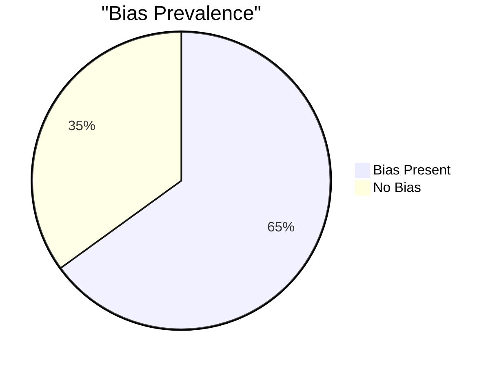
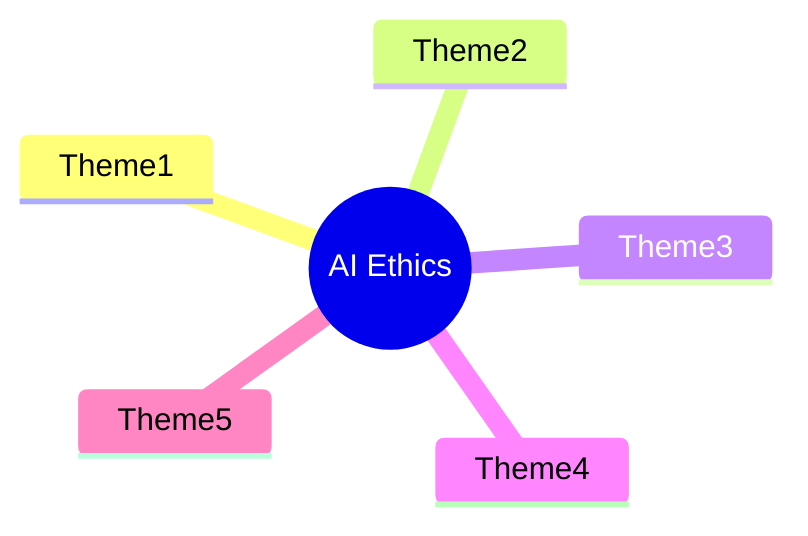
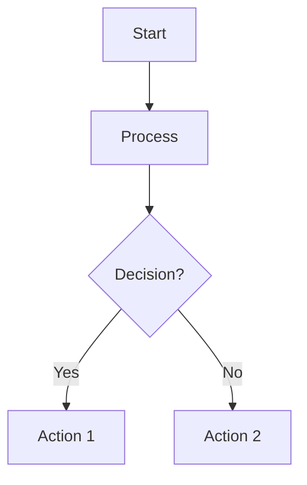
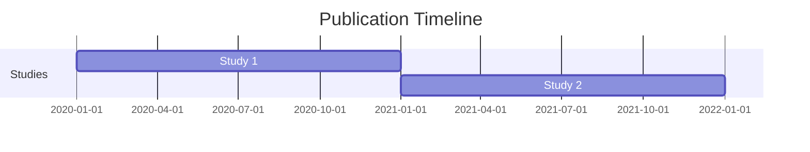
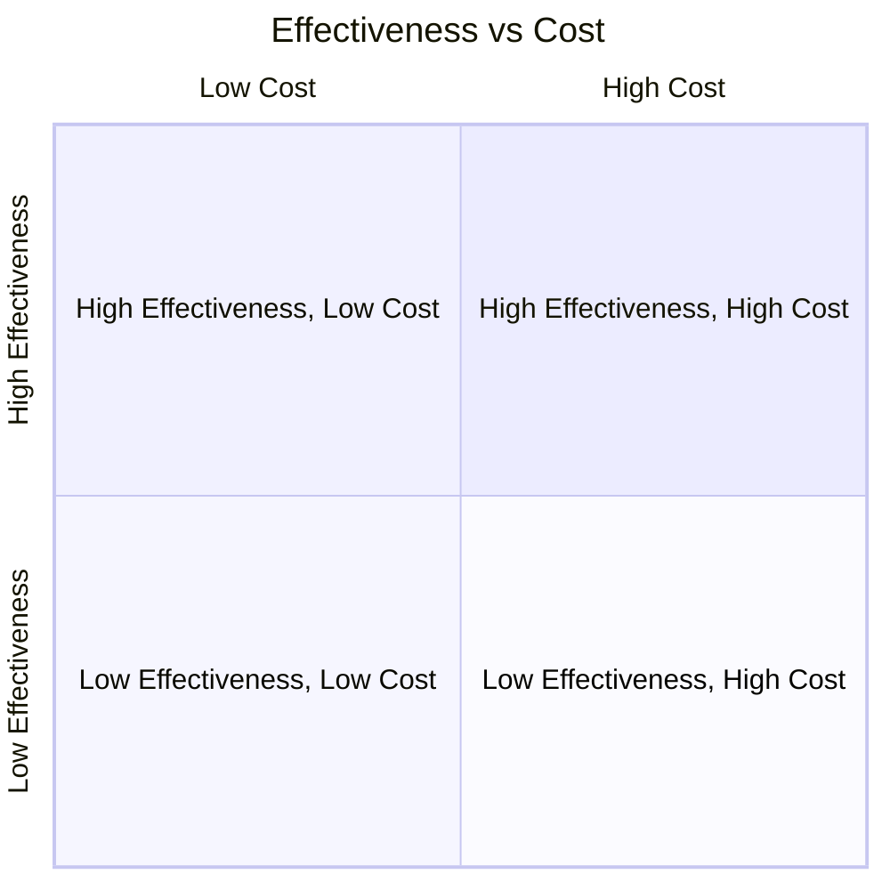
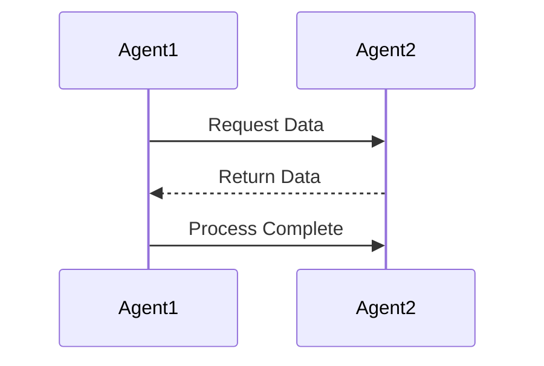
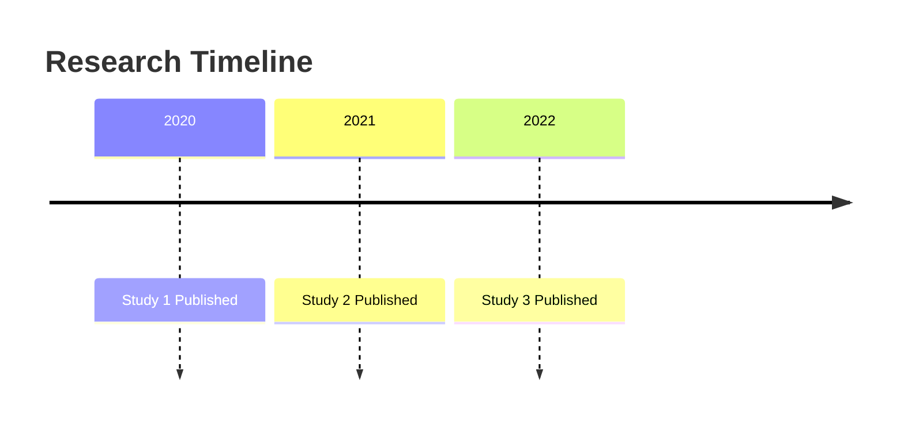

# Advanced Features

This document covers advanced and optional features of the Literature Review Assistant.

## Table of Contents

- [Bibliometric Features](#bibliometric-features)
- [Git Integration](#git-integration)
- [Quality Assessment Workflow](#quality-assessment-workflow)
- [Manuscript Pipeline](#manuscript-pipeline)
- [Citation Resolution](#citation-resolution)
- [CSL Citation Styles](#csl-citation-styles)
- [Submission Packages](#submission-packages)
- [Journal Templates](#journal-templates)
- [Text Humanization](#text-humanization)

## Bibliometric Features

The system includes enhanced bibliometric capabilities powered by pybliometrics (Scopus) and scholarly (Google Scholar). These features are optional and require additional dependencies.

### Installation

Install bibliometric dependencies:

```bash
uv pip install -e ".[bibliometrics]"
# or
uv pip install pybliometrics scholarly
```

### Features

**Enhanced Scopus Connector:**
- Author profile retrieval with h-index, citation counts, coauthors
- Affiliation details (institution, country, city)
- Subject area classifications
- Citation metrics per author

**Google Scholar Connector:**
- Publication search
- Author search and profiles
- Citation tracking (find papers citing a given paper)
- Related articles discovery

**Author Service:**
- Unified interface for author retrieval across databases
- Author profile aggregation from multiple sources
- Bibliometric metrics collection

**Citation Network Builder:**
- Build citation networks from papers
- Track citation relationships
- Export network graphs for visualization

### Configuration

Enable bibliometric features in `config/workflow.yaml`:

```yaml
workflow:
  databases: ["PubMed", "arXiv", "Semantic Scholar", "Crossref", "ACM", "Google Scholar"]
  
  # Bibliometrics settings
  bibliometrics:
    enabled: true
    include_author_metrics: true
    include_citation_networks: true
    include_subject_areas: true
    include_coauthors: true
    include_affiliations: true
  
  # Google Scholar specific settings
  google_scholar:
    enabled: true
    use_proxy: true  # Highly recommended to avoid CAPTCHAs
    proxy_type: "scraperapi"  # Options: scraperapi, free, none
```

### Usage Examples

**Retrieve Author Profile:**

```python
from src.search.author_service import AuthorService
from src.search.database_connectors import ScopusConnector

# Create connectors
scopus = ScopusConnector(api_key="your_scopus_key")
connectors = {"Scopus": scopus}

# Create author service
author_service = AuthorService(connectors)

# Get author by ID
author = author_service.get_author("12345678", database="Scopus")
print(f"Author: {author.name}, h-index: {author.h_index}")

# Search authors
authors = author_service.search_author("John Smith", database="Scopus")
```

**Build Citation Network:**

```python
from src.search.citation_network import CitationNetworkBuilder
from src.search.connectors.google_scholar_connector import GoogleScholarConnector

# Create citation network builder
gs_connector = GoogleScholarConnector(use_proxy=True)
network_builder = CitationNetworkBuilder(google_scholar_connector=gs_connector)

# Add papers and build network
network_data = network_builder.build_network_from_papers(papers)
stats = network_builder.get_citation_statistics()

# Export as NetworkX graph
G = network_builder.export_networkx_graph()
```

**Enhanced Scopus Search:**

```python
from src.search.database_connectors import ScopusConnector

scopus = ScopusConnector(api_key="your_key")

# Search papers (now includes citation_count, subject_areas, eid)
papers = scopus.search("machine learning", max_results=10)

# Retrieve author by ID
author = scopus.get_author_by_id("12345678")

# Retrieve affiliation details
affiliation = scopus.get_affiliation_by_id("60105007")

# Search authors
authors = scopus.search_authors("AUTHLAST(Smith) AND AUTHFIRST(John)")
```

## Git Integration

The system includes Git integration for manuscript version control.

### Initialize Repository

```python
from src.version_control.git_manager import GitManuscriptManager
from pathlib import Path

# Note: Use workflow-specific manuscript directory (e.g., data/outputs/workflow_{topic}_{timestamp}/manuscript)
git_manager = GitManuscriptManager(Path("data/outputs/workflow_{topic}_{timestamp}/manuscript"))
git_manager.initialize_repo()
git_manager.commit_changes("Initial manuscript export")
```

### Create Branch

```python
git_manager.create_branch("revisions")
```

### Check Status

```python
status = git_manager.get_status()
print(status)
```

## Quality Assessment Workflow

The workflow includes a quality assessment phase that can be automatically filled using LLM or completed manually.

### Automatic LLM-Based Assessment (Default)

By default, the workflow automatically fills quality assessments using LLM:

1. **Template Generation**: After data extraction, the workflow generates a quality assessment template file at `data/quality_assessments/workflow_{id}_assessments.json`
2. **Automatic Filling**: The system uses LLM to assess:
   - **Risk of Bias (RoB 2)**: Domain assessments for each study (randomization, deviations, missing data, measurement, selection)
   - **GRADE Assessments**: Certainty ratings, downgrade/upgrade reasons, and justifications for each outcome
3. **Workflow Continues**: After auto-filling, the workflow automatically proceeds to the next phase

### Manual Assessment (Optional)

To disable automatic filling and complete assessments manually:

```bash
# Disable auto-fill via CLI
python main.py --no-auto-fill-qa

# Or edit config/workflow.yaml
quality_assessment:
  auto_fill: false  # Disable automatic LLM-based filling
```

When auto-fill is disabled:
1. **Template Generation**: Template is generated at `data/quality_assessments/workflow_{id}_assessments.json`
2. **Manual Assessment**: You must complete the template by filling in all assessments
3. **Resume Workflow**: After completing the assessments, re-run `python main.py` - it will automatically resume from the quality assessment phase

### Configuration

Control auto-fill behavior in `config/workflow.yaml`:

```yaml
quality_assessment:
  risk_of_bias_tool: "RoB 2"  # Options: "RoB 2", "ROBINS-I", "CASP"
  grade_assessment: true      # Enable GRADE certainty assessment
  auto_fill: true              # Automatically fill assessments using LLM (default: true)
  template_path: "data/quality_assessments/{workflow_id}_assessments.json"
```

### CLI Flags

```bash
# Enable auto-fill explicitly (default behavior)
python main.py --auto-fill-qa

# Disable auto-fill for manual assessment
python main.py --no-auto-fill-qa
```

### Assessment File Format

The assessment file contains:
- `studies`: Array of study assessments with RoB 2 domain ratings ("Low", "Some concerns", "High", "Critical", or "Not applicable")
- `grade_assessments`: Array of GRADE assessments with certainty ratings ("High", "Moderate", "Low", "Very Low")

### How Auto-Fill Works

The automatic assessment system:
- Uses LLM (default: Gemini Pro) to analyze extracted data for each study
- Assesses risk of bias domains based on study design, methodology, and reported outcomes
- Provides GRADE certainty assessments based on risk of bias, consistency, and evidence quality
- Falls back to conservative assessments if LLM calls fail
- Logs all assessments with notes indicating they are automated

**Note**: Automated assessments should be reviewed for accuracy, especially for complex studies or non-standard designs. The system marks all automated assessments with notes for easy identification.

## Manuscript Pipeline

The system includes an integrated manuscript pipeline for generating submission-ready packages. Phases 17-18 are automatically executed when enabled in configuration.

### Enabling Manuscript Pipeline

Edit `config/workflow.yaml`:

```yaml
manubot:
  enabled: true  # Enable Manubot export (Phase 17)
  output_dir: "manuscript"
  citation_style: "ieee"
  auto_resolve_citations: true

submission:
  enabled: true  # Enable submission package generation (Phase 18)
  default_journal: "ieee"
  generate_pdf: true
  generate_docx: true
  generate_html: true
```

### Manubot Integration (Phase 17)

Export your systematic review to Manubot-compatible structure:

```bash
# Automatic execution when enabled in config
python main.py

# Or manual export
python main.py --manubot-export
```

This creates a `manuscript/` directory with:
- `content/` - Structured markdown files for each section
- `manubot.yaml` - Manubot configuration
- Organized sections ready for collaborative editing

**Checkpoint Support**: Phase 17 checkpoints are saved automatically, allowing resumption from this phase.

### Submission Package Generation (Phase 18)

Build complete submission packages for journals:

```bash
# Automatic execution when enabled in config
python main.py

# Or manual package building
python main.py --build-package --journal ieee
```

This generates a `submission_package_ieee/` directory containing:
- Manuscript in PDF, DOCX, and HTML formats
- Figures directory with all visualizations
- Supplementary materials (search strategies, PRISMA checklist, etc.)
- References in BibTeX and RIS formats
- Submission checklist for validation

**Checkpoint Support**: Phase 18 checkpoints are saved automatically, allowing resumption from this phase.

## Citation Resolution

The system supports automatic citation resolution from identifiers using Manubot. This allows you to cite papers without manually entering metadata.

### Supported Identifier Types

- **DOI**: `doi:10.1038/nbt.3780` or `10.1038/nbt.3780`
- **PubMed ID**: `pmid:29424689` or `29424689`
- **arXiv ID**: `arxiv:1407.3561` or `arXiv:1407.3561`
- **Generic citekeys**: Any Manubot-supported citekey format

### Manual Resolution

Resolve a single citation from command line:

```bash
python main.py --resolve-citation doi:10.1038/nbt.3780
python main.py --resolve-citation pmid:29424689
python main.py --resolve-citation arxiv:1407.3561
```

### Auto-Resolution

Enable automatic citation resolution during export:

```yaml
manubot:
  enabled: true
  auto_resolve_citations: true
```

When enabled, citations in Manubot format (`[@doi:...]`, `[@pmid:...]`) are automatically resolved and added to the citation list during manuscript export.

### Error Handling

If citation resolution fails:
- Verify identifier format is correct
- Check internet connection
- Try manual resolution: `python main.py --resolve-citation doi:10.1038/...`
- Some identifiers may require Manubot package: `uv pip install manubot`

### Journal Support

List available journals:

```bash
python main.py --list-journals
```

Validate submission package:

```bash
python main.py --validate-submission --journal ieee
```

## CSL Citation Styles

The system supports Citation Style Language (CSL) styles for flexible citation formatting.

### Supported Styles

- IEEE
- APA
- Nature
- PLOS ONE
- PLOS Computational Biology
- BMJ
- AMA
- Vancouver
- Harvard
- Chicago
- MLA

### Changing Citation Style

Edit `config/workflow.yaml`:

```yaml
manubot:
  citation_style: "apa"  # Change from "ieee" to "apa"
```

### Custom Styles

1. Download CSL style from https://github.com/citation-style-language/styles
2. Place in `data/cache/csl_styles/`
3. Reference by filename (without .csl extension)

Styles are automatically downloaded and cached on first use.

## Submission Packages

Generate complete submission packages for journal submission with all required files.

### Package Contents

A submission package includes:
- Manuscript in PDF, DOCX, and HTML formats
- Figures directory with all visualizations
- Tables directory (if applicable)
- Supplementary materials (search strategies, PRISMA checklist, data extraction forms)
- References in BibTeX and RIS formats
- Submission checklist for validation

### Building Packages

#### Single Journal

```bash
python main.py --build-package --journal ieee
```

#### Multiple Journals

Edit `config/workflow.yaml`:

```yaml
submission:
  enabled: true
  journals: ["ieee", "nature", "plos"]
```

Or use Python:

```python
from src.export.submission_package import SubmissionPackageBuilder
from pathlib import Path

# Note: Use workflow-specific output directory (e.g., data/outputs/workflow_{topic}_{timestamp}/)
builder = SubmissionPackageBuilder(Path("data/outputs/workflow_{topic}_{timestamp}"))
packages = builder.build_for_multiple_journals(
    workflow_outputs,
    journals=["ieee", "nature", "plos"],
    manuscript_markdown=Path("data/outputs/workflow_{topic}_{timestamp}/final_report.md"),
)
```

### Validation

Validate submission package:

```bash
python main.py --validate-submission --journal ieee
```

Or check the `submission_checklist.md` file in the package directory.

### Journal-Specific Requirements

Each journal has specific requirements defined in `config/journals.yaml`:
- Required sections
- Page limits
- Figure formats
- Citation styles

## Journal Templates

The system includes LaTeX templates for journal-specific formatting.

### Available Templates

Templates are in `templates/journals/`:
- `ieee.latex` - IEEE Transactions template
- `nature.latex` - Nature template
- `plos.latex` - PLOS template

### Custom Templates

Create custom template:

```python
from src.export.template_manager import TemplateManager

manager = TemplateManager()
template_content = """
% Custom Template
\\documentclass{article}
...
"""
manager.create_custom_template("myjournal", template_content)
```

Templates are automatically used when generating PDFs via Pandoc.

## Text Humanization

The system includes an advanced text humanization feature that improves the naturalness and human-like quality of generated manuscripts.

### How It Works

1. **Style Pattern Extraction**: After full-text screening, the system extracts writing patterns from eligible papers (reuses cached full-text, no additional API calls)
2. **Enhanced Prompts**: Writing agents receive style guidelines based on extracted patterns
3. **Naturalness Scoring**: LLM evaluates text quality across multiple dimensions
4. **Post-Processing**: Text is refined iteratively until naturalness threshold is met

### Configuration

Enable/configure in `config/workflow.yaml`:

```yaml
writing:
  style_extraction:
    enabled: true                    # Extract writing patterns from eligible papers
    model: "gemini-2.5-pro"          # LLM model for section extraction
    max_papers: null                 # Max papers to analyze (null = all eligible)
    min_papers: 3                    # Minimum papers required for pattern extraction
  
  humanization:
    enabled: true                    # Enable text humanization post-processing
    model: "gemini-2.5-pro"          # LLM model for humanization
    temperature: 0.3                  # Temperature for variation
    max_iterations: 2                # Max refinement iterations
    naturalness_threshold: 0.75      # Minimum naturalness score (0.0-1.0)
    section_specific: true            # Use section-specific strategies
```

### Naturalness Dimensions

The system evaluates text across:
- **Sentence Structure Diversity**: Variation in sentence types (simple, compound, complex)
- **Vocabulary Richness**: Synonym usage and domain-specific terms
- **Citation Naturalness**: Natural placement and varied phrasing
- **Transition Quality**: Natural connectors, avoiding formulaic phrases
- **Overall Human-Like Quality**: Weighted average of all dimensions

### Efficiency Benefits

- **No Additional API Calls**: Reuses full-text already retrieved during screening
- **Domain-Relevant**: Patterns extracted from papers in the same topic area
- **Workflow-Integrated**: Patterns extracted before writing, stored in checkpoints
- **Automatic**: Runs automatically when enabled, no manual intervention needed

## Visualization Tools

Writing agents (results_writer and methods_writer) have access to tools that can generate dynamic diagrams and tables to enhance article visualizations.

### Overview

The system provides:
- **Mermaid diagrams** - 16+ diagram types (pie charts, mindmaps, flowcharts, gantts, sankey diagrams, etc.)
- **Markdown tables** - Thematic analysis tables, topic-specific tables, inclusion/exclusion criteria tables

### Available Tools

#### 1. generate_mermaid_diagram

Generates Mermaid diagrams dynamically based on diagram type and Mermaid syntax code.

**Parameters:**
- `diagram_type` (string, required): Type of diagram - pie, mindmap, flowchart, gantt, sankey, treemap, quadrant, xy, sequence, timeline
- `mermaid_code` (string, required): Complete Mermaid syntax code
- `output_dir` (string, optional): Directory to save diagram (defaults to workflow output directory)
- `diagram_title` (string, optional): Title for the diagram file

**Returns:** Path to generated SVG/HTML file

**Example Usage:**
```python
# LLM generates Mermaid code and calls tool
generate_mermaid_diagram(
    diagram_type="pie",
    mermaid_code='pie title "Bias Prevalence"\n    "Bias Present" : 65\n    "No Bias" : 35',
    output_dir="data/outputs",
    diagram_title="bias_prevalence"
)
```

#### 2. generate_thematic_table

Generates a thematic analysis table from identified themes.

**Parameters:**
- `themes` (array, required): List of identified theme names
- `output_dir` (string, optional): Directory to save table file
- `extracted_data` (array, optional): List of study data (can be empty array)
- `theme_descriptions` (object, optional): Dictionary mapping theme names to descriptions

**Returns:** Path to markdown table file

#### 3. generate_topic_analysis_table

Generates a topic-specific summary table.

**Parameters:**
- `topic_focus` (string, required): Focus area (e.g., "bias prevalence", "governance", "usability")
- `output_dir` (string, optional): Directory to save table file
- `extracted_data` (array, optional): List of study data (can be empty array)
- `focus_areas` (array, optional): List of specific focus areas within the topic

**Returns:** Path to markdown table file

#### 4. generate_inclusion_exclusion_table

Generates an inclusion/exclusion criteria table for the methods section.

**Parameters:**
- `inclusion_criteria` (array, required): List of inclusion criteria
- `exclusion_criteria` (array, required): List of exclusion criteria
- `output_dir` (string, optional): Directory to save table file

**Returns:** Path to markdown table file

### How It Works

1. **Agent receives data**: Results agent receives `extracted_data` and other inputs
2. **Agent analyzes data**: LLM analyzes the data and identifies themes, topics, and visualization needs
3. **Agent calls tools**: LLM decides when to call tools based on the data analysis
4. **Tools generate files**: Tools generate SVG diagrams or markdown tables and return file paths
5. **Agent references files**: LLM includes file paths in the generated text (e.g., "Figure 2 shows...")

### Diagram Type Selection Guide

The system supports 16+ diagram types. Here's when to use each:

#### Pie Chart
**Use when:** Showing percentages, proportions, or categorical distributions
**Example:** "65% of studies showed bias" -> pie chart
**Syntax:**


#### Mindmap
**Use when:** Showing themes/concepts radiating from central topic
**Example:** Thematic framework with 5 themes around "AI Ethics"
**Syntax:**


#### Flowchart
**Use when:** Showing processes, workflows, decision trees
**Example:** Study selection process, methodology workflow
**Syntax:**


#### Gantt Chart
**Use when:** Showing timelines, publication trends over time
**Example:** Publication timeline by year
**Syntax:**


#### Sankey Diagram
**Use when:** Showing flows, transformations, resource allocation
**Example:** Papers flowing through screening stages (3,561 -> 3,200 -> 500 -> 20)
**Syntax:**
```mermaid
sankey-beta
    flows
    Start --> Stage1 : 3561
    Stage1 --> Stage2 : 3200
    Stage2 --> Stage3 : 500
    Stage3 --> Final : 20
```

#### Treemap
**Use when:** Showing hierarchical data, nested categories
**Example:** Theme hierarchies, subject area breakdowns
**Syntax:**


#### Quadrant Chart
**Use when:** Two-dimensional comparisons
**Example:** Effectiveness vs. cost, bias vs. impact
**Syntax:**


#### XY Chart
**Use when:** Scatter plots, correlations
**Example:** Effectiveness vs. sample size correlation
**Syntax:**
```mermaid
xychart-beta
    x-axis [10, 20, 30, 40, 50]
    y-axis [0.5, 0.6, 0.7, 0.8, 0.9]
    bar [0.5, 0.6, 0.7, 0.8, 0.9]
```

#### Sequence Diagram
**Use when:** Interactions over time between actors
**Example:** Data extraction process between agents
**Syntax:**


#### Timeline
**Use when:** Chronological events, milestones
**Example:** Publication timeline, study milestones
**Syntax:**


### Decision Process for Diagram Selection

1. **Analyze your data structure and purpose:**
   - What type of data do you have? (percentages, themes, processes, timelines, flows, hierarchies)
   - What relationship are you trying to show? (proportions, relationships, flows, comparisons)

2. **Choose the diagram type:**
   - Percentages/proportions -> **pie chart**
   - Themes/concepts -> **mindmap**
   - Processes/workflows -> **flowchart**
   - Timelines -> **gantt** or **timeline**
   - Flows/transformations -> **sankey**
   - Hierarchies -> **treemap**
   - Two-dimensional comparisons -> **quadrant** or **xy chart**
   - Interactions over time -> **sequence diagram**

3. **Generate Mermaid code:**
   - Use the syntax examples above as templates
   - Adapt the code to your specific data
   - Ensure proper formatting and syntax

4. **Call the tool:**
   - Use `generate_mermaid_diagram` tool with:
     - `diagram_type`: The chosen type
     - `mermaid_code`: The generated Mermaid syntax
     - `output_dir`: Directory to save the SVG
     - `diagram_title`: Optional title for the file

5. **Reference in text:**
   - Include the generated SVG file path in your text
   - Example: "Figure 2 shows the thematic framework (see `thematic_framework.svg`)..."

### Common Use Cases

#### Thematic Analysis
- **Mindmap**: Best for showing themes/concepts radiating from central topic
- **Treemap**: Best for hierarchical theme structures
- **Flowchart**: Best for showing relationships between themes

#### Quantitative Data
- **Pie Chart**: Percentages, proportions (e.g., "65% of studies showed bias")
- **XY Chart**: Correlations, two-variable relationships
- **Sankey**: Flows, transformations (e.g., papers through stages)

#### Temporal Data
- **Gantt Chart**: Timelines, schedules, publication trends
- **Timeline**: Chronological events, milestones

#### Relationships
- **Flowchart**: Process relationships, decision flows
- **Sequence Diagram**: Temporal interactions between actors

#### Comparisons
- **Quadrant Chart**: Two-dimensional comparisons (effectiveness vs. cost)
- **XY Chart**: Scatter plots for correlations

#### Hierarchical Data
- **Treemap**: Nested categories, hierarchies
- **Mindmap**: Central concept with branches

### Dependencies

- `mermaid-py>=0.8.0` - For diagram generation
- `tabulate>=0.9.0` - For table generation

Both are installed automatically when installing the project dependencies.

### Configuration

Tools are automatically registered for writing agents in `workflow_initializer.py`. No additional configuration is required.

### Output Files

- **Diagrams**: Saved as `.svg` or `.html` files in the workflow output directory
- **Tables**: Saved as `.md` files in the workflow output directory

Files are automatically referenced in the generated article text.
