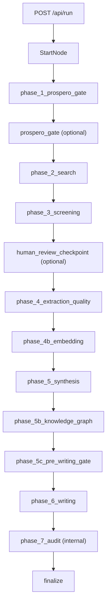

# Architecture

## Purpose

Automate systematic reviews from research question to submission artifacts with deterministic evidence, reproducible persistence, and auditable LLM usage.

## Runtime planes

- **API and orchestration:** `src/web/app.py`, `src/web/routers/`, `src/orchestration/workflow.py`, `src/orchestration/resume.py`
- **Data plane:** per-run `runtime.db` (`src/db/schema.sql`)
- **Control plane:** `runs/workflows_registry.db` (`src/db/workflow_registry.py`)
- **Frontend:** `frontend/src/` with typed API in `frontend/src/lib/api.ts`
- **Artifacts:** run outputs under `runs/YYYY-MM-DD/...`

## Invariants

- Fix behavior in `src/` and `frontend/src/`, never by editing `runs/` artifacts.
- Typed models at phase boundaries (`src/models/`).
- No LLM-computed statistics when deterministic code exists.
- LLM calls logged in `cost_records` with model and token accounting.
- Model IDs from `config/settings.yaml`, not hardcoded in source.

## Canonical paths

| Concern | Path |
|---------|------|
| Runtime graph | `src/orchestration/workflow.py` (`RUN_GRAPH`) |
| Phase order | `src/orchestration/phase_catalog.py` (`PHASE_ORDER`) |
| Typed contracts | `src/models/` |
| DB schema | `src/db/schema.sql` |
| Registry | `src/db/workflow_registry.py` |
| Stats truth | `src/db/source_of_truth.py`, `src/db/stats.py` |
| API routers | `system`, `config`, `run_lifecycle`, `history`, `database_explorer`, `costs`, `validation`, `artifacts`, `screening_review`, `advanced`, `prospero_gate`, `workflow_draft` |
| Frontend API | `frontend/src/lib/api.ts` |
| Frontend phases | `frontend/src/lib/constants.ts` |

Build phases (1-8) are planning labels. Runtime checkpoints use `phase_catalog.py` keys. Do not mix the two naming systems.

---

## Pipeline

### Agent lifecycle stages

Think → Plan → Build → Review → Test → Ship (route via `docs/CONTEXT.md`).

### Runtime checkpoint order

`PHASE_ORDER` in `src/orchestration/phase_catalog.py`:

1. `phase_1_prospero_gate`
2. `phase_2_search`
3. `phase_3_screening`
4. `phase_4_extraction_quality`
5. `phase_4b_embedding`
6. `phase_5_synthesis`
7. `phase_5b_knowledge_graph`
8. `phase_5c_pre_writing_gate`
9. `phase_6_writing`
10. `phase_7_audit` (internal; not user-resumable)
11. `finalize`

`phase_7_audit` stays in `PHASE_ORDER` but is excluded from `USER_RESUMABLE_PHASE_ORDER` and frontend resume controls.

### Runtime map

### Checkpoint taxonomy

- **Canonical order:** `phase_catalog.py` (`PHASE_ORDER`)
- **User-resumable:** `USER_RESUMABLE_PHASE_ORDER`
- **Frontend resume:** `RESUME_PHASE_ORDER` in `constants.ts` (must match backend)
- **Frontend display:** `PHASE_ORDER` (may include UI-only stages like `fulltext_pdf_retrieval`)
- **Rewind:** `WorkflowRepository.rollback_phase_data`

### Human gates

| Status | Trigger | Resume |
|--------|---------|--------|
| `awaiting_review` | Screening HITL | `POST /api/run/{run_id}/approve-screening` + resume |
| `awaiting_prospero` | PROSPERO gate | `POST /api/run/{run_id}/submit-prospero` |

Web mode parks via `End(WorkflowRunResult)`; CLI may poll or exit.

---

## Persistence

### Databases

- **Runtime DB:** `runs/.../runtime.db` (schema: `src/db/schema.sql`)
- **Registry:** `runs/workflows_registry.db` (`src/db/workflow_registry.py`)

### Table families (runtime)

Search/corpus, screening, extraction/cohort, synthesis/graph, writing/manuscript, control plane (`workflow_steps`, `checkpoints`, `event_log`), validation/audit, `cost_records`.

### Truth rules

- **Included studies:** `study_cohort_membership` with `synthesis_eligibility='included_primary'`
- **Costs:** `cost_records`
- **Registry:** use `db_path` from registry rows; do not guess paths

### Resume and rewind

Checkpoints via `src/orchestration/resume.py`. Rewind clears downstream artifacts, step journals, and recovery policies through `rollback_phase_data`.

---

## LLM and costs

### Configuration

All model IDs in `config/settings.yaml`. Use `complete_validated()` for structured LLM output.

### Cost surfaces

- Per-run: `/api/db/{run_id}/costs`, `.../aggregates`, `.../export`
- Global: `/api/history/costs/aggregates`, `.../export`

Filters use `cost_records.created_at`.

### Screening funnel (cost control)

1. BM25 rank
2. `max_llm_screen` cap
3. `batch_screen_*` pre-rank
4. Dual-reviewer screening (`reviewer_batch_size`)

Default recall-first profile in `config/settings.yaml`: `max_llm_screen: 200`, `batch_screen_threshold: 0.30`, `reviewer_batch_size: 10`. Raise threshold only after replay validation.
