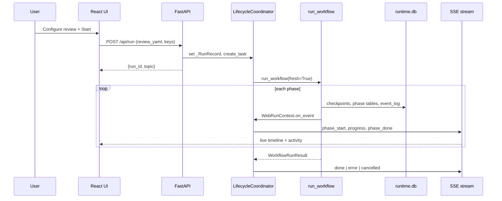

# System Diagram (End-to-End)

Developer-deep map of the Literature Review Assistant: entry points, orchestration graph, phase runners, LLM/sub-agent patterns, external connectors, persistence, and delivery channels.

For runtime contracts and checkpoint taxonomy, see [ARCHITECTURE.md](./ARCHITECTURE.md). For HTTP surface, see [API.md](./API.md).

---

## Layered overview (orchestration + delivery)

Two planes, modeled after a multi-agent orchestration diagram:

1. **Orchestration and reasoning** - how user intent becomes phased work, delegated LLM agents, and external API calls.
2. **Persistence and delivery** - how durable state, filesystem artifacts, and UI/download channels expose results.

```mermaid
flowchart TB
    subgraph entry ["Entry and control plane"]
        direction TB
        user["User / Researcher"]
        ui["React UI<br/>frontend/src/App.tsx<br/>SetupView → RunView"]
        cli["CLI<br/>src/main.py<br/>run | resume | export"]
        pm2["PM2<br/>litreview-api :8001<br/>litreview-ui :5173"]
        reviewYaml["review.yaml<br/>ReviewConfig<br/>PICO, keywords, databases"]
        settingsYaml["settings.yaml<br/>SettingsConfig<br/>agent models, RPM tiers"]
        registry["workflows_registry.db<br/>src/db/workflow_registry.py<br/>workflow_id → db_path"]
        user --> ui
        user --> cli
        pm2 --> ui
        pm2 --> api
        ui -->|"POST /api/run<br/>POST /api/history/resume"| api
        cli -->|"run_workflow_sync<br/>or API resume"| orch
        reviewYaml --> api
        settingsYaml --> api
        api["FastAPI<br/>src/web/app.py<br/>run_lifecycle + history routers"]
        api --> coord
        coord["RunLifecycleCoordinator<br/>src/web/lifecycle_coordinator.py<br/>asyncio task + SSE event_log"]
        coord --> orch
        registry -.->|"resolve db_path"| coord
    end

    subgraph orch ["Orchestration and multi-agent reasoning"]
        direction TB
        orch --> graph
        graph["PydanticAI RUN_GRAPH<br/>src/orchestration/workflow.py<br/>ReviewState → WorkflowRunResult"]
        graph --> nodes
        nodes["Graph nodes<br/>src/orchestration/nodes/*<br/>thin routing only"]
        nodes --> runners
        runners["Phase runners<br/>src/orchestration/runners/*<br/>IO, gates, persistence"]
        runners --> llm
        runners --> tools
        llm["LLM layer<br/>src/llm/pydantic_client.py<br/>PydanticAIClient + RateLimiter<br/>config/settings.yaml agents"]
        llm --> providers["Providers<br/>Google / Anthropic / OpenAI / Groq / OpenRouter"]
        llm --> cost["cost_records<br/>LLMProvider.log_cost"]
        runners --> subagents
        subagents["Sub-agent patterns (phase-local)"]
        subagents --> dual["DualReviewerScreener<br/>src/screening/dual_screener.py<br/>reviewer A + B + adjudicator"]
        subagents --> ratchet["Writing ratchet<br/>src/writing/orchestration.py<br/>outline + section rewrite loop"]
        subagents --> audit["Manuscript audit<br/>src/manuscript/reviewer.py<br/>multi-pass LLM profiles"]
        tools["Tools and connectors"]
        tools --> searchConn["Search connectors<br/>src/search/* + build_connectors()"]
        tools --> pdf["PDF / fulltext<br/>src/fulltext/retrieval.py<br/>fetch_full_text tiers A/B/C"]
        tools --> webTools["Web tools (pre-run)<br/>src/llm/factory.py<br/>WebSearchTool + WebFetchTool"]
        searchConn --> extApis
        pdf --> extApis
        extApis["External APIs<br/>OpenAlex, PubMed, arXiv, IEEE,<br/>Semantic Scholar, Crossref, Scopus,<br/>Embase, WoS, Europe PMC, CORE,<br/>DBLP, ClinicalTrials, Perplexity Search,<br/>Unpaywall, PMC, Elsevier"]
        runners --> control
        control["Control plane (runtime.db)<br/>checkpoints | event_log<br/>workflow_steps | recovery_policies<br/>writing_manifests | gate_results"]
        runners --> hitl
        hitl["Human gates (park → resume)"]
        hitl --> prosperoGate["awaiting_prospero<br/>POST submit-prospero"]
        hitl --> screeningGate["awaiting_review<br/>POST approve-screening"]
    end

    subgraph delivery ["Persistence and delivery"]
        direction TB
        runners --> runtimeDb
        runtimeDb["runtime.db per run<br/>src/db/schema.sql<br/>papers → screening → extraction →<br/>synthesis → manuscript → audit"]
        runners --> artifacts
        artifacts["Filesystem artifacts<br/>runs/YYYY-MM-DD/wf-*/run_*/<br/>doc_*, fig_*, data_*, papers/"]
        artifacts --> summary
        summary["run_summary.json<br/>artifact index + counts"]
        runtimeDb --> finalize
        artifacts --> finalize
        finalize["FinalizeNode<br/>finalize_runner.py<br/>refresh TeX/Bib + package_submission"]
        finalize --> submission
        submission["submission/<br/>manuscript.tex|pdf|docx<br/>references.bib, figures/<br/>supplementary/*.csv"]
        submission --> channels
        summary --> channels
        channels["Delivery channels"]
        channels --> sse["SSE live stream<br/>GET /api/stream/{run_id}"]
        channels --> resultsUi["ResultsView<br/>ManuscriptViewer, ArtifactFileList"]
        channels --> downloads["Downloads<br/>/api/download, submission.zip,<br/>manuscript.docx, studies-files.zip"]
        channels --> diag["Diagnostics<br/>/api/run/{id}/diagnostics<br/>readiness, costs, validation"]
    end

    orch ~~~ delivery
```

---

## Runtime phase pipeline

Canonical order from `src/orchestration/phase_catalog.py` (`PHASE_ORDER`). UI timeline inserts `fulltext_pdf_retrieval` between screening and extraction; backend checkpoint is `phase_3b_fulltext`.

```mermaid
flowchart LR
    start["StartNode<br/>start_runner.py"] --> p1
    p1["phase_1_prospero_gate<br/>prospero_gate_runner<br/>protocol + PROSPERO park"]
    p1 --> p2["phase_2_search<br/>search_runner<br/>connectors + dedup"]
    p2 --> p3["phase_3_screening<br/>screening_runner<br/>dual LLM + keyword/BM25"]
    p3 --> p3b["phase_3b_fulltext<br/>PDFRetriever"]
    p3b --> hitl{"HITL enabled?"}
    hitl -->|yes| hr["HumanReviewCheckpoint<br/>awaiting_review"]
    hitl -->|no| p4
    hr -->|approve + resume| p4
    p4["phase_4_extraction_quality<br/>extraction_runner<br/>extract + RoB/GRADE"]
    p4 --> p4b["phase_4b_embedding<br/>EmbeddingNode<br/>paper_chunks_meta"]
    p4b --> p5["phase_5_synthesis<br/>synthesis_runner<br/>statsmodels + narrative"]
    p5 --> p5b["phase_5b_knowledge_graph<br/>KnowledgeGraphNode"]
    p5b --> p5c["phase_5c_pre_writing_gate<br/>bounded rewind"]
    p5c -->|not ready| rewind["rewind to 4/4b/5/5b"]
    rewind --> p4
    p5c -->|ready| p6
    p6["phase_6_writing<br/>writing_runner<br/>HyDE → outline → sections"]
    p6 --> p7["phase_7_audit<br/>audit_runner<br/>contracts + LLM audit"]
    p7 --> fin["finalize<br/>finalize_runner<br/>IEEE pack + registry completed"]
    fin --> endNode["End(WorkflowRunResult)"]

    p1 -.->|park| prosperoPark["End awaiting_prospero"]
    prosperoPark -.->|submit + resume| p2
```



### Phase 6 writing sub-checkpoints

| Sub-checkpoint | Module focus |
|----------------|--------------|
| `phase_6a_hyde` | `src/rag/hyde.py` |
| `phase_6a2_outline` | `src/writing/outline_generator.py` |
| `phase_6b_phase_a` | `src/writing/section_writer.py` (Phase A sections) |
| `phase_6c_phase_b` | `src/writing/section_writer.py` (Phase B sections) |
| `phase_6d_assembly` | `src/writing/renderers.py`, manuscript assembly |
| `phase_6e_concepts` | concept diagram generation |
| `phase_6f_custom_diagrams` | custom diagram generation |

---

## Node → runner → domain map

| Graph node | Runner | Primary domain modules |
|------------|--------|------------------------|
| `StartNode` | `start_runner.run_start_node` | registry, run dir, `config_snapshot.yaml` |
| `ResumeStartNode` | `start_runner.resolve_resume_next_phase` | registry status routing |
| `ProsperoGateNode` | `prospero_gate_runner` | `src/protocol/generator.py` |
| `SearchNode` | `search_runner` | `src/search/strategy.py`, connectors, dedup |
| `ScreeningNode` | `screening_runner` | `dual_screener`, `pdf_retrieval`, keyword/BM25 |
| `HumanReviewCheckpointNode` | `hitl_runner` | registry `awaiting_review` |
| `ExtractionQualityNode` | `extraction_runner` | `src/extraction/`, `src/quality/` |
| `EmbeddingNode` | inline in `embedding_node.py` | `src/rag/chunker.py`, `embedder.py` |
| `SynthesisNode` | `synthesis_runner` | `src/synthesis/*`, forest/funnel viz |
| `KnowledgeGraphNode` | inline in `knowledge_graph_node.py` | `src/knowledge_graph/*` |
| `PreWritingGateNode` | `pre_writing_gate_runner` | `helpers/pre_writing_gate.py` |
| `WritingNode` | `writing_runner` | `src/writing/*`, `runners/writing/*` |
| `ManuscriptAuditNode` | `audit_runner` | `src/manuscript/contracts.py`, `reviewer.py` |
| `FinalizeNode` | `finalize_runner` | `src/export/submission_packager.py` |

---

## Search connectors and external APIs

Built by `build_connectors()` in `src/orchestration/helpers/search_connectors.py`.

| Config key | Class | External API |
|------------|-------|----------------|
| `openalex` | `OpenAlexConnector` | `api.openalex.org` |
| `pubmed` | `PubMedConnector` | NCBI Entrez (Biopython) |
| `arxiv` | `ArxivConnector` | arXiv API |
| `ieee_xplore` | `IEEEXploreConnector` | IEEE Xplore API |
| `semantic_scholar` | `SemanticScholarConnector` | Semantic Scholar Graph API |
| `crossref` | `CrossrefConnector` | Crossref REST |
| `perplexity_search` | `PerplexitySearchConnector` | Perplexity Search API |
| `scopus` | `ScopusConnector` | Elsevier Scopus API + session gateway |
| `embase` | `EmbaseConnector` | Elsevier Embase API |
| `web_of_science` | `WebOfScienceConnector` | Clarivate WoS Starter API |
| `clinicaltrials` | `ClinicalTrialsConnector` | ClinicalTrials.gov API v2 |
| `dblp` | `DblpConnector` | DBLP search API |
| `core` | `CoreConnector` | CORE API v3 |
| `europepmc` | `EuropePmcConnector` | Europe PMC REST |

Fulltext retrieval (`src/fulltext/retrieval.py`) races Unpaywall, publisher PDFs, arXiv, S2, PMC, CORE, OpenAlex content, Europe PMC, and Elsevier ScienceDirect tiers.

---

## LLM vs deterministic by phase

| Phase | LLM | Deterministic |
|-------|-----|-----------------|
| prospero gate | - | registration gate |
| search | - | connectors, dedup, CSV import |
| screening | dual reviewers, batch ranker, adjudicator | keyword/BM25 prefilter, heuristics |
| extraction | extraction, classification, RoB/GRADE prompts | cohort rules, gate checks |
| embedding | embedding API | chunking |
| synthesis | optional narrative direction | `statsmodels` pooling, forest/funnel |
| knowledge graph | - | graph build, Louvain, gap detection |
| pre-writing gate | - | prerequisite validation, rewind policy |
| writing | HyDE, outline, sections, humanizer | `evidence_assembler`, contracts, grounding |
| audit | `run_manuscript_audit` profiles | `run_manuscript_contracts`, readiness |
| finalize | - | LaTeX pack, CSV supplements, registry |

Every orchestration LLM call logs to `cost_records` via `LLMProvider.log_cost()` (except pre-run `config_generator.py`).

---

## Phase → DB → artifacts → UI

| Phase | Key DB tables | Key filesystem artifacts | UI surface |
|-------|---------------|--------------------------|------------|
| start | `workflows` | `config_snapshot.yaml` | Config tab |
| prospero | `checkpoints` | `doc_prospero_registration.*` | Prospero gate |
| search | `papers`, `search_results` | `doc_protocol.md`, search appendix | Files |
| screening | `screening_*`, `study_cohort_membership` | `papers/*.pdf`, manifest | Screening, References |
| extraction | `extraction_records`, `rob_*`, `grade_*` | RoB figures | Quality |
| embedding | `paper_chunks_meta` | - | diagnostics |
| synthesis | `synthesis_results` | forest/funnel PNG, narrative JSON | Figures |
| knowledge graph | `paper_relationships`, `research_gaps` | evidence network PNG | Evidence network |
| pre-writing | `validation_*`, `gate_results` | - | readiness |
| writing | `manuscript_*`, `section_*`, `writing_manifests` | `doc_manuscript.md`, PRISMA/diagram figs | ManuscriptViewer |
| audit | `manuscript_audit_*` | `run_summary.json` update | readiness audit |
| finalize | assemblies, `completed` status | `submission/*`, final summary | Export, ZIP/DOCX |

**Canonical truth:** included studies = `study_cohort_membership.synthesis_eligibility='included_primary'`; costs = `cost_records`; registry `db_path` resolves runtime DB location.

---

## Request flow (web path)



---

## File path index (diagram labels)

```
src/orchestration/workflow.py          RUN_GRAPH, run_workflow*, run_workflow_resume
src/orchestration/phase_catalog.py     PHASE_ORDER, rollback_cascade_for
src/orchestration/resume.py            load_resume_state, validate_resume_allowed
src/orchestration/nodes/               graph nodes (thin)
src/orchestration/runners/             phase runners (fat)
src/web/app.py                         FastAPI app + router mount
src/web/lifecycle_coordinator.py       RunLifecycleCoordinator
src/web/state.py                       _run_wrapper, _resume_wrapper, WebRunContext
src/web/routers/run_lifecycle.py       POST /api/run, SSE streams
src/web/routers/history.py             resume, attach, archive
src/db/schema.sql                      runtime schema
src/db/workflow_registry.py            workflows_registry.db
src/db/source_of_truth.py              canonical count precedence
src/llm/pydantic_client.py             PydanticAIClient
src/llm/provider.py                    LLMProvider, log_cost
src/search/                            database connectors
src/fulltext/retrieval.py              tiered PDF/fulltext fetch
src/screening/dual_screener.py         dual-reviewer screening
src/writing/orchestration.py           section ratchet loop
src/manuscript/contracts.py            deterministic manuscript contracts
src/manuscript/reviewer.py             LLM audit orchestration
src/export/submission_packager.py      package_submission
frontend/src/App.tsx                   SetupView / RunView shell
frontend/src/lib/api/                  typed HTTP client
frontend/src/lib/constants.ts          PHASE_ORDER, RESUME_PHASE_ORDER
src/main.py                            CLI entry
```
