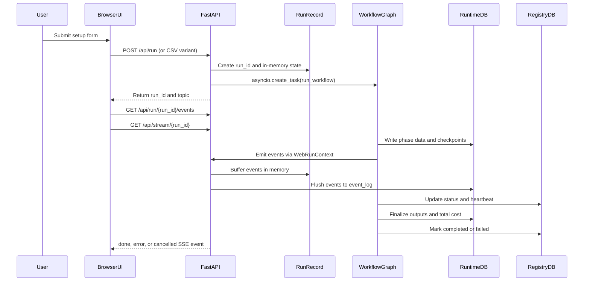
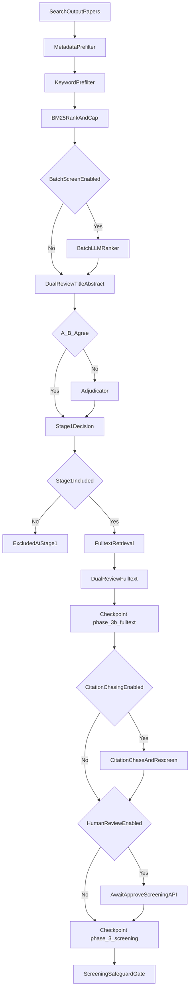
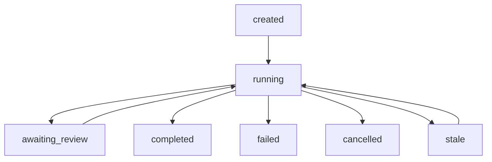

# LitReview -- Unified System Specification

**Version:** 1.1
**Date:** March 2026
**Owner:** Parth Chandak
**Purpose:** Single living recipe for building and maintaining the LitReview systematic review automation system. Covers architecture, technology decisions, data flow, phase design, and operating procedures. This document is the sole source of truth -- read it before writing any code.

---

## 1. Product Purpose and Strategic Context

### 1.1 What It Is

LitReview is a local-first AI agent that automates systematic literature reviews from a research question to an IEEE-submission-ready manuscript package. It runs entirely on the researcher's machine. No cloud service, no multi-tenancy, no account required.

The system has two interfaces that are fully independent:
- A CLI (`uv run python -m src.main`) for headless pipeline execution
- A local web dashboard (FastAPI + React) for interactive runs, live log streaming, and DB exploration

Adding or removing the frontend does not affect the backend pipeline.

### 1.2 Why It Exists

The primary goal is to publish 3-4 systematic review papers per year in IEEE journals (IEEE Access, IEEE CG&A, IEEE Transactions on Human-Machine Systems) to support an EB-1A extraordinary ability visa petition. Speed to first publication is the number-one priority.

The tool must produce manuscripts that pass peer review without requiring the user to manually execute any systematic review methodology step.

---

## 2. System Architecture

Section 2 is the one-stop architecture map for runtime behavior, persistence, state transitions, and frontend/API interaction. Sections 6, 8, 9, and 10 provide deeper implementation details that must remain consistent with this section.

### 2.1 Architecture Planes

The system has three runtime layers and three persistence planes.

```mermaid
flowchart TD
    browserLayer["Browser Layer (React/Vite)"] --> apiLayer["FastAPI Runtime Layer (`src/web/app.py`)"]
    apiLayer --> graphLayer["Workflow Graph Layer (`src/orchestration/workflow.py`)"]
    graphLayer --> runtimeDb["Per-run `runtime.db` (data plane)"]
    apiLayer --> registryDb["`workflows_registry.db` (control plane)"]
    graphLayer --> artifactPlane["Run directory artifacts (artifact plane)"]
```

Persistence plane responsibilities:
- Control plane (`runs/workflows_registry.db`): workflow allocation, run discovery, heartbeat, status, resume routing.
- Data plane (`runs/.../runtime.db`): phase outputs, checkpoints, events, cost records, manuscript and RAG state.
- Artifact plane (`runs/.../run_*/`): files such as `doc_manuscript.md`, `doc_manuscript.tex`, `references.bib`, figures, and `run_summary.json`.

### 2.2 Runtime Lifecycle Sequence

This sequence is the canonical start-to-finish flow in web mode.



### 2.3 Workflow Graph (Top-Level Nodes)

The pipeline uses PydanticAI Graph `BaseNode` nodes.

```
StartNode / ResumeStartNode
    |
    v
SearchNode                    (phase_2_search)
    |
    v
ScreeningNode                 (phase_3_screening)
    |
    v
HumanReviewCheckpointNode     (optional; waits for /api/run/{run_id}/approve-screening)
    |
    v
ExtractionQualityNode         (phase_4_extraction_quality)
    |
    v
EmbeddingNode                 (phase_4b_embedding)
    |
    v
SynthesisNode                 (phase_5_synthesis)
    |
    v
KnowledgeGraphNode            (phase_5b_knowledge_graph)
    |
    v
WritingNode                   (phase_6_writing)
    |
    v
FinalizeNode                  (finalize)
    |
    v
End
```

Resume order is driven by `checkpoints` phase keys:
`phase_2_search`, `phase_3_screening`, `phase_4_extraction_quality`, `phase_4b_embedding`, `phase_5_synthesis`, `phase_5b_knowledge_graph`, `phase_6_writing`, `finalize`.
`phase_3b_fulltext` is a screening sub-phase marker and not part of top-level order.

### 2.4 Phase/Subphase Execution Contract

The table below is the high-level contract from node entry to persisted outputs.

| Top-Level Phase | Key Subphases | Main Writes |
|-----------------|---------------|-------------|
| Start | Run path creation, config snapshot, artifact path registration | `config_snapshot.yaml`, initial state artifacts |
| Search | Connector search or master-list bypass, dedup, supplementary merge, search gate | `papers`, `search_results`, `gate_results(search_volume)`, `checkpoints(phase_2_search)` |
| Screening | Metadata prefilter, keyword/BM25 gate, optional batch pre-ranker, dual reviewer/adjudicator, fulltext stage, optional citation chase, screening gate | `screening_decisions`, `dual_screening_results`, `screening_metrics`, `gate_results(screening_safeguard)`, `checkpoints(phase_3b_fulltext, phase_3_screening)` |
| Human checkpoint | Optional status transition to `awaiting_review` and approval resume | registry status transitions, optional screening override writes |
| Extraction/Quality | Fulltext retrieval, study classification, extraction, table extraction merge, RoB/CASP/MMAT routing, GRADE aggregation, extraction gate | `extraction_records`, `rob_assessments`, `casp_assessments`, `mmat_assessments`, `grade_assessments`, `gate_results(extraction_completeness)`, `checkpoints(phase_4_extraction_quality)` |
| Embedding | Chunking and embedding persistence | `paper_chunks_meta`, `cost_records`, `checkpoints(phase_4b_embedding)` |
| Synthesis | Feasibility, narrative synthesis, optional meta-analysis and sensitivity | `synthesis_results`, figure artifacts, `checkpoints(phase_5_synthesis)` |
| Knowledge graph | Relationship graph, communities, gap detection | `paper_relationships`, `graph_communities`, `research_gaps`, `checkpoints(phase_5b_knowledge_graph)` |
| Writing | Grounding build, HyDE + RAG retrieval, section writing/humanizer, citation repair, persistence invariants | `section_drafts`, `citations`, `claims`, `evidence_links`, `manuscript_*`, `rag_retrieval_diagnostics`, `checkpoints(phase_6_*)` |
| Finalize | Manuscript export artifacts, package pre-population, summary finalization | `doc_manuscript.tex`, `references.bib`, `submission/*`, `run_summary.json`, final workflow status |

### 2.5 Screening Internals (Expanded)

The screening stage has multiple deterministic and LLM branches; this is the canonical shape.



Important branch notes:
- `BatchLLMRanker` runs after deterministic prefilters and before dual-review.
- Citation chasing is an optional post-fulltext branch that screens newly discovered candidates; it is not a full graph restart.
- Human review checkpoint is a runtime status gate (`awaiting_review`) and resumes on approval API call.
- Keyword prefilter has an adaptive fail-open path when exclusion ratio is extreme; this prevents brittle over-filtering.
- Confidence fast-path can skip adjudication when both reviewers strongly agree; disagreements or low-confidence cases route to adjudicator.
- If fulltext is unavailable and `skip_fulltext_if_no_pdf` is enabled, the no-PDF heuristic can exclude before full stage completion.
- On resume, `phase_3b_fulltext` checkpoints allow skipping already completed expensive fulltext loops.

### 2.6 Storage Contracts and Source of Truth

Canonical storage model:
- `workflows_registry.db` is the authoritative workflow lookup and lifecycle store.
- Per-run `runtime.db` is the authoritative phase output store.
- `run_summary.json` is the artifact index consumed by artifact endpoints.

Canonical read precedence for run stats is defined in `src/db/source_of_truth.py` and applied in the API layer:
- Included-paper stats: `dual_screening_results` first, event-derived fallback second, extraction fallback third.
- Cost stats: `SUM(cost_usd)` from `cost_records` only.
- Manuscript reads: DB `manuscript_assemblies` first, file fallback second.

### 2.7 Runtime State, Replay, and Resume

Two run identifiers exist and must not be conflated:
- `run_id`: API stream/session key for active in-memory run state.
- `workflow_id`: durable run identity across restarts and history attach/resume.

Replay model:
- In-memory: `_RunRecord.event_log` for immediate replay (`GET /api/run/{run_id}/events`).
- Durable: `event_log` table in `runtime.db` (`GET /api/workflow/{workflow_id}/events` fallback).
- Streaming: `GET /api/stream/{run_id}` with heartbeats and terminal events.

Resume model:
- `ResumeStartNode` and `load_resume_state()` read `checkpoints`.
- Routing jumps to first incomplete top-level phase.
- Phase-local resume logic skips already persisted paper-level work where possible.

### 2.8 API to Frontend Consumption Map

This map links runtime API surfaces to frontend consumers.

| API Surface | Primary Frontend Consumer |
|-------------|---------------------------|
| `/api/run*`, `/api/cancel/{run_id}` | `frontend/src/App.tsx`, `frontend/src/views/SetupView.tsx` |
| `/api/stream/{run_id}`, `/api/run/{run_id}/events`, `/api/workflow/{workflow_id}/events` | `frontend/src/hooks/useSSEStream.ts`, `frontend/src/views/RunView.tsx`, `frontend/src/views/ActivityView.tsx` |
| `/api/history*`, `/api/notes/*` | `frontend/src/components/Sidebar.tsx`, `frontend/src/App.tsx` |
| `/api/db/{run_id}/*` | `frontend/src/views/DatabaseView.tsx`, `frontend/src/views/CostView.tsx` |
| `/api/run/{run_id}/artifacts`, `/api/run/{run_id}/export`, `/api/download`, `/api/run/{run_id}/submission.zip`, `/api/run/{run_id}/manuscript.docx` | `frontend/src/views/ResultsView.tsx` |
| `/api/run/{run_id}/papers-reference`, `/api/run/{run_id}/papers/{paper_id}/file`, `/api/run/{run_id}/fetch-pdfs` | `frontend/src/views/ReferencesView.tsx` |
| `/api/run/{run_id}/screening-summary`, `/api/run/{run_id}/approve-screening` | `frontend/src/views/ScreeningReviewView.tsx` |

### 2.9 Gate and Failure Semantics

Gate outcomes are persisted in `gate_results` and can stop execution depending on profile:
- `search_volume`
- `screening_safeguard`
- `extraction_completeness`
- `citation_lineage`
- `cost_budget`
- `resume_integrity`

Failure behavior summary:
- In strict gate mode, failing hard gates ends the workflow before downstream phases.
- In warning mode, pipeline can continue with explicit warning events and summaries.
- Writing has additional persistence invariants; when violated, partial checkpoints are saved and run fails fast.

### 2.10 End-to-End Operational Scenarios

This table closes the end-to-end gap between pipeline internals and runtime operations the user actually performs.

| Scenario | Entry Surface | Core Flow | Terminal Outcome |
|----------|---------------|-----------|------------------|
| New run (AI search) | `POST /api/run` | Start -> Search connectors -> Screening -> Extraction -> Embedding -> Synthesis -> Knowledge graph -> Writing -> Finalize | `done` or `error` |
| New run (master list only) | `POST /api/run-with-masterlist` | Start -> master-list parse bypasses connector search -> Screening onward | `done` or `error` |
| New run (search + supplementary CSV) | `POST /api/run-with-supplementary-csv` | Start -> connector search + supplementary merge -> dedup -> Screening onward | `done` or `error` |
| Human checkpoint approval | `POST /api/run/{run_id}/approve-screening` | Screening pauses in `awaiting_review` -> approval resumes from checkpoint -> downstream phases continue | `running` then terminal event |
| Attach historical run | `POST /api/history/attach` | Bind historical `runtime.db` to a new `run_id` session -> replay events and expose DB views | historical read-only session active |
| Resume historical workflow | `POST /api/history/resume` | Resolve `workflow_id` -> load checkpoints -> `ResumeStartNode` routes to first incomplete phase | resumed `running` then terminal event |
| Living refresh | `POST /api/run/{run_id}/living-refresh` | Create incremental rerun from last search date -> standard pipeline path with updated search scope | new run with terminal event |
| User cancellation | `POST /api/cancel/{run_id}` | Cancellation flag propagates through loop boundaries -> graceful stop and checkpoint where supported | `cancelled` |
| Export packaging | `POST /api/run/{run_id}/export` | Use finalized artifacts and regenerate package if needed -> expose zip/docx download endpoints | export metadata and downloadable files |
| CLI run/resume path | `uv run python -m src.main ...` | Same graph nodes and checkpoint semantics without browser SSE transport | CLI completion or failure |

### 2.11 Runtime Status and Transition Model

The workflow lifecycle is status-driven across registry, in-memory run state, SSE stream, and checkpoints.



Status semantics:
- `running`: active task and heartbeat updates.
- `awaiting_review`: paused on human checkpoint; no downstream phase progression until approval.
- `completed`: finalize finished and artifact summary available.
- `failed`: terminal error path (including strict gate failures and invariant failures).
- `cancelled`: user-initiated stop.
- `stale`: registry-level recovery state when heartbeat expires; can transition back to running on successful resume/reattach.

### 2.12 Directory Layout

```
literature-review-assistant/
|-- pyproject.toml                  # uv-managed; Python 3.11+
|-- spec.md                         # THIS FILE -- single source of truth (replaces docs/research-agent-v2-spec.md + docs/frontend-spec.md)
|-- Procfile.dev                    # Overmind: api + ui processes
|-- bin/dev                         # ./bin/dev starts both processes
|-- config/
|   |-- review.yaml                 # Per-review research config (change every review)
|   `-- settings.yaml               # System behavior config (change rarely)
|-- frontend/                       # React/Vite/TypeScript web UI
|   |-- vite.config.ts              # @ alias, /api proxy to :8001 (PORT env var, default 8001)
|   `-- src/
|       |-- App.tsx                 # Root: sidebar + lazy view router
|       |-- lib/api.ts              # All typed fetch wrappers + SSE types
|       |-- hooks/                  # useSSEStream, useCostStats, useBackendHealth
|       |-- components/             # Sidebar, LogStream, ResultsPanel
|       `-- views/                  # SetupView, RunView, ActivityView, CostView, DatabaseView, ResultsView, ScreeningReviewView, ReferencesView (tab 6); history UX lives in Sidebar.tsx, not a separate view
|-- src/
|   |-- main.py                     # CLI entry point (run, resume, export, validate, status)
|   |-- models/                     # ALL Pydantic data contracts
|   |-- db/                         # SQLite schema, connection manager, repositories, registry
|   |-- orchestration/              # workflow.py, context.py, state.py, resume.py, gates.py
|   |-- search/                     # base.py (SearchConnector protocol), 12 connectors (scopus, web_of_science, openalex, pubmed, semantic_scholar, ieee_xplore, arxiv, crossref, perplexity_search, clinicaltrials, csv_import, embase), dedup, strategy, pdf_retrieval
|   |-- screening/                  # dual_screener, keyword_filter, prompts.py, reliability, gemini_client
|   |-- extraction/                 # extractor, study_classifier
|   |-- quality/                    # rob2, robins_i, casp, grade, study_router
|   |-- synthesis/                  # feasibility, meta_analysis, effect_size, narrative
|   |-- rag/                        # chunker, embedder (PydanticAI), hybrid retriever (BM25+dense RRF), hyde (HyDE query expansion), reranker (Gemini listwise)
|   |-- writing/                    # section_writer, humanizer, humanizer_guardrails, prompts/ (dir), context_builder, orchestration, citation_grounding, contradiction_resolver
|   |-- citation/                   # ledger (claim -> evidence -> citation)
|   |-- protocol/                   # PROSPERO-format protocol generator
|   |-- prisma/                     # PRISMA 2020 flow diagram
|   |-- visualization/              # forest_plot, funnel_plot, rob_figure, timeline, geographic
|   |-- export/                     # ieee_latex, bibtex_builder, submission_packager, prisma_checklist, ieee_validator
|   |-- llm/                        # provider, pydantic_client, base_client, rate_limiter, model_fallback
|   |-- web/                        # FastAPI app (40+ endpoints, SSE, static serving)
|   `-- utils/                      # structured_log, logging_paths (RunPaths + create_run_paths), ssl_context
|-- tests/
|   |-- unit/                       # unit test suite (run `uv run pytest tests/unit -q`)
|   `-- integration/                # integration pipeline test suite
`-- runs/                           # All per-run artifacts + central registry (gitignored)
```

---

## 3. Technology Stack and Decisions

| Layer | Technology | Version | Why This, Not Something Else |
|-------|-----------|---------|------------------------------|
| Language | Python | 3.11+ | Type hints, async/await, mature ecosystem |
| Package manager | uv | latest | Fast; single tool for venv + install + run |
| Orchestration | PydanticAI Graph (BaseNode API) | latest | Built by Pydantic team; typed state, model-agnostic; avoids LangChain ecosystem weight; native Pydantic integration |
| LLM provider | Google Gemini (config-driven 2.5 tiers by default) | 2.5/3.x | 1M token context window; cost-tiered by task volume; free tier sufficient for a single review run |
| Persistence | SQLite via aiosqlite | latest | Single-user local tool; zero deployment; trivially portable; paper-level write durability |
| CLI output | rich | 13+ | Progress bars, tables, status panels |
| Search (primary) | OpenAlex REST API | direct aiohttp | 250M+ works; CC0 licensed; free API key; api_key in URL required since Feb 2026 |
| Search (supplemental) | PubMed Entrez, arXiv, IEEE Xplore, Semantic Scholar, Crossref | various | Recall expansion per domain |
| Search (auxiliary) | Perplexity Search API | latest | Discovery only; tagged OTHER_SOURCE; not primary evidence |
| Meta-analysis | statsmodels combine_effects() | 0.14+ | Deterministic; peer-validated; forest plot built in; avoids custom statistical implementation |
| Effect sizes | scipy.stats + statsmodels | latest | Deterministic; LLMs are NEVER used for statistics |
| Screening ranking | bm25s | 0.2+ | BM25 relevance ranking for LLM screening cap; pure Python, scipy-based; faster than rank-bm25 |
| Author parsing | nameparser | 1.1+ | Surname extraction for display_label; handles "Last, First" and "First Last" formats |
| Title filtering | wordfreq | 3.0+ | Zipf frequency lookup for domain-agnostic title word filtering in display_label |
| Backend API | FastAPI + uvicorn | 0.129+ / 0.40+ | Async; Pydantic-native; SSE via sse-starlette |
| Frontend | React + TypeScript | 19 / 5 | Strict typing; no `any` at API boundaries |
| Build tool | Vite + pnpm | 7 / 10 | Fast HMR in dev; chunk splitting in prod |
| UI components | shadcn/ui + Tailwind CSS | latest / 4 | Copy-owned Radix-based components; utility classes only; no CSS-in-JS |
| Charts | Recharts | latest | Cost bar charts in CostView |
| SSE client | @microsoft/fetch-event-source | latest | Robust SSE with abort controller support |
| Process manager | PM2 | latest | Primary: runs litreview-api + litreview-ui via ecosystem.config.js; Overmind (tmux) is available as alternative via Procfile.dev |

### 3.1 Absolute Rules

These rules apply to every line of code in this project. They are not suggestions.

1. **NO LLM-computed statistics.** Meta-analysis, effect sizes, and heterogeneity stats use scipy/statsmodels deterministic functions only.
2. **NO untyped dictionaries at phase boundaries.** Every function crossing a module boundary accepts and returns Pydantic models from `src/models/`. Internal helpers within a module may use dicts.
3. **ALL I/O is async.** aiosqlite for database, aiohttp for HTTP, asyncio.Semaphore for concurrency control.
4. **ALL LLM calls are logged** with model, tokens in, tokens out, cost USD, and latency ms to the `cost_records` table immediately after each call.
5. **Paper-level persistence.** Write each individual screening decision, extraction record, and quality assessment to SQLite immediately after processing. Never batch writes at phase end. Every processing loop checks for already-processed IDs before starting.
6. **Build in exact phase order.** Do not implement Phase N+1 code before Phase N is approved.
7. **Use `rich`** for all CLI output -- progress bars with completed/total count for long-running phases.
8. **Use exact checkpoint phase key strings** from Section 8.3. Mismatched strings cause silent resume failures.
9. **No Unicode characters** in any file. ASCII 32-126 only. Use YES/NO/PASS/FAIL instead of checkmarks, -> instead of arrows.
10. **Never commit** `.env`, `runs/**`, or other run-specific generated artifacts.

---

## 4. Configuration System

Three-layer configuration following the twelve-factor app principle. Secrets live in `.env`. Per-review research parameters live in `review.yaml`. System behavior parameters live in `settings.yaml`. Infrastructure constants (connector rate limits, API retry counts) live in Python code.

### 4.1 `.env` -- Secrets

Never committed to git. Loaded via python-dotenv at startup before any config access.

```
GEMINI_API_KEY=...              # Required
OPENALEX_API_KEY=...            # Required since Feb 2026 (free at openalex.org)
IEEE_API_KEY=...                # Optional; for IEEE Xplore connector
WOS_API_KEY=...                 # Optional; for Web of Science connector (Clarivate Starter API, 300 req/day free)
SCOPUS_API_KEY=...              # Optional; for Scopus connector (Elsevier Search API)
EMBASE_API_KEY=...              # Optional; for Embase connector (Elsevier institutional)
PUBMED_EMAIL=...                # Required for PubMed Entrez (Biopython)
PUBMED_API_KEY=...              # Optional; raises PubMed rate limit from 3 to 10 req/sec
PERPLEXITY_SEARCH_API_KEY=...   # Optional; for auxiliary discovery connector
SEMANTIC_SCHOLAR_API_KEY=...    # Optional; improves rate limits for Semantic Scholar
PORT=8001                       # Optional; backend port (default 8001 in dev, 8000 in prod)
UI_PORT=5173                    # Optional; Vite dev server port (dev only)
```

The web UI never stores API keys server-side. The user pastes keys into the Setup form; they are posted in the request body to the local FastAPI process. The browser caches them in `localStorage` under `litreview_api_keys` for convenience between sessions.

### 4.2 `config/review.yaml` -- Per-Review Config

Edit this file for each new review. All other files stay the same.

| Field | What It Controls |
|-------|-----------------|
| `research_question` | The driving question; becomes the workflow topic key in the registry |
| `review_type` | systematic / scoping / narrative |
| `pico.*` | population, intervention, comparison, outcome -- injected verbatim into screening prompts |
| `keywords` | Intervention keyword list -- used by the keyword pre-filter and BM25 ranker |
| `inclusion_criteria` | List of criteria strings -- passed to Reviewer A prompt |
| `exclusion_criteria` | List of criteria strings -- passed to Reviewer B prompt |
| `target_databases` | Which connectors to activate for this review |
| `date_range_start` / `date_range_end` | Year bounds applied by all connectors |
| `search_overrides` | Optional per-database Boolean query override; omit a key to use auto-generated |
| `protocol.*` | PROSPERO registration info (PRISMA 2020 requirement) |
| `funding.*` / `conflicts_of_interest` | Disclosure fields for manuscript |
| `domain` | Subject domain string injected into LLM prompts for context |
| `scope` | Scope description string injected into LLM prompts |
| `target_sections` | Optional list of section names to generate (defaults to all 6) |

### 4.3 `config/settings.yaml` -- System Behavior Config

Change rarely. Values are tuned from real runs.

| Section | Key Fields |
|---------|-----------|
| `llm.*` | `flash_rpm`, `flash_lite_rpm`, `pro_rpm` -- free-tier rate limits enforced by rate limiter |
| `agents.*` | Per-agent model string (e.g. `google-gla:gemini-2.5-flash-lite`) and temperature. Changing a model requires only a YAML edit. |
| `screening.*` | `stage1_include_threshold` (0.85), `stage1_exclude_threshold` (0.80), `screening_concurrency` (asyncio.Semaphore), `max_llm_screen` (optional BM25 cap), `skip_fulltext_if_no_pdf`, `pdf_retrieval_concurrency` (20 -- concurrent PDF fetches), `batch_screen_concurrency` (3 -- concurrent batch ranker batches), `reviewer_batch_size` (default 10 -- papers per dual-reviewer LLM call; 0 = per-paper legacy mode) |
| `dual_review.*` | `enabled`, `kappa_warning_threshold` (0.4) |
| `gates.*` | `profile` (strict / warning), `search_volume_minimum` (50), `screening_minimum` (5), `extraction_completeness_threshold` (0.80), `cost_budget_max` (USD) |
| `writing.*` | `humanization`, `humanization_iterations` (2), `checkpoint_per_section`, `llm_timeout` (120s) |
| `risk_of_bias.*` | `rct_tool` (rob2), `non_randomized_tool` (robins_i), `qualitative_tool` (casp) |
| `meta_analysis.*` | `enabled`, `heterogeneity_threshold` (50 = I-squared cutoff for fixed vs random effects), `funnel_plot_minimum_studies` (10), effect measures |
| `ieee_export.*` | `template` (IEEEtran), `max_abstract_words` (250 config ceiling; writing currently enforces 230 via `_trim_abstract_to_limit()`), `target_page_range` ([7, 10]) |
| `citation_lineage.*` | `block_export_on_unresolved` (true), `minimum_evidence_score` (0.5) |
| `search.*` | `max_results_per_db` (global default: 500), `per_database_limits` (per-connector overrides), `citation_chasing_concurrency` (5 -- concurrent S2/OpenAlex chase requests). Note: `citation_chasing_enabled` is a config-model default (false) unless explicitly set in YAML. |
| `extraction.*` | `core_full_text`, `europepmc_full_text`, `semanticscholar_full_text` (toggles for full-text tiers), `sciencedirect_full_text`, `unpaywall_full_text`, `pmc_full_text`, `use_pdf_vision`, `full_text_min_chars` |
| `rag.*` | `embed_model` (gemini-embedding-001), `embed_dim` (768 -- MRL dimension, changing requires re-embedding), `embed_batch_size` (20), `embed_concurrency` (4 -- concurrent embedding batch API calls), `chunk_max_words` (400), `chunk_overlap_sentences` (2), `use_hyde` (true -- HyDE query expansion before dense embed), `hyde_model` (gemini-2.5-flash-lite), `rerank` (true -- Gemini listwise reranking), `reranker_model` (gemini-2.5-flash-lite) |

Both YAML files are validated into Pydantic models at startup via `src/config/loader.py`. Invalid config fails fast with a clear error message.
Runtime model IDs are forbidden in `src/` Python code paths; `config/settings.yaml` is the single source of truth for model selection. CI enforces this via `tests/unit/test_no_runtime_model_literals.py`.

---

## 5. Data Contracts

All phase boundaries use Pydantic models from `src/models/`. The contract layer is the only mechanism that allows phases to be tested, replaced, or resumed in isolation.

### 5.1 Phase Boundary Model Map

| Crossing | Input | Output |
|---------|-------|--------|
| CLI / API -> workflow | `ReviewConfig` + `SettingsConfig` | `ReviewState` |
| Search -> Screening | `CandidatePaper` list (via `SearchResult`) | filtered `CandidatePaper` list |
| Screening -> Extraction | `CandidatePaper` list (included papers) | `DualScreeningResult` per paper |
| Extraction -> Quality | `CandidatePaper` + `ExtractionRecord` | `RoB2Assessment` / `RobinsIAssessment` / `GRADEOutcomeAssessment` |
| Quality -> Synthesis | `ExtractionRecord` list + assessments | `MetaAnalysisResult` list or `NarrativeSynthesis` |
| Synthesis -> Writing | synthesis results + `PRISMACounts` | `SectionDraft` per section |
| Writing -> Export | `SectionDraft` list + `CitationEntryRecord` list | IEEE LaTeX package |
| Any phase -> Gate | phase output values | `GateResult` |

### 5.2 Model Families (src/models/)

| File | Key Models |
|------|-----------|
| `papers.py` | `CandidatePaper`, `SearchResult`, `compute_display_label()` |
| `screening.py` | `ScreeningDecision` (single reviewer), `DualScreeningResult` (both + adjudication) |
| `extraction.py` | `ExtractionRecord` -- study design, participants, intervention, outcomes, effect sizes, source spans |
| `quality.py` | `RoB2Assessment` (5 domains), `RobinsIAssessment` (7 domains), `GRADEOutcomeAssessment` (8 factors) |
| `claims.py` | `ClaimRecord`, `EvidenceLinkRecord`, `CitationEntryRecord` -- 3-tier citation lineage chain |
| `writing.py` | `SectionDraft` -- versioned section with claim and citation ID lists |
| `workflow.py` | `GateResult`, `DecisionLogEntry` |
| `additional.py` | `InterRaterReliability`, `MetaAnalysisResult`, `PRISMACounts`, `ProtocolDocument`, `SummaryOfFindingsRow`, `CostRecord` |
| `config.py` | `ReviewConfig`, `SettingsConfig`, and all sub-configs |
| `enums.py` | All shared enums: `ReviewType`, `ScreeningDecisionType`, `ReviewerType`, `RiskOfBiasJudgment`, `RobinsIJudgment`, `GateStatus`, `ExclusionReason`, `GRADECertainty`, `StudyDesign`, `SourceCategory` |

### 5.3 Phase-Internal Models

These models cross internal function boundaries within a single module but do NOT cross module boundaries. They are defined in their home module, not in `src/models/`, to avoid circular imports.

| Model | Lives In |
|-------|---------|
| `SynthesisFeasibility`, `NarrativeSynthesis` | `src/synthesis/` |
| `StudySummary`, `WritingGroundingData` | `src/writing/` |
| `AgentRuntimeConfig` | `src/llm/provider.py` |

### 5.4 display_label

`CandidatePaper.display_label` is computed once on first DB save via `compute_display_label()` in `src/models/papers.py` and stored in the `papers.display_label` column. All downstream code (RoB figure, BibTeX citekey generation, visualizations) reads this field. Never re-derive it with local heuristics. Priority chain: author surname + year -> first meaningful title word + year -> first 22 chars of title -> `Paper_{paper_id[:6]}`.

Implementation uses two libraries: `nameparser.HumanName(authors[0]).last` for author surname extraction (handles "Last, First" and "First Last" formats robustly), and `wordfreq.zipf_frequency(word, "en")` with a threshold of 3.5 to skip common filler words in title extraction -- replacing the previous ~60-entry hardcoded domain word list with a language-frequency-based filter that requires no topic-specific knowledge.

---

## 6. Pipeline Phases

Eight build phases in strict dependency order. Each phase writes a completion marker to the `checkpoints` table (except FinalizeNode, which uses `run_summary.json`). The canonical phase key strings are fixed -- any mismatch silently breaks resume.

```
Phase 1: Foundation        -> no checkpoint (workflow row serves as marker)
Phase 2: Search            -> checkpoint key: "phase_2_search"
Phase 3: Screening         -> checkpoint key: "phase_3_screening"
Phase 4: Extraction+Quality -> checkpoint key: "phase_4_extraction_quality"
Phase 4b: Embedding        -> checkpoint key: "phase_4b_embedding"
Phase 5: Synthesis         -> checkpoint key: "phase_5_synthesis"
Phase 5b: Knowledge Graph  -> checkpoint key: "phase_5b_knowledge_graph"
Phase 6: Writing           -> checkpoint key: "phase_6_writing"
Finalize                   -> writes run_summary.json + registry status = "completed"
```

### 6.1 Phase 1: Foundation

**What to build:** All Pydantic models in `src/models/`. SQLite database layer (`src/db/`): connection manager with WAL journal mode + NORMAL sync + FK enforcement + 40MB cache + temp in memory. Typed CRUD repositories for every table. Six quality gates. Decision log. Citation ledger. LLM provider with 3-tier model assignment, sliding-window rate limiter, and cost logging. Review config loader.

**Quality gates defined here:**

| Gate | Passes When |
|------|------------|
| `search_volume` | Total deduplicated records >= 50 |
| `screening_safeguard` | Papers passing full-text screening >= 5 |
| `extraction_completeness` | >= 80% fields filled AND < 35% papers with empty core fields |
| `citation_lineage` | Zero unresolved claims at export |
| `cost_budget` | Cumulative LLM cost < `settings.gates.cost_budget_max` |
| `resume_integrity` | All checkpoint data valid on resume |

### 6.2 Phase 2: Search

**What happens:** Connectors run concurrently via asyncio. Each builds a query from `ReviewConfig` (or uses `search_overrides`). Results map to `CandidatePaper` objects. Deduplication uses exact DOI matching plus MinHash LSH candidate generation with fuzzy title confirmation (`thefuzz`) and small-set brute-force fallback. Per-database counts are recorded for the PRISMA diagram. A PROSPERO-format protocol document is generated.

**Connector set (configured by `target_databases` in `config/review.yaml` and runtime overrides):**

| Connector | Protocol | Source Category |
|-----------|---------|----------------|
| Scopus | Elsevier Scopus Search API, TITLE-ABS-KEY field codes, 5 req/sec, enrich_scopus_abstracts() backfills via ScienceDirect | DATABASE |
| Web of Science | Clarivate WoS Starter API (X-ApiKey header, TS= prefix, 50 records/page, 300 req/day free tier) | DATABASE |
| OpenAlex | Direct aiohttp REST, api_key in URL, relevance search (short_query, 5-10 keywords) | DATABASE |
| PubMed | Biopython Entrez, MeSH + field codes | DATABASE |
| Semantic Scholar | Academic Graph API, keyword search | DATABASE |

**Opt-in connectors (add to target_databases in review.yaml to enable):**

| Connector | Protocol | Source Category |
|-----------|---------|----------------|
| IEEE Xplore | Direct REST with API key | DATABASE |
| ClinicalTrials.gov | CT.gov v2 API, query.term | OTHER_SOURCE |
| arXiv | arxiv Python library | DATABASE |
| Crossref | Works API, polite email | DATABASE |
| Perplexity | Perplexity Search API, cap 20 | OTHER_SOURCE |
| Embase | Elsevier Embase API (EMBASE_API_KEY) | DATABASE |

Perplexity and ClinicalTrials items tagged `SourceCategory.OTHER_SOURCE` count toward the PRISMA right-hand column (other sources). URL-based source inference (`_infer_source_from_url()`) attributes Perplexity-discovered papers to academic databases when they link to PubMed, arXiv, etc.

**Query generation:** `src/search/strategy.py` `build_database_query()` applies database-specific query syntax. Scopus uses TITLE-ABS-KEY field codes; WoS uses TS= prefix groups; PubMed uses MeSH + [Title/Abstract] field codes; OpenAlex and Semantic Scholar use a short relevance-search phrase (5-10 keywords) because their APIs are relevance-ranked, not boolean-filter. A `search_overrides` key in `review.yaml` takes precedence for any database. The AI config generator (`src/web/config_generator.py`) generates database-specific overrides for all six primary databases (including openalex) in a single two-stage Gemini pipeline.

**Gate:** `search_volume` -- fails if deduplicated records < 50.

**Outputs:** `CandidatePaper` list in `ReviewState`, per-database counts in `PRISMACounts`, `doc_search_strategies_appendix.md`, `doc_protocol.md`.

### 6.3 Phase 3: Screening

**What happens:** Papers pass through a two-stage funnel.

Stage 0 (pre-filter): The keyword filter auto-excludes papers with zero intervention keyword matches before any LLM call (`ExclusionReason.KEYWORD_FILTER`). If `max_llm_screen` is set, BM25 (bm25s library) ranks remaining candidates by topic relevance; papers below the cap receive `LOW_RELEVANCE_SCORE` exclusions written to the DB without LLM calls. This cuts LLM costs by up to 80%.

Stage 0b (batch LLM pre-ranker, optional): When `batch_screen_enabled` is true in settings.yaml, `BatchLLMRanker` (`src/screening/batch_ranker.py`) scores BM25-passing papers in batches of `batch_screen_size` using the `batch_screener` agent. Papers scoring below `batch_screen_threshold` (default 0.30) are auto-excluded as `batch_screened_low` without reaching the dual-reviewer. The `batch_screen_done` SSE event records the funnel counts. This stage fires after BM25 cap and before Stage 1.

Stage 1 (title/abstract): Two independent AI reviewers evaluate records using batch-capable screening (`reviewer_batch_size` in settings). Default behavior sends groups of papers per dual-reviewer call; setting `reviewer_batch_size: 0` enables legacy per-paper mode. Reviewer A uses an inclusion-emphasis prompt (temperature 0.1, gemini-2.5-flash-lite). Reviewer B uses an exclusion-emphasis prompt (temperature 0.1, gemini-2.5-flash -- different model for genuine cross-model validation). Agreement yields the final decision. Disagreement triggers the adjudicator agent (model from `settings.yaml`).

Stage 2 (full-text): Papers passing Stage 1 get full text via a unified tiered resolver: Tier 0 publisher-direct PDF URL, Tier 0.5 `citation_pdf_url` meta extraction, Tier 1 Unpaywall, Tier 1b arXiv, Tier 2 group (Semantic Scholar, CORE, Europe PMC, OpenAlex, bioRxiv/medRxiv), then ScienceDirect/PMC/Crossref links, and Tier 6 landing-page scraping. Papers without retrievable full text are excluded with `NO_FULL_TEXT` when `skip_fulltext_if_no_pdf` is true. Full-text screening follows the same dual-reviewer pattern.

**Ctrl+C behavior:** First Ctrl+C sets proceed-with-partial flag; the screening loop exits after the current paper and saves a checkpoint with `status='partial'`. Second Ctrl+C raises `KeyboardInterrupt` (hard abort). The SIGINT handler is registered via `asyncio.add_signal_handler` (skipped on Windows where it is not supported).

**Inter-rater reliability:** Cohen's kappa computed via `sklearn.metrics.cohen_kappa_score`. A kappa below `kappa_warning_threshold` (0.4) triggers a warning. The target kappa for Definition of Done is >= 0.6.

**Confidence fast-path:** If both reviewers agree with confidence above the auto-include or auto-exclude threshold, adjudication is skipped. Papers with confidence between thresholds always go to adjudication.

**Gate:** `screening_safeguard` -- fails if fewer than 5 papers pass full-text screening.

**Outputs:** `DualScreeningResult` per paper, `InterRaterReliability`, `doc_disagreements_report.md`, `doc_fulltext_retrieval_coverage.md`.

### 6.4 Phase 4: Extraction and Quality Assessment

**What happens:** For each included paper, full text is fetched via the same tiered resolver used in screening (Tier 0/0.5/1/1b/2-group/6) before extraction. The study design classifier (model from `settings.yaml` `agents.study_type_detection`, confidence threshold 0.70) routes the paper to the correct risk-of-bias tool. Classifiers with confidence < 0.70 fall back to `StudyDesign.NON_RANDOMIZED`. Every classification decision is written to the decision log with confidence, threshold, and rationale.

Structured extraction (model from `settings.yaml` `agents.extraction`) populates `ExtractionRecord` fields including `outcomes[].effect_size` and `outcomes[].se` for downstream statistical pooling. Heuristic fallback activates on API error.

Risk-of-bias assessment runs async (model from `settings.yaml` `agents.quality_assessment` with typed JSON schema output):

| Study Type | Tool | Domains | Scale |
|-----------|------|---------|-------|
| RCT | RoB 2 | 5 Cochrane domains | Low / Some concerns / High |
| Non-randomized / Cohort / Case-control | ROBINS-I | 7 domains | Low / Moderate / Serious / Critical / No Information |
| Cross-sectional | CASP | Design-specific checklist | Pass / Fail / Can't tell |
| Mixed-methods | MMAT 2018 | Mixed-methods appraisal | Yes / No / Can't tell |
| Qualitative | CASP | Design-specific checklist | Pass / Fail / Can't tell |

RoB 2 overall judgment algorithm: all Low -> Low; any High -> High; otherwise -> Some Concerns. NEVER a single summary score.

GRADE certainty is assessed per outcome across 5 downgrading factors (risk of bias, inconsistency, indirectness, imprecision, publication bias) and 3 upgrading factors (large effect magnitude, dose-response gradient, residual confounding). Starting certainty: High for RCTs, Low for observational.

A risk-of-bias traffic-light figure (matplotlib) shows rows = studies, columns = domains, cells = colored by judgment. The figure reads `display_label` from the DB for study labels.

**Gate:** `extraction_completeness` -- fails if >= 35% of papers have empty core fields or < 80% of required fields filled.

**Outputs:** `ExtractionRecord` per paper, `RoB2Assessment` / `RobinsIAssessment` per paper, `GRADEOutcomeAssessment` per outcome, `fig_rob_traffic_light.png`.

Before synthesis/writing, ExtractionQualityNode applies a hard primary-study gate using `primary_study_status`: non-primary records are filtered out of `state.included_papers` so downstream synthesis and manuscript sections use empirically primary studies only.

### 6.5 Phase 5: Synthesis

**What happens:** A feasibility checker determines whether quantitative pooling is possible based on clinical and methodological similarity. Generic groupings (`primary_outcome`, `secondary_outcome`) are treated as NOT feasible even if the feasibility verdict is true.

If feasible:
- Effect sizes computed via statsmodels (`effectsize_smd` for continuous, `effectsize_2proportions` for dichotomous) and scipy -- never by LLM
- Results pooled via `statsmodels.stats.meta_analysis.combine_effects()`
- Fixed-effect model when I-squared < 50%; random-effects (DerSimonian-Laird) when I-squared >= 50%
- Forest plot generated per outcome using statsmodels `.plot_forest()`
- Funnel plot (matplotlib scatter: x = effect size, y = standard error inverted) generated when >= 10 studies

If not feasible: structured narrative synthesis produced with effect direction tables and per-study summary rows.

Synthesis results (`SynthesisFeasibility` + `NarrativeSynthesis`) are persisted to the `synthesis_results` table. The writing node loads these first and falls back to `data_narrative_synthesis.json` for older runs.

**Outputs:** `MetaAnalysisResult` per outcome (or `NarrativeSynthesis`), `fig_forest_plot.png`, `fig_funnel_plot.png`, `data_narrative_synthesis.json`.

### 6.6 Phase 6: Writing

**What happens:** RAG retrieval runs before each section.

**RAG retrieval (runs before each section):** A three-stage pipeline surfaces the most relevant evidence chunks from embedded paper content. (1) HyDE (`src/rag/hyde.py`) generates a 100-200 word hypothetical excerpt of the section using Gemini Flash -- producing a richer dense query vector than the bare section name. (2) The hypothetical text is embedded for cosine retrieval; BM25 uses the original research question + section name without the hypothetical, to avoid hallucinated keyword drift. Reciprocal Rank Fusion combines both signals into a top-20 candidate set. (3) A Gemini Flash listwise reranker (`src/rag/reranker.py`) scores all 20 candidates in a single LLM call and returns the top-8 chunks, which are injected as `rag_context` into the writing prompt. The abstract skips HyDE (already synthesis-grounded). Any retrieval failure falls back silently -- the section is written without RAG context. RAG is controlled by `settings.yaml rag.*` (`use_hyde`, `rerank`, and their model keys).

A `WritingGroundingData` object is built from PRISMA counts, extraction records, and synthesis results. This block of factual data -- search metadata, PRISMA counts, study characteristics, synthesis direction, per-study summaries, and valid citekeys -- is injected verbatim into every writing prompt. The LLM is instructed to use these numbers exactly and never invent statistics.

WritingNode uses a two-phase approach to enable cross-section synthesis:
- **Phase A** (abstract, intro, methods, results) -- run concurrently.
- **Phase B** (discussion, conclusion) -- run after Phase A; each receives a PRIOR SECTIONS CONTEXT block summarising the Results draft (and Discussion for Conclusion). This prevents mechanical repetition and allows Phase B sections to synthesise and extend rather than restate.

Section word limits (`SECTION_WORD_LIMITS` in `src/writing/prompts/sections.py`): abstract 230, intro 700, methods 900, results 1400, discussion 900, conclusion 350. The abstract is capped deterministically post-LLM by `_trim_abstract_to_limit()`.

A section writer (model from `settings.yaml` `agents.writing`) generates each of six manuscript sections. All section prompts enforce:
- Prohibited AI-tell phrases (e.g. "Of course", "As an expert", "Certainly")
- MANDATORY CITATION COVERAGE RULE: the LLM must cite every included study at least once
- Citation catalog split into "INCLUDED STUDIES -- CITATION COVERAGE REQUIRED" and "METHODOLOGY REFERENCES" blocks; LLM may only use citekeys from these blocks
- Study-count-adapted language (singular vs plural)

After each section, the humanizer (flash tier, up to `humanization_iterations` refinement passes) polishes the output for academic tone. A deterministic guardrail pass (`src/writing/humanizer_guardrails.py`) runs to remove repetitive filler while preserving bracketed citation blocks and numeric/statistical tokens. The naturalness scorer was removed -- it returned a constant 0.8 and never gated any output.

A compact 5-column study characteristics table (Study (Year) | Country | Design | N | Key Finding) is generated by `build_compact_study_table()` and injected at the `### Study Characteristics` heading in the Results body to satisfy PRISMA 2020 Item 19.

A programmatic citation coverage check runs after writing: uncited citekeys are grouped by study design and appended as a natural-prose coverage paragraph via `_build_citation_coverage_patch()`. This runs in addition to, not instead of, the LLM's own citation mandate.

The citation ledger validates after each section: every in-text citekey must resolve to a `CitationEntryRecord`. Zero unresolved citations is required before export.

Each completed section is saved to the `section_drafts` table immediately. On resume after a crash, the writing node loads completed sections from the DB and skips them.

**Zero-papers guard:** When 0 papers are included (e.g. gates.profile=warning allows continuation past screening_safeguard), WritingNode produces a minimal manuscript without LLM calls via `_build_minimal_sections_for_zero_papers()`. No style extraction, HyDE, or section-writing LLM calls run.

**Gate:** `citation_lineage` -- blocks export if `block_export_on_unresolved` is true and any claim has an unresolved citation.

**Outputs:** `SectionDraft` per section (6 total), `doc_manuscript.md`. The `include_rq_block=False` default in `assemble_submission_manuscript()` omits the "Research Question:" prefix for clean IEEE output.

### 6.7 Phase 7: PRISMA and Visualizations (Rendered in WritingNode)

**What happens:** PRISMA 2020 flow diagram rendered using the `prisma-flow-diagram` library (`plot_prisma2020_new`) with a matplotlib fallback on ImportError. Two-column structure: databases left, other sources right. Per-database counts in the identification box. Exclusion reasons categorized from `ExclusionReason` enum. Arithmetic validation runs (records in = records out at every stage).

Current behavior: the right-hand "other sources" column is active in `render_prisma_diagram()` through `other_methods` mapping. Counts are sourced from `PRISMACounts` category splits.

Publication timeline and geographic distribution figures are also generated here.

**Outputs:** `fig_prisma_flow.png`, `fig_publication_timeline.png`, `fig_geographic_distribution.png`.

### 6.8 Phase 8: Export (Part of FinalizeNode)

**What happens:** `FinalizeNode` first generates `doc_manuscript.tex` and `references.bib` as first-class run artifacts directly in the run directory (no user action required). Then, when the user clicks Export (POST /api/run/{run_id}/export), `package_submission()` assembles a full submission package with `\includegraphics` figure references and attempts pdflatex compilation. IEEE LaTeX exporter uses IEEEtran.cls format with numbered `\cite{citekey}` references, `booktabs` tables, and `\includegraphics` figures. BibTeX file generated from the citation ledger.

Note: `POST /export` has a fast-path -- if `submission/manuscript.tex`, `references.bib`, and `manuscript.docx` already exist it returns them immediately without recompiling. Use `?force=true` to force a full rebuild. The `doc_manuscript.md` source is written in the writing stage (not by export); changes to `assemble_submission_manuscript()` (e.g. `include_rq_block`, `build_compact_study_table`) affect new runs.

A submission package is assembled:

```
submission/
|-- manuscript.tex
|-- manuscript.pdf   (best-effort; present when local pdflatex compilation succeeds)
|-- manuscript.docx
|-- references.bib
|-- figures/
`-- supplementary/
    |-- search_strategies_appendix.pdf  (stub in v1)
    |-- prisma_checklist.pdf            (stub in v1)
    |-- extracted_data.csv
    `-- screening_decisions.csv
```

Validators run:
- IEEE validator: abstract capped at 230 words, references 30-80, all `\cite{}` resolve in `.bib`, no placeholder text
- PRISMA checklist validator: 27 items, gate requires >= 24/27 reported

Registry status updated to "completed". `run_summary.json` written to log dir with all artifact paths.

**Outputs:** Full `submission/` directory, `run_summary.json`.

---

## 7. LLM Integration

### 7.1 Three-Tier Model Selection

| Tier | Model | Input / Output per 1M tokens | Agent Assignments |
|------|-------|------------------------------|-------------------|
| Bulk | Config-driven (`settings.yaml`) | Provider-dependent | High-volume agents (screening/search/RAG helpers) |
| Fast | Config-driven (`settings.yaml`) | Provider-dependent | Moderate-volume reviewers and adjudication paths |
| Quality | Config-driven (`settings.yaml`) | Provider-dependent | High-quality extraction/writing/assessment paths |

Reviewer A (gemini-2.5-flash-lite) and Reviewer B (gemini-2.5-flash) use different models intentionally -- this provides genuine cross-model validation rather than intra-model temperature variation. Flash-Lite is optimal for bulk classification at scale; Flash provides a different model perspective for Reviewer B without the cost of Pro. HyDE generation and listwise reranking also use Flash-Lite for speed and cost efficiency.

Model assignments per agent are in `settings.yaml` under `agents.*`. Changing a model requires only a YAML edit -- no code changes. Runtime Python code in `src/` must not embed concrete model IDs.

### 7.2 Rate Limiting

A sliding-window + min-interval rate limiter in `src/llm/rate_limiter.py` enforces configured limits from `settings.yaml llm.*` (current defaults in this repo: Flash-Lite 120 RPM, Flash 60 RPM, Pro 20 RPM).

`reserve_call_slot(agent_name)` blocks until a slot is available. A `rate_limit_wait` SSE event (fields: `tier`, `slots_used`, `limit`, `waited_seconds`) is emitted on the first poll and every 10s thereafter. When the slot is acquired after waiting, a `rate_limit_resolved` SSE event (fields: `tier`, `waited_seconds`) is emitted. Both events are wired for ScreeningNode, ExtractionQualityNode, and WritingNode. The `on_waiting`/`on_resolved` callbacks are registered whenever a `RunContext` or `WebRunContext` is present -- the `verbose` flag only gates the CLI console print, not the SSE emission. These limits can be relaxed in `settings.yaml` for paid-tier keys (paid Flash: 2,000 RPM).

### 7.3 Cost Tracking

Every LLM call records a `CostRecord` to the `cost_records` table immediately after the call completes. The `cost_budget` gate queries the cumulative total at the end of each phase. The web UI `CostView` reads cost data from the `cost_records` table via `GET /api/db/{run_id}/costs` (DB polling every 5s for active runs), which is the complete and authoritative source across all phases. SSE `api_call` events are used as a last-resort fallback only if the DB has not yet responded. The `useCostStats` hook aggregates SSE events for the sidebar badge display only.

### 7.4 PydanticAI Client (Shared)

`src/llm/pydantic_client.py` provides the shared `PydanticAIClient` with:
- Exponential-backoff retry on HTTP 429/502/503/504 (max 5 retries)
- Typed JSON schema mode (`response_schema`) for structured outputs
- Per-request timeout from `settings.yaml` `llm.request_timeout_seconds`

Used by: extraction, quality assessment, writing, humanizer, benchmark scripts, and helper modules. Screening has its own `PydanticAIScreeningClient` due to different batching and concurrency requirements.

### 7.5 Screening Prompts Design

Every screening prompt opens with a context block: role, goal, topic, research question, domain, and keywords. Structured JSON output is enforced at the end of every prompt. Truncation limits: title/abstract (full content, no truncation), full-text (first 8,000 chars), extraction (first 32,000 chars; PyMuPDF parses PDFs to clean markdown, typically 40-60K chars; the 32K slice is the LLM context window budget).

Reviewer A prompt emphasizes inclusion: "Include this paper if ANY inclusion criterion is plausibly met." Reviewer B prompt emphasizes exclusion: "Exclude this paper if ANY exclusion criterion clearly applies." The adjudicator sees both decisions and reasons before making a final call.

---

## 8. Persistence and Resume

### 8.1 SQLite Schema (32 Tables)

Each run creates its own `runtime.db`. Schema defined in `src/db/schema.sql`.

| Table | Purpose |
|-------|---------|
| `papers` | All candidate papers with display_label |
| `search_results` | Per-database search metadata (dates, queries, counts) |
| `screening_decisions` | Every individual reviewer decision (paper-level persistence) |
| `dual_screening_results` | Aggregated dual-reviewer final decisions |
| `extraction_records` | Full ExtractionRecord JSON per paper |
| `claims` | Atomic factual claims from manuscript sections |
| `citations` | Bibliographic references (citekey unique) |
| `evidence_links` | Claim -> citation mappings with evidence span and score |
| `rob_assessments` | RoB 2 / ROBINS-I assessment JSON per paper (PRIMARY KEY: workflow_id, paper_id) |
| `casp_assessments` | CASP assessment JSON per paper (PRIMARY KEY: workflow_id, paper_id; ON CONFLICT upsert) |
| `mmat_assessments` | MMAT 2018 assessment JSON per paper (PRIMARY KEY: workflow_id, paper_id; ON CONFLICT upsert) |
| `grade_assessments` | GRADEOutcomeAssessment JSON per outcome (aggregated across all papers per outcome name) |
| `section_drafts` | Versioned manuscript sections (unique per workflow+section+version) |
| `gate_results` | Quality gate outcomes per phase |
| `decision_log` | Append-only audit trail for all decisions |
| `cost_records` | LLM call cost tracking (model, tokens, USD, latency, phase) |
| `workflows` | Per-run metadata (topic, config_hash, status, dedup_count) |
| `checkpoints` | Phase completion markers (key: phase string, status: completed / partial) |
| `synthesis_results` | SynthesisFeasibility + NarrativeSynthesis JSON per outcome |
| `event_log` | Persisted SSE event log for replay; loaded by history/attach endpoint |
| `paper_chunks_meta` | RAG chunk store: chunk_id, paper_id, chunk_index, content (text), embedding (JSON float array, 768-dim); indexed by workflow_id and paper_id |
| `manuscript_sections` | Canonical DB-first manuscript section state |
| `manuscript_blocks` | Ordered manuscript content blocks per section version |
| `manuscript_assets` | Render assets (tables/figures/aux text) for assembly |
| `manuscript_assemblies` | Assembled manuscript content per format (md/tex) |
| `rag_retrieval_diagnostics` | Per-section RAG telemetry (candidate counts, selected chunks, latency, status) |
| `screening_corrections` | Human override audit rows for active learning |
| `learned_criteria` | Learned screening criteria extracted from corrections |
| `paper_relationships` | Knowledge graph edges between papers |
| `graph_communities` | Knowledge graph communities |
| `research_gaps` | Gap detector outputs persisted per workflow |

SQLite connection settings: WAL journal mode (concurrent reads + single writer), NORMAL synchronous (~2-3x faster writes), foreign keys ON (SQLite does NOT enforce FKs by default), 40MB cache, temp tables in memory. On open, `repair_foreign_key_integrity()` inserts stub papers for orphaned paper_id refs (e.g. from migration) to avoid FOREIGN KEY constraint failures.

All per-run file paths (runtime.db, app log, run_summary.json, output documents, figures) are resolved via `create_run_paths(run_root, workflow_description)` in `src/utils/logging_paths.py`, which returns a frozen `RunPaths` dataclass. Every log and output artifact lives under a single `run_dir` -- there is no separate log directory or output directory.

Canonical table ownership and stat precedence are centralized in `src/db/source_of_truth.py` (`TABLE_OWNERSHIP`, `RUN_STATS_PRECEDENCE`) to keep API read paths consistent.

### 8.2 Central Registry

`{run_root}/workflows_registry.db` holds a single `workflows_registry` table:

```
workflow_id | topic | config_hash | db_path | status | created_at | updated_at | heartbeat_at
```

This maps (topic, config_hash) to the absolute path of the per-run `runtime.db`, enabling resume without filesystem scanning. The per-run `workflows` table still exists in `runtime.db` for local workflow metadata.

Implementation note: registry DB also maintains internal allocation/support tables (for example workflow counter state), and notes metadata is supported via API.

### 8.3 Canonical Phase Key Strings

These strings MUST be identical in `src/orchestration/resume.py` (`PHASE_ORDER` list) and in every `save_checkpoint()` call in `workflow.py`. Any mismatch causes silent resume failures.

```
PHASE_ORDER = [
    "phase_2_search",
    "phase_3_screening",
    "phase_4_extraction_quality",
    "phase_4b_embedding",
    "phase_5_synthesis",
    "phase_5b_knowledge_graph",
    "phase_6_writing",
    "finalize",
]
```

Phase 1 (Foundation) has no checkpoint -- the existence of the `workflows` row serves as the completion marker.

`phase_3b_fulltext` is a screening sub-phase marker used by resume logic but is not part of PHASE_ORDER. `phase_4b_embedding` (RAG chunk embedding) and `phase_5b_knowledge_graph` (Louvain community + gap detection) run between their neighbouring phases. They are included in PHASE_ORDER for correct resume ordering but are not part of the original 8-phase specification -- they are enhancements added after Phase 4 and Phase 5 respectively.

### 8.4 Resume Flow

```
resume --topic "my question"
    |
    v
Query workflows_registry.db for matching topic + config_hash
    |
    v
Open runtime.db at registry db_path
    |
    v
load_resume_state() reads checkpoints table
    |
    v
ResumeStartNode -> routes to first phase NOT in completed checkpoints
    |
    v
Within that phase: query per-paper table for already-processed IDs
    |
    v
Skip processed papers -> process remaining -> write to SQLite immediately
```

Topic-based auto-resume: if `run` is called and a workflow already exists for the same `config_hash`, the CLI prompts: "Found existing run for this topic (phase N/8 complete). Resume? [Y/n]".

Fallback for old runs: if the registry is missing, `resume --workflow-id` scans `run_summary.json` files under the run root to locate the runtime.db.

### 8.5 run_summary.json

`FinalizeNode` writes this to `{log_dir}/run_summary.json`. The `status`, `validate`, `export`, and web UI `artifacts` endpoint all read this file to locate output artifact paths. Fixed artifact keys used by all downstream consumers:

```
artifacts:
  manuscript_md       -> doc_manuscript.md
  manuscript_tex      -> doc_manuscript.tex        (generated by FinalizeNode; no figures/ dir)
  references_bib      -> references.bib            (generated by FinalizeNode)
  prisma_diagram      -> fig_prisma_flow.png
  rob_traffic_light   -> fig_rob_traffic_light.png  (alias)
  rob2_traffic_light  -> fig_rob2_traffic_light.png
  timeline            -> fig_publication_timeline.png
  geographic          -> fig_geographic_distribution.png
  narrative_synthesis -> data_narrative_synthesis.json
  run_summary         -> run_summary.json
  search_appendix     -> doc_search_strategies_appendix.md
  protocol            -> doc_protocol.md
  coverage_report     -> doc_fulltext_retrieval_coverage.md
  disagreements_report-> doc_disagreements_report.md
  fig_forest_plot     -> fig_forest_plot.png
  fig_funnel_plot     -> fig_funnel_plot.png
  concept_taxonomy    -> fig_concept_taxonomy.svg
  conceptual_framework-> fig_conceptual_framework.svg
  methodology_flow    -> fig_methodology_flow.svg
  evidence_network    -> fig_evidence_network.png
  papers_dir          -> papers/
  papers_manifest     -> data_papers_manifest.json
```
Note: `manuscript_tex` and `references_bib` are pre-registered in `StartNode` and
written by `FinalizeNode` without requiring a POST /export call. The `submission/`
directory (created by `package_submission`) contains a separate `manuscript.tex` with
`\includegraphics` figure references and is only produced on explicit export.

---

## 9. Web UI Architecture

### 9.1 Two-Process Split

```
Dev mode:
  Vite dev server (:5173) -- proxies /api/* to FastAPI (:8001)
  Browser opens http://localhost:5173

Production:
  pnpm run build -> frontend/dist/
  FastAPI serves frontend/dist/ as StaticFiles at /
  Browser opens http://localhost:8000
```

PM2 is the primary process manager. `ecosystem.config.js` starts `litreview-api` (port 8001) and `litreview-ui` (Vite on port 5173). Overmind (`Procfile.dev`) is the alternative for tmux-based dev.

```
# PM2 (primary)
pm2 start ecosystem.config.js

# Overmind (alternative)
api: uv run uvicorn src.web.app:app --port ${PORT:-8001} --reload --reload-dir src --reload-dir config
ui:  cd frontend && pnpm run dev -- --port ${UI_PORT:-5173}
```

PM2: `pm2 start ecosystem.config.js` then `pm2 logs`. Overmind: `overmind start` then `overmind connect api`.

### 9.2 SSE Event Flow

```
user submits form
    |
    v
POST /api/run -> FastAPI creates _RunRecord (task + event replay state)
                  returns {run_id, topic}
    |
    v
Browser: GET /api/run/{run_id}/events  (prefetch replay buffer)
          -> gets all buffered events so far
    |
    v
Browser: GET /api/stream/{run_id}     (open live SSE connection)
    |
    v
run_workflow() emits via WebRunContext._emit(event)
    -> event_dict goes into asyncio.Queue  (live stream)
    -> event_dict appended to _RunRecord.event_log  (replay buffer)
    |
    v
EventSourceResponse dequeues and sends as SSE
    |
    v
useSSEStream.ts deduplicates by content-stable event keys (not list index),
caps UI event state (MAX_UI_EVENTS), and appends large replay payloads in chunks
using startTransition to keep the main thread responsive.
LogStream virtualizes by row count threshold regardless of viewport width.
setState({events: merged+capped}) -> all views re-render within bounded cost
```

Heartbeat events are sent every 15 seconds of inactivity to keep the connection alive through long phases. `useSSEStream` silently discards heartbeat events.

### 9.3 View Model

The frontend is run-centric. The sidebar is a run list, not a navigation menu. Selecting a run sets `selectedRun` in App state. `RunView` renders 6 base tabs in workflow order: Config, Activity, Data, Cost, Results, References. `Review Screening` is a conditional 7th tab that appears only when status is `awaiting_review`. The selected tab is URL-driven (`/run/{workflowId}/{tab}`), not stored in localStorage.

| View | Purpose |
|------|---------|
| SetupView | Question-first config generation flow with optional supplementary CSV upload; includes YAML review/edit and "Load from past run" via `GET /api/history/{workflow_id}/config` |
| RunView | 6 base tabs (Config, Activity, Data, Cost, Results, References) plus conditional Review Screening when awaiting_review |
| ConfigView | Shows research question and timestamped review.yaml for the run; used by agents and for copy-to-clipboard |
| ActivityView | Phase timeline + stats strip + event log (text search); works for live SSE runs and historical fetched runs. Historical runs support two-tap phase resume directly on timeline steps (first tap arms preview range, second tap confirms resume from that phase). |
| CostView | Recharts bar chart grouped by model/phase + sortable cost/token tables; reads from cost_records DB via /api/db/{run_id}/costs (primary, polls every 5s while active); SSE api_call events used as fallback before first DB response |
| ResultsView | LaTeX export trigger, DOCX download, inline manuscript viewer, collapsible artifact browser, PRISMA compliance panel, evidence network panel (available when run is done) |
| DatabaseView | Paginated papers (with search), filterable screening decisions, cost records from runtime.db |
| Sidebar (history) | Past runs from workflows_registry shown in one stable run list (no live-card reshuffle once history row exists); one-click Resume triggers default auto-resume; no separate HistoryView file exists |

### 9.4 DB Explorer Flow

```
user clicks "Open" on a past run
    |
    v
POST /api/history/attach {workflow_id, topic, db_path}
    -> creates _RunRecord with db_path set, status=done
    -> loads event_log from event_log table in runtime.db
    returns {run_id}
    |
    v
Frontend sets selectedRun.id = run_id; hasRun = true; all tabs unlock
    |
    v
GET /api/db/{run_id}/papers|screening|costs
    -> FastAPI opens runtime.db at record.db_path via aiosqlite
    -> returns typed paginated response
```

`runId` (live SSE target) is always distinct from `dbRunId` (DB explorer target). Attaching a historical run does not affect any active live stream.

### 9.5 Design System

Dark-only theme. All colors from Tailwind utility classes.

| Role | Class | Hex |
|------|-------|-----|
| Page background | bg-[#09090b] | #09090b |
| Card background | bg-zinc-900 | #18181b |
| Card border | border-zinc-800 | #27272a |
| Body text | text-zinc-200 | #e4e4e7 |
| Muted text | text-zinc-500 | #71717a |
| Active accent | bg-violet-600 / text-violet-400 | #7c3aed / #a78bfa |
| Success / cost | text-emerald-400 | #34d399 |
| Error | text-red-400 | #f87171 |
| Warning | text-amber-400 | #fbbf24 |

Typography: Inter via Google Fonts. `font-mono` for log output and cost figures.

Run card status border (2px left): emerald = completed, violet = running/connecting, red = error/failed, amber = cancelled, zinc = idle/unknown.

---

## 10. API Contract

### 10.1 REST Endpoints

| Method | Path | Description |
|--------|------|-------------|
| POST | /api/run | Start new review from JSON config payload (`RunRequest`); returns `{run_id, topic}` |
| POST | /api/run-with-masterlist | Start review from master-list CSV upload (multipart form) |
| POST | /api/run-with-supplementary-csv | Start review with connector search plus supplementary CSV upload (multipart form) |
| GET | /api/stream/{run_id} | SSE stream of ReviewEvent JSON; heartbeat every 15s; ends with done/error/cancelled |
| POST | /api/cancel/{run_id} | Cancel active run; sets cancellation event |
| GET | /api/runs | List all in-memory active runs |
| GET | /api/results/{run_id} | Artifact paths for completed run |
| GET | /api/download | Download artifact file (query param `path`; restricted to runs/) |
| GET | /api/config/review | Default review.yaml content (pre-fills Setup form) |
| POST | /api/config/generate | AI config generation from research question; returns YAML string |
| POST | /api/config/generate/stream | SSE-streamed version of config generation |
| GET | /api/config/env-keys | API keys already set in server .env; used to pre-fill Setup form |
| GET | /api/health | Health check; polled every 6s by useBackendHealth hook |
| GET | /api/history | Past runs from workflows_registry.db |
| GET | /api/history/active-run | Whether a run for the given workflow_id is currently active |
| GET | /api/history/{workflow_id}/config | Original review.yaml written at run completion |
| POST | /api/history/attach | Attach historical run for DB explorer; loads event_log from DB |
| POST | /api/history/resume | Resume a historical run; body includes workflow_id, optionally from_phase |
| DELETE | /api/history/{workflow_id} | Delete run directory + registry entry from disk |
| GET | /api/db/{run_id}/papers | Paginated + searchable papers from runtime.db |
| GET | /api/db/{run_id}/papers-all | All papers with doi + url fields for clickable links |
| GET | /api/db/{run_id}/papers-facets | Distinct facet values (sources, decisions) for filter UI |
| GET | /api/db/{run_id}/papers-suggest | Autocomplete suggestions for paper search |
| GET | /api/db/{run_id}/screening | Screening decisions with stage/decision filters |
| GET | /api/db/{run_id}/costs | Cost records grouped by model and phase (includes embedding phase) |
| GET | /api/db/{run_id}/tables | Vision-extracted table rows from papers |
| GET | /api/db/{run_id}/rag-diagnostics | Per-section RAG retrieval diagnostics |
| GET | /api/run/{run_id}/artifacts | Full run_summary.json for any run (live or historical) |
| GET | /api/run/{run_id}/manuscript | Download manuscript content (`fmt=md` or `fmt=tex`) |
| GET | /api/run/{run_id}/events | Replay buffer snapshot (all buffered SSE events for live run) |
| GET | /api/workflow/{workflow_id}/events | Events from event_log table by workflow ID (historical) |
| PATCH | /api/notes/{workflow_id} | Update run notes |
| GET | /api/notes/stream | SSE stream for notes updates |
| GET | /api/run/{run_id}/papers-reference | Included papers list with PDF/TXT file availability flags |
| GET | /api/run/{run_id}/papers/{paper_id}/file | Stream PDF or TXT file for a specific included paper |
| POST | /api/run/{run_id}/fetch-pdfs | Retroactive full-text fetch for completed runs; returns `{attempted, succeeded, failed}` |
| GET | /api/run/{run_id}/screening-summary | Human-in-the-loop screening summary (counts, sample decisions) |
| POST | /api/run/{run_id}/approve-screening | Approve screening and unblock HumanReviewCheckpointNode |
| GET | /api/run/{run_id}/knowledge-graph | Force-directed knowledge graph nodes and edges for EvidenceNetworkViz |
| GET | /api/run/{run_id}/prisma-checklist | PRISMA 2020 compliance checklist (item-by-item pass/fail/partial) |
| GET | /api/run/{run_id}/grade-sof | GRADE Summary of Findings table for the review |
| POST | /api/run/{run_id}/living-refresh | Start incremental re-run from last_search_date for living reviews |
| POST | /api/run/{run_id}/export | Package IEEE LaTeX submission; calls package_submission() |
| GET | /api/run/{run_id}/submission.zip | Download the submission ZIP package |
| GET | /api/run/{run_id}/manuscript.docx | Download the Word DOCX manuscript |
| GET | /api/run/{run_id}/prospero-form.docx | Download generated PROSPERO registration form (DOCX) |
| GET | /api/run/{run_id}/prospero-form.md | Download generated PROSPERO registration form (Markdown) |
| GET | /api/logs/stream | SSE tail of per-run PM2 log file; filtered by run_id query param |

### 10.1.1 Endpoint Parity Checklist

Endpoint parity is enforced in CI via `scripts/check_spec_endpoint_parity.py`, which compares Section 10.1 rows against `src/web/app.py` FastAPI decorators and fails on drift in either direction.

- `Run lifecycle`: `/api/run`, `/api/run-with-masterlist`, `/api/run-with-supplementary-csv`, `/api/stream/{run_id}`, `/api/cancel/{run_id}` -> handlers `@app.post("/api/run")`, `@app.post("/api/run-with-masterlist")`, `@app.post("/api/run-with-supplementary-csv")`, `@app.get("/api/stream/{run_id}")`, `@app.post("/api/cancel/{run_id}")` in `src/web/app.py`.
- `Config`: `/api/config/review`, `/api/config/env-keys`, `/api/config/generate`, `/api/config/generate/stream` -> handlers `@app.get("/api/config/review")`, `@app.get("/api/config/env-keys")`, `@app.post("/api/config/generate")`, `@app.post("/api/config/generate/stream")`.
- `History and notes`: `/api/history`, `/api/history/active-run`, `/api/history/{workflow_id}/config`, `/api/history/resume`, `/api/history/attach`, `/api/notes/{workflow_id}`, `/api/notes/stream` -> matching `@app.get/@app.post/@app.patch` decorators in `src/web/app.py`.
- `DB explorer`: `/api/db/{run_id}/papers`, `/papers-all`, `/papers-facets`, `/papers-suggest`, `/screening`, `/costs`, `/tables`, `/rag-diagnostics` -> matching `@app.get("/api/db/...")` handlers.
- `Artifacts and export`: `/api/run/{run_id}/artifacts`, `/manuscript`, `/events`, `/workflow/{workflow_id}/events`, `/export`, `/submission.zip`, `/manuscript.docx`, `/prospero-form.docx`, `/prospero-form.md`, `/logs/stream` -> matching `@app.get/@app.post` handlers.
- `References and review controls`: `/api/run/{run_id}/papers-reference`, `/papers/{paper_id}/file`, `/fetch-pdfs`, `/screening-summary`, `/approve-screening`, `/knowledge-graph`, `/prisma-checklist`, `/grade-sof`, `/living-refresh` -> matching `@app.get/@app.post` handlers.

### 10.2 SSE Event Types

All events carry a `ts` field (UTC ISO-8601). `ReviewEvent` discriminated union in `frontend/src/lib/api.ts` is the canonical TypeScript type.

| Type | Key Fields | Description |
|------|-----------|-------------|
| phase_start | phase, description, total | A pipeline phase began |
| phase_done | phase, summary (object), total, completed | A phase finished |
| progress | phase, current, total | Progress within a phase |
| api_call | source, status, phase, call_type, model, paper_id, latency_ms, tokens_in, tokens_out, cost_usd, records, section_name, word_count | One LLM call completed; used for client-side cost aggregation |
| connector_result | name, status, records, error | One search connector returned results |
| screening_decision | paper_id, stage, decision, confidence | One paper screening outcome; confidence (0-1) when available |
| extraction_paper | paper_id, design, rob_judgment | One paper extracted |
| synthesis | feasible, groups, n_studies, direction | Meta-analysis summary |
| rate_limit_wait | tier, slots_used, limit, waited_seconds | Rate limiter pausing; waited_seconds is cumulative wait so far |
| rate_limit_resolved | tier, waited_seconds | Rate limiter slot acquired after a wait |
| db_ready | (none) | Run DB is open; DB Explorer tabs unlock immediately |
| done | outputs (label -> path) | Run completed successfully |
| error | msg | Run failed |
| cancelled | (none) | Run was cancelled by user |
| heartbeat | (none) | Keep-alive every 15s; sent as a raw SSE frame (not a JSON ReviewEvent), never enters the TypeScript ReviewEvent union; silently discarded by useSSEStream before JSON parsing |

### 10.3 In-Memory Run State

Each active run in `src/web/app.py` is tracked as a `_RunRecord` class (not a dataclass):
- `run_id`: short UUID prefix used as SSE endpoint key
- `task`: background asyncio.Task running run_workflow()
- `event_log`: in-memory replay buffer for prefetch endpoint
- `_flush_index`: marker for batched event_log -> SQLite flush
- `_flush_lock`: lock for coordinated flusher writes
- `_event_cond`: condition variable used by SSE stream wait loop
- `db_path`: path to runtime.db (set when db_ready event fires)
- `workflow_id`: set after workflow starts; used for export and history
- `topic`: research question string for the run
- `done`: bool flag set when the run completes or errors
- `error`: optional error message string
- `outputs`: artifact label->path dict populated at finalize
- `run_root`: root directory for this run's artifacts
- `created_at`: monotonic clock seconds (float) for in-memory TTL eviction
- `review_yaml`: original review.yaml content stored at run start

---

## 11. End-to-End Data Flow

This section traces data from raw PDF bytes through every pipeline stage to the final IEEE manuscript. Use it to understand where a bug could cause wrong content in a section.

### 11.1 PDF Bytes to Writing Context

```
[Search connectors]
    -- CandidatePaper (paper_id, doi, title, abstract, url) --> papers table
    |
    v
[ScreeningNode]
    -- DualScreeningResult --> screening_decisions + decision_log tables
    -- full_text retrieved via PDFRetrievalResult (pdf_bytes, full_text, source)
    |
    v
[ExtractionQualityNode]
    -- pdf_bytes (from PDFRetrievalResult) --> papers/{paper_id}.pdf (disk)
    -- full_text (parsed from pdf_bytes via PyMuPDF) --> ExtractionRecord.full_text
    -- ExtractionRecord (structured fields: outcomes, effect_size, N, design) --> extraction_records table
    -- RoB2Assessment / RobinsIAssessment --> rob_assessments table
    -- CASPAssessment --> casp_assessments table
    -- MMATAssessment --> mmat_assessments table
    -- GRADEOutcomeAssessment --> grade_assessments table
    -- data_papers_manifest.json updated (pdf_available, txt_available flags)
    |
    v
[EmbeddingNode]
    -- ExtractionRecord fields chunked by src/rag/chunker.py
    -- chunk.content strings --> Gemini embedding API --> vectors
    -- vectors + chunk metadata --> paper_chunks_meta table
    |
    v
[SynthesisNode]
    -- ExtractionRecord list --> feasibility check (deterministic)
    -- feasibility.feasible=True --> combine_effects() (statsmodels, no LLM)
    -- synthesis output --> data_narrative_synthesis.json (artifact)
    -- GRADE outcomes --> grade_assessments table (upsert per outcome name)
    -- forest plot, funnel plot --> fig_forest_plot.png, fig_funnel_plot.png
    |
    v
[KnowledgeGraphNode]
    -- ExtractionRecord list --> community detection --> fig_evidence_network.png
    |
    v
[WritingNode]
    |
    +-- prepare_writing_context(included_papers, settings)
    |       --> citation_catalog string (included studies + methodology refs)
    |
    +-- build_writing_grounding(prisma_counts, extraction_records, narrative,
    |       citation_catalog, rob2_assessments, robins_i_assessments,
    |       grade_assessments, ...)
    |       --> WritingGroundingData (frozen factual block injected into every prompt)
    |       --> format_grounding_block() --> FACTUAL DATA BLOCK string
    |
    +-- For each section [abstract, introduction, methods, results, discussion, conclusion]:
    |       1. generate_hyde_document(section, research_question) --> hypothetical text
    |       2. embed_query(hyde_text) --> query vector
    |       3. hybrid_retrieve(query_vector, query_text, bm25_index) --> top-K chunks (RRF fusion)
    |       4. rerank(query, chunks) --> reranked_chunks --> rag_context string
    |       5. get_section_context(section, grounding) --> section prompt with FACTUAL DATA BLOCK
    |       6. SectionWriter.write_section_async(prompt + rag_context) --> raw_content
    |       7. humanize_async(raw_content) x humanization_iterations --> humanized_content
    |       8. verify_citation_grounding(humanized_content, valid_citekeys) --> hallucinated_keys
    |       9. repair_hallucinated_citekeys(content, hallucinated_keys, valid_citekeys)
    |          --> all occurrences of each bad key replaced (re.sub, not str.replace)
    |      10. CitationLedger.validate_section() --> unresolved claims flagged
    |      11. SectionDraft saved to section_drafts table
    -- section_drafts assembled --> doc_manuscript.md
    |
    v
[FinalizeNode]
    -- bibtex_builder --> references.bib
    -- ieee_latex: markdown_to_latex(md, figure_paths) --> doc_manuscript.tex
    -- total cost summed from cost_records --> run_summary.json
    -- RoB traffic light --> fig_rob_traffic_light.png / fig_rob2_traffic_light.png
```

### 11.2 Key Invariants

- **No LLM statistics:** All effect sizes, p-values, heterogeneity measures, and confidence intervals are computed by scipy/statsmodels only. LLMs receive pre-computed numbers verbatim in the FACTUAL DATA BLOCK.
- **Citation lineage:** Every sentence with a `[CiteKey]` marker is registered in the citation ledger as a `ClaimRecord` linked to `EvidenceLinkRecord`s. `block_export_on_unresolved: true` prevents submission if unresolved claims remain.
- **All citekey replacements global:** `repair_hallucinated_citekeys` uses `re.sub` to replace ALL occurrences of each hallucinated key, not just the first.
- **Resume safety:** `load_resume_state` restores all artifact paths including `papers_dir`, `papers_manifest`, `manuscript_tex`, and `references_bib` so phase 4+ resume never writes to empty paths.
- **Cost tracking complete:** Every LLM call (screening, extraction, quality, writing, humanization) logs to `cost_records`. Embedding calls log with `cost_usd=0.0` (Gemini embedding-001 is free) and approximate token counts.

---

## 12. Development Workflow

### 12.1 Prerequisites

- Python 3.11+, uv (`pip install uv` or `curl -LsSf https://astral.sh/uv/install.sh | sh`)
- Node 20.19+ or 22.12+, pnpm 10 (`npm install -g pnpm`)
- PM2 (`npm install -g pm2`) -- primary dev process manager; or Overmind + tmux (`brew install overmind`) as alternative
- pdflatex (for IEEE export compilation; part of TeX Live or MacTeX)
- API keys in `.env` (see Section 4.1)

### 12.2 One-Time Setup

```
# Install Python dependencies
uv sync

# Install frontend dependencies
cd frontend && pnpm install

# Copy .env.example to .env and fill in API keys
cp .env.example .env
```

### 12.3 Daily Development

```
pm2 start ecosystem.config.js                    # Start FastAPI + Vite together (recommended)
# Open http://localhost:5173 -- Vite proxies /api to FastAPI on :8001

# Run CLI only (no frontend needed):
uv run python -m src.main run --config config/review.yaml
uv run python -m src.main run --config config/review.yaml --verbose
uv run python -m src.main run --config config/review.yaml --debug
uv run python -m src.main run --config config/review.yaml --offline     # heuristic screening only
uv run python -m src.main run --config config/review.yaml --fresh       # ignore existing run for same config_hash
uv run python -m src.main run --config config/review.yaml --settings config/settings.yaml
uv run python -m src.main run --config config/review.yaml --run-root runs/

# Resume / manage runs:
uv run python -m src.main resume --topic "my research question"
uv run python -m src.main resume --workflow-id abc123
uv run python -m src.main resume --workflow-id abc123 --no-api
uv run python -m src.main resume --topic "my research question" --config config/review.yaml --settings config/settings.yaml --run-root runs/
uv run python -m src.main status --workflow-id abc123 --run-root runs/
uv run python -m src.main validate --workflow-id abc123 --run-root runs/
uv run python -m src.main export --workflow-id abc123 --run-root runs/
uv run python -m src.main prospero --workflow-id abc123 --run-root runs/
```

### 12.4 Testing

```
uv run ruff check . --fix && uv run ruff format .   # Python lint + format
cd frontend && pnpm fix && pnpm typecheck           # ESLint + TypeScript
uv run pytest tests/unit -q                         # unit tests
uv run pytest tests/integration -q                 # integration tests (require config/review.yaml)
uv run python -m src.main --help                    # confirm CLI loads without error
```

After each phase, run all commands and confirm clean output before proceeding.

### 12.5 Production Frontend Build

```
cd frontend && pnpm run build         # tsc strict mode + Vite chunk split -> frontend/dist/
# FastAPI serves frontend/dist/ at / automatically when the directory exists
# Open http://localhost:8000 (production/static mode)
# Dev split mode remains: frontend on 5173, backend API on 8001
```

Run both lint and typecheck. TypeScript strict mode catches type issues, and ESLint catches style/safety issues.

### 12.6 Output Artifact Naming

All runtime artifacts use type-based prefixes for clarity:
- `fig_*` (PNG/SVG figures): prisma_flow, publication_timeline, geographic_distribution, rob_traffic_light, rob2_traffic_light, forest_plot, funnel_plot, concept_diagram_*
- `doc_*` (Markdown/DOCX docs): manuscript, protocol, prospero_registration, search_strategies_appendix, fulltext_retrieval_coverage, disagreements_report
- `data_*` (JSON): narrative_synthesis, papers_manifest
- `papers/` directory stores retrieved per-paper PDF/TXT files
- `run_summary.json` (in log dir, not output dir)

---

## 13. Methodology Standards

The tool enforces these academic standards structurally -- via typed data models, quality gates, and validators -- not through LLM judgment.

| Standard | Tool / Phase | Requirement |
|----------|-------------|-------------|
| PRISMA 2020 | All phases | 27-item checklist; >= 24/27 required at export; two-column flow diagram (databases left, other sources right); per-database counts; exclusion reasons categorized |
| PRISMA-S | Phase 2 | Full Boolean search string documented for every database with dates and record limits |
| PROSPERO protocol | Phase 2 | 22-field protocol document generated from ReviewConfig before search |
| Cochrane dual-reviewer | Phase 3 | Two independent reviewers with different prompts; disagreements adjudicated; Cohen's kappa computed; disagreements report generated |
| RoB 2 | Phase 4 | 5-domain Cochrane tool for RCTs; domain-based judgments only (Low / Some concerns / High); NEVER a single summary score; overall judgment via algorithm |
| ROBINS-I | Phase 4 | 7-domain tool for non-randomized studies; separate judgment scale (Low / Moderate / Serious / Critical / No Information) |
| CASP | Phase 4 | Qualitative and cross-sectional appraisal checklist (ROBINS-I requires longitudinal intervention structure; cross-sectional designs use CASP instead) |
| GRADE | Phase 4/6 | Per-outcome certainty across 5 downgrading + 3 upgrading factors; output High / Moderate / Low / Very Low; Summary of Findings table in manuscript |
| Meta-analysis | Phase 5 | Fixed-effect (I-squared < 50%) or random-effects DerSimonian-Laird (>= 50%); Cochran's Q + I-squared reported; forest plot per outcome; funnel plot when >= 10 studies |
| IEEE submission | Phase 8 | IEEEtran.cls; abstract capped at 230 words; 7-10 pages; numbered BibTeX references; PRISMA checklist as supplementary |

**Citation lineage rule:** Every factual claim in the manuscript must trace through: `ClaimRecord -> EvidenceLinkRecord -> CitationEntryRecord -> papers.paper_id`. The `block_export_on_unresolved` gate enforces this at export time. LLMs are constrained to the provided citation catalog; they cannot introduce new references.

**LLMs write prose about what the structured data shows. They do not compute or invent the data itself.**

**Benchmark reference:** `reference/gold_standard_benchmark.json` stores structured quality criteria derived from published systematic reviews. Populate it by running `scripts/build_benchmark.py` with your own reference PDFs or using `--fetch-web` to pull high-quality published SRs from the web. Use for validating manuscript structure (IMRaD sections, PRISMA flow, GRADE SoF), methodology (databases, dual screening, RoB tools), and reporting completeness.

---

## 14. Implementation Status

Living section -- update as work completes.

Status taxonomy:
- `Implemented`: active behavior present in current code paths.
- `Partial`: implemented but incomplete, conditionally wired, or missing a connected surface.
- `Historical`: milestone/sprint snapshot retained for context; not a claim about current default behavior.

| Component | Status | Notes |
|-----------|--------|-------|
| Phase 1: Foundation | Implemented | Models, SQLite, 6 gates, citation ledger, LLM provider, rate limiter |
| Phase 2: Search | Implemented | All 12 connectors (scopus, web_of_science, openalex, pubmed, semantic_scholar, ieee_xplore, arxiv, crossref, perplexity_search, clinicaltrials, csv_import, embase) + ClinicalTrials.gov grey literature, MinHash LSH dedup (datasketch + thefuzz), BM25 ranking, protocol generator, SearchConfig |
| Phase 3: Screening | Implemented | Dual reviewer with cross-model validation (Reviewer A=flash-lite tier, Reviewer B=flash tier -- see config/settings.yaml), keyword filter, BM25 cap, batch LLM pre-ranker (batch_ranker.py; batch_screener agent; papers below batch_screen_threshold auto-excluded as batch_screened_low), kappa injected into writing, Ctrl+C proceed-with-partial, confidence fast-path, protocol-only auto-exclusion; forward citation chasing (Semantic Scholar + OpenAlex) runs at end of ScreeningNode -- chased papers are immediately dual-screened (title/abstract + fulltext) in the same run and contribute to dual_screening_results |
| Phase 4: Extraction + Quality | Implemented | LLM extraction with PyMuPDF full-text parsing (32K char context, up from 8K), async RoB 2 / ROBINS-I / CASP with heuristic fallback tagged by assessment_source, GRADE auto-wired from RoB data (assess_from_rob), study router, RoB traffic-light figure |
| Phase 5: Synthesis | Implemented | Hardened feasibility (requires effect_size+se in >= 2 studies), statsmodels pooling (DL), forest + funnel plots, LLM-based narrative direction classification, sensitivity analysis (leave-one-out + subgroup), synthesis_results table |
| Phase 6: Writing | Implemented | Section writer, humanizer, deterministic guardrails (preserve citekeys and numerics), citation validation, per-section checkpoint, WritingGroundingData (includes kappa, sensitivity_results, n_studies_reporting_count, separated search sources, rob_summary, grade_summary injected from actual assessments), GRADE table + RoB summary injected into writing prompts; two-phase WritingNode (Phase A concurrent: abstract/intro/methods/results; Phase B with PRIOR SECTIONS CONTEXT: discussion/conclusion); SECTION_WORD_LIMITS (results 1400, methods 900, discussion 900, abstract 230 enforced by _trim_abstract_to_limit); MANDATORY CITATION COVERAGE RULE with design-grouped _build_citation_coverage_patch; build_compact_study_table injected at ### Study Characteristics; abstract-only rate caution gate (>40% triggers hedged-language requirement) |
| Phase 7: PRISMA + Viz | Implemented | PRISMA diagram (prisma-flow-diagram + fallback), timeline, geographic, ROBINS-I in RoB figure, uniform artifact naming |
| Phase 8: Export + Orchestration | Implemented | Run/resume, IEEE LaTeX, BibTeX, validators, Word DOCX export (pypandoc + python-docx), submission packager, pdflatex, CLI subcommands |
| Web UI | Partial | FastAPI SSE backend (40+ endpoints incl. screening-summary, approve-screening, living-refresh, prisma-checklist, papers-reference, papers/{id}/file, fetch-pdfs), React/Vite/TypeScript frontend, structured Setup form, run-centric sidebar, RunView with 6 base tabs (Config -> Activity -> Data -> Cost -> Results -> References, with step numbers and chevron connectors) plus conditional Review Screening when awaiting_review, Config tab shows research question and timestamped review.yaml for agent reference, DB explorer with heuristic RoB filter, cost tracking, grouped Results panel with PRISMA checklist panel, ScreeningReviewView for HITL approval, ReferencesView (tab 6) shows included papers with PDF/TXT download and retroactive "Fetch PDFs" button; NOTE: living-refresh backend endpoint exists but no frontend control is currently wired to it -- trigger via CLI or direct API call; history UX lives in Sidebar.tsx (not a separate HistoryView component) |
| Human-in-the-Loop | Implemented | HumanReviewCheckpointNode pauses run at awaiting_review status; approve-screening API resumes; frontend shows Review Screening tab with AI decisions + confidence |
| Living Review | Implemented | living_review + last_search_date in review.yaml; SearchNode skips previously-screened DOIs; POST /api/run/{run_id}/living-refresh creates incremental re-run |
| Resume | Implemented | Central registry, topic auto-resume, mid-phase resume, resume-from-phase (backend API supports from_phase param; UI phase-picker modal removed -- resume via CLI --from-phase flag or direct API call), fallback scan of run_summary.json |
| Post-build improvements | Historical | display_label (single source of truth in papers table), synthesis_results table, dedup_count column, SearchConfig per-connector limits, BM25 cap with LOW_RELEVANCE_SCORE exclusions |
| Post-build: Hybrid RAG + PRISMA fixes | Historical | Hybrid BM25+dense RAG (RRF) in WritingNode, PydanticAI Embedder replacing google-generativeai SDK, PRISMA endpoint registry fallback, duplicate Discussion heading dedup, PRISMACounts field name fixes |
| Post-build: HyDE + Gemini listwise reranker | Historical | HyDE (hypothetical doc embeddings, Gao et al. 2022) for rich dense query vectors; Gemini Flash listwise reranker (single LLM call ranks 20 candidates to top 8); removed sentence-transformers/torch (382 MB) in favour of zero-new-dep PydanticAI calls |
| Validation benchmark | Implemented | scripts/benchmark.py measures screening recall, extraction field accuracy, RoB kappa vs. gold-standard corpus |
| Enhancement #4: Semantic Chunking | Historical | Sentence-boundary chunker (nltk sent_tokenize) replaces fixed 512-word windows; chunks stay under ~400 words, 2-sentence overlap; fallback to regex split if nltk unavailable; settings: rag.chunk_max_words, rag.chunk_overlap_sentences in settings.yaml (chunker.py module constants are fallbacks when called standalone) |
| Enhancement #5: PICO-Aware Retrieval | Historical | PICO terms from review.yaml injected into HyDE prompt and BM25 query string when review.pico is populated; no separate settings.yaml toggle (pico_query_boost does not exist) |
| Enhancement #6: Living Review Auto-Refresh | Historical | Delta pipeline: search from last_search_date, screen/embed new papers only, merge into previous DB, re-run synthesis+writing only if new evidence added |
| Enhancement #7: Multi-Modal Evidence | Historical | Tiered full-text retrieval (Tier 0 publisher-direct, Tier 0.5 citation_pdf_url meta, Tier 1 Unpaywall, Tier 1b arXiv, Tier 2 group Semantic Scholar/CORE/OpenAlex/EuropePMC/bioRxiv, then ScienceDirect/PMC/Crossref, Tier 6 landing-page fallback); unified resolver used by extraction and screening; Gemini vision extracts quantitative outcome rows from PDFs; vision+text outcomes merged; table rows chunked as separate embeddings; GET /api/db/{run_id}/tables endpoint; Scopus abstract gap fixed via enrich_scopus_abstracts() |
| Enhancement #8: Contradiction-Aware Synthesis | Historical | contradiction_detector.py surfaces conflict pairs; WritingNode injects "Conflicting Evidence" subsection into Discussion with citation keys and reconciliation hypothesis |
| Enhancement #9: Adaptive Screening Threshold | Historical | Active-learning calibration loop: configurable sample size (`screening.calibration_sample_size`, current settings default 15), kappa computed, thresholds adjusted via bisection until kappa > 0.7 or max iterations; calibration emits phase_start/phase_done SSE events (phase="screening_calibration") for live UI progress |
| Enhancement #10: GRADE Evidence Profile | Historical | Full GRADE Summary of Findings table (studies, participants, effect estimate, certainty, reason); build_sof_table() in grade.py; GradeSoFTable + GradeSoFRow models; LaTeX longtable export; GET /api/run/{run_id}/grade-sof endpoint |
| Search quality sprint | Historical | Scopus connector (src/search/scopus.py, TITLE-ABS-KEY field codes, 5 req/sec limit, 429 back-off); Web of Science connector (src/search/web_of_science.py, TS= prefix syntax, Starter API). Historical note: this row reflects sprint defaults at that time; current review template and generated configs may include additional databases. |
| OpenAlex query fix + config generator | Historical | OpenAlex received the broad boolean OR fallback causing ~500 off-topic results. Fix: (1) strategy.py added openalex branch returning short_query (same pattern as semantic_scholar); (2) config_generator.py added openalex field to _SearchOverrides model and updated _STRUCTURE_PROMPT to generate all six database overrides; all descriptions and examples made domain-agnostic so generator works for any topic. |
| Manuscript quality sprint | Historical | Root causes fixed in pipeline: assemble_submission_manuscript() includes GRADE SoF table, search appendix, excluded-studies footnote; abstract prompt includes kappa framing; semicolon parsing in citation extraction; IMRaD heading prompts tightened. finalize_manuscript.py is a thin regeneration utility for historical runs; _strip_unresolved_citekeys() is the only remaining safety net. Citation lineage gate: FinalizeNode validates manuscript; block_export_on_unresolved respected. |
| Zero-papers manuscript | Implemented | WritingNode guard: when 0 papers included (gates.profile=warning allows continuation past screening_safeguard), produces minimal manuscript without LLM calls via _build_minimal_sections_for_zero_papers(). Appendix B (Characteristics of Included Studies) includes Full Text Retrieved column. Sidebar RunCardMetrics displays 0/0 for found/included. |
| Web of Science connector | Implemented | src/search/web_of_science.py -- Clarivate WoS Starter API (X-ApiKey header, TS/TI/PY query fields, 50 records/page, 300 req/day free tier); WOS_API_KEY env var; sourced as DATABASE category |
| Gemini model routing refresh | Historical | All agents are config-driven in settings.yaml; current defaults use gemini-2.5-flash-lite for bulk/RAG helpers and gemini-2.5-flash for adjudication, extraction, quality, and writing paths. UpdatePrices live auto-updater + YAML-configured pricing fallback map (`llm.price_fallback_per_mtok`) are used for accurate cost tracking. |
| Cost tab DB-first fix | Historical | CostView now polls /api/db/{run_id}/costs every 5s as primary source; removed guard that skipped DB when SSE had any events (caused earlier-phase costs to disappear once writing phase started streaming 2 events). |
| RAG config from settings.yaml | Historical | embed_model, embed_dim, embed_batch_size, chunk_max_words, chunk_overlap_sentences moved to settings.yaml rag.* section; embedder.py caches Embedder instances per (model, dim) key; embedding_node.py and workflow.py read all values from config instead of hardcoded constants. |
| Activity log verbosity v3 + pipeline fixes | Historical | (1) Screening decisions now carry method badge (LLM vs AUTO/heuristic) in SSE payload; frontend renders heuristic auto-excludes with amber dim styling vs. zinc for LLM excludes; REASON_LABELS translates internal codes (insufficient_content_heuristic) to human-readable text. (2) Progress events no longer suppressed in LogStream -- calibration phase now shows per-paper ticks (1/15, 2/15...). (3) rate_limiter.py on_waiting callback fires immediately on first wait occurrence (was suppressed 30s). (4) CROSS_SECTIONAL study design now routes to CASP instead of ROBINS-I (ROBINS-I requires longitudinal intervention structure). (5) build_credit_section() added to markdown_refs.py; build_markdown_declarations_section() now appends CRediT author contribution statement. (6) repositories.py get_dual_screening_stats() now queries per-paper fulltext exclusion reasons from screening_decisions table. (7) PRISMA diagram build_prisma_counts() uses actual fulltext stage counts from dual_screening_results when _reports_assessed_raw > included_total. (8) protocol/generator.py maps review_type to PROSPERO item 21 study design descriptions instead of using raw enum value. (9) Discussion prompt enumerates 6 required limitation categories explicitly. |
| Gap audit sprint (wf-e7d87ff1) | Historical | 5 additional submission-readiness fixes independently found: (1) PRISMA full-text count: build_prisma_counts() now uses actual dual_screening_results fulltext-stage counts (_reports_assessed_raw > included_total signals real exclusions); get_prisma_screening_counts() queries exclusion reasons from screening_decisions; fixes "14 assessed" when 21 were actually assessed with 7 excluded. (2) Limitations writing prompt: Discussion section now explicitly requires 6 limitation categories (language restriction, no citation chasing, no grey literature, observational designs, heterogeneous outcomes, missing sample sizes). (3) CRediT author contributions: build_credit_section() + build_markdown_declarations_section(author_name) added to markdown_refs.py; every manuscript now includes CRediT taxonomy block. (4) CROSS_SECTIONAL routing: StudyRouter routes cross-sectional to casp (CASP cohort/cross-sectional checklist); removed from ROBINS-I set which now covers only NON_RANDOMIZED/COHORT/CASE_CONTROL. (5) Protocol study type: PROSPERO item 21 now uses _STUDY_DESIGN_DESCRIPTIONS dict keyed by review_type instead of review_type.value ("systematic" literal). (6) Reviewer language: screening_method_description and all writing prompts use neutral "two independent reviewers"/"third adjudicator" -- no AI/human qualifier. TRANSPARENCY RULE in format_grounding_block() updated to match. |
| Audit fix sprint (wf-e7d87ff1) | Historical | 12 submission-readiness fixes: (1) PRISMACounts.automation_excluded tracks BM25/keyword pre-filter exclusions and maps to PRISMA "Automation tools" slot in diagram (not "other"); WritingGroundingData gains zero_yield_databases + automation_excluded fields with CRITICAL LLM disclosure instructions. (2) Citation ledger validate_manuscript() accepts numeric [N] keys (manuscript uses numbered refs after convert_to_numbered_citations); fixes historical citation_lineage_valid=false. (3) HTML detection+stripping in extractor.py (_is_html_content, _strip_html) prevents boilerplate LLM responses from connector paywall pages; HTML boilerplate guard in build_study_characteristics_table() Key Outcomes column. (4) screening_method_description updated to accurately state "full-text PDFs were not retrieved"; Appendix B footnote clarified. (5) GRADE build_sof_table() skips placeholder-named outcomes (consistent with Evidence Profile); Effect/Reason truncated at word boundary. (6) Methodology references: _METHODOLOGY_REFS (Page2021 PRISMA 2020, Sterne2019 RoB 2, Sterne2016 ROBINS-I, Guyatt2011 GRADE, Cohen1960) pre-registered by register_methodology_citations(); included in catalog + valid_citekeys so writing LLM can cite methodology papers. (7) Kappa: "not computed" fallback instruction prevents LLM reporting phantom values. (8) _normalize_doi() standardizes all DOIs to https://doi.org/ in reference list. (9) _capitalize_name_part() + _fmt_author_str() fix lowercase author names. (10) PICOS table gains Study Design (S) row. (11) Results prompt requires explicit Figure 3 + Figure 4 in-text references. (12) Discussion Strengths/Limitations prompt requires explicit enumeration of 6 limitation categories. |
| References tab + PDF fetch | Implemented | ReferencesView (tab 6): included papers list with PDF/TXT availability badges; GET /api/run/{run_id}/papers-reference; GET /api/run/{run_id}/papers/{paper_id}/file streams saved PDF or TXT; POST /api/run/{run_id}/fetch-pdfs retroactively fetches full text for all included papers in completed runs (all 8 tiers: Unpaywall, arXiv, Semantic Scholar, CORE, Europe PMC, ScienceDirect, PMC, Crossref); ExtractionQualityNode writes papers/ dir + data_papers_manifest.json during pipeline runs; "Fetch PDFs" button in UI triggers retroactive fetch for older runs |
| Robust citation pipeline | Implemented | Multi-layer citation matching: DOI -> URL -> title fuzzy -> LLM batch resolver (citation_matching agent in settings.yaml). citations table gains source_type column ('included'/'methodology'/'background_sr') used to split CITATION CATALOG into separate blocks. inject_missing_citations.py CLI script for post-hoc coverage fix. Programmatic coverage check in WritingNode with design-grouped patch. CJK character stripping in _escape_latex(). Author name deduplication in _fmt_author_str(). |
| Manuscript quality improvements | Implemented | Two-phase WritingNode (Phase A concurrent, Phase B with PRIOR SECTIONS CONTEXT cross-section injection). SECTION_WORD_LIMITS updated (results 1400, methods 900). _trim_abstract_to_limit() post-LLM abstract word cap at 230. build_compact_study_table() generates 5-column PRISMA Item 19 table injected at ### Study Characteristics. _build_citation_coverage_patch groups uncited keys by design for natural prose. include_rq_block=False default in assemble_submission_manuscript removes "Research Question:" prefix. Abstract-only rate quality gate (>40% triggers CAUTION). Tier 0.5 full-text retrieval (_quick_citation_pdf_url citation_pdf_url meta extraction for Wiley/Springer/Nature/Sage/OJS/JoVE). |
| run_index stubs | Partial | Planned: StartNode would write run_index/{workflow_id}.yaml for VS Code grep visibility. No code in src/ writes to run_index/ or workflow_id.txt. StartNode writes config_snapshot.yaml (with workflow_id in header) to the run dir. show_run_info.py reads from runtime.db directly. |
| Configurable content threshold | Implemented | `insufficient_content_min_words` (default 0) controls short-abstract word-count exclusion in dual_screener, while deterministic prefilter behavior is also controlled by `auto_exclude_empty_abstract` (currently true) and rescue sampling settings in `keyword_filter`; net effect: empty abstracts are typically auto-excluded before dual-review unless rescued by title-keyword policy. |
| PubMed search override guidance | Historical | Search overrides in config/review.yaml should use single-word root-form terms in AND groups to avoid recall loss from exact multi-word phrases; MeSH terms that are too narrow for the topic should be avoided; use root-form single terms instead of compound phrases for best recall |
| Search recall overhaul | Historical | 6 root causes of inconsistent cross-run search results fixed: (1) OpenAlex is_core:true filter removed -- was silently capping results at 6 for niche topics; broad-first-screen-tight methodology now applies; openalex limit raised to 1000. (2) build_boolean_query uses keywords only, not PICO descriptions (PICO sentences produced 0-result ClinicalTrials.gov queries). (3) short_query uses first 8 keywords space-joined (not full PICO concatenation). (4) clinicaltrials_gov case added to build_database_query (was falling through to full base query with PICO sentences). (5) WoS connector raises RuntimeError on quota exhaustion/429 instead of silent 0-result success -- coordinator marks as "failed" in SSE. (6) SearchStrategyCoordinator emits WARNING log when any connector returns fewer than low_recall_warning_threshold records (default 10, configurable in settings.yaml). Config generator prompts use domain-agnostic examples so the LLM generates correct queries for any topic. |
| Audit bug fixes (wf-b431ebff) | Historical | 5 root-cause fixes for manuscript audit issues: (1) Unicode citekey normalization: register_background_sr_citations() now applies unicodedata.normalize("NFD") + Mn-category strip to author surnames before building citekeys -- accented surnames (e.g. Perez from Perez-Encinas) no longer produce unresolvable non-ASCII citekeys in the manuscript. (2) Neutral screening language: removed "(large language models)" from all 4 screening_method_description string occurrences in context_builder.py; all branches now use plain "Two independent reviewers" and "a third reviewer" with no AI/human qualifier. (3) Search eligibility window disclosure: WritingGroundingData gains search_eligibility_window: str field (e.g. "2000-2026") computed from review_config.date_range_start/end; format_grounding_block() emits it with CRITICAL DATE RANGE RULE preventing LLM from reporting publication year range of included papers as the eligibility window. (4) Full-text retrieval disclosure (PRISMA item 10): WritingGroundingData gains fulltext_retrieved_count and fulltext_total_count (extraction_source != "text"/"heuristic" = full text retrieved); format_grounding_block() emits mandatory PRISMA item 10 disclosure with exact counts. (5) Author name for CRediT: ReviewConfig.author_name (already existed) is now passed through WritingGroundingData and emitted in grounding block; set author_name in review.yaml to eliminate "[Author name]" placeholder in CRediT statement. |
| Batch dual-reviewer + DB arithmetic fix | Historical | (1) reviewer_batch_size (default 10 in settings.yaml) sends N papers per dual-reviewer LLM call, reducing LLM calls by ~5x at batch_size=10; 0=per-paper legacy mode; dual_screener.py dispatches to _screen_batch_mode() internally; per-paper decisions, callbacks, and adjudication are unchanged -- methodologically identical to per-paper mode. (2) records_after_deduplication and records_excluded_screening pre-computed in build_writing_grounding() from prisma_counts and injected verbatim into format_grounding_block() with CRITICAL instructions; LLM is forbidden from performing PRISMA arithmetic; root cause of "1882 vs 1884" error eliminated. 7 new unit tests added to tests/unit/test_screening.py. |
| Pipeline cleanup + RoB/GRADE grounding | Historical | (1) naturalness_scorer removed (always returned 0.8, never gated output; module deleted, agent key removed from settings.yaml). (2) StylePatterns / style_extractor removed from writing pipeline (always returned empty patterns; prepare_writing_context() now returns catalog str directly). (3) src/llm/model_fallback.py: centralized get_fallback_model(tier) resolver reads settings.yaml and raises clear errors if required model config is missing. (4) rob_summary and grade_summary injected into WritingGroundingData and format_grounding_block() from actual DB assessments so writing LLM receives structured RoB/GRADE evidence. (5) _escape_latex() now protects \\cite{}/\\textbf{} argument strings before escaping underscores. (6) LaTeX table rules upgraded to booktabs (\\toprule/\\midrule/\\bottomrule); longtable and hyperref added to IEEE preamble. |
| IEEE LaTeX Unicode hardening + resume bug fixes | Historical | (1) _escape_latex() refactored into 7-step pipeline: targeted typographic table (7 entries: em-dash/en-dash/smart-quotes/non-breaking-hyphen -> IEEEtran forms), LaTeX special chars, degree sign, pylatexenc.UnicodeToLatexEncoder fallback for all remaining non-ASCII, last-resort [?] guard with warning log for unrenderable glyphs (e.g. Arabic). inputenc/fontenc/textcomp added to IEEE preamble. (2) context_builder.py: math.isnan() guard on cohens_kappa prevents nan propagation into LLM prompt; emits "not calculable (N=X)" with single-class explanation. (3) writing/orchestration.py: save_checkpoint("phase_6_writing") moved after manuscript file write; resume.py: file-existence guard clears stale phase_6_writing checkpoint when doc_manuscript.md is absent. (4) markdown_refs.py: citation_rows unpacking updated to 9 values (includes url). (5) property-based tests added with hypothesis: test_escape_latex_always_ascii_output, test_escape_latex_emdash_uses_triple_dash, test_escape_latex_endash_uses_double_dash, test_escape_latex_smart_quotes_use_standard_ligatures, test_escape_latex_preserves_latex_commands, test_escape_latex_special_chars_are_escaped. pylatexenc>=2.10 and hypothesis>=6.151.9 added as project dependencies. |
| Manuscript pipeline audit fixes (wf-0005) | Historical | 7 root-cause fixes identified by manuscript-auditor: (1) build_compact_study_table() Key Finding: was reading nonexistent rec.key_finding; now reads results_summary dict (priority: summary -> main_finding -> key_finding -> primary_outcome). (2) Country column: removed setting fallback that produced institution names ("Clinical facility", "Orthopedic Skills Lab"); NR when paper.country is empty. (3) inject_missing_citations.py figure_paths: script now detects PNG figures in run dir and passes them to markdown_to_latex(); previously the Figures section was always empty after re-generation. (4) WritingGroundingData field consolidation: removed duplicate reports_sought/reports_not_retrieved fields (added in prior commit); fulltext_sought/fulltext_not_retrieved (canonical names) now populated from prisma_counts directly in build_writing_grounding(). DO NOT CONFUSE disambiguation note added to grounding block. (5) Abstract model name leak: _trim_abstract_to_limit() regex strips google-*:* model ID strings before word-counting; grounding block uses "automated LLM relevance pre-ranker" label instead of raw model ID. (6) Background SR topic filter: register_background_sr_citations() now requires keyword token overlap in paper title before registering; falls back to unfiltered set when 0 papers match. (7) inject_missing_citations.py --workflow-id: added mutually exclusive --workflow-id flag that resolves run dir from workflows_registry.db; --run-dir still supported. |
| Observability + backward-compat sweep | Historical | Rate-limit resolved events (Part 1): rate_limiter.py gains _wait_start_times per tier and on_resolved(tier, waited_seconds) callback fired when a slot is acquired after waiting; _wait_log_interval lowered 30s->10s; waited_seconds passed as 4th arg to on_waiting; provider.py accepts on_resolved param and wires to RateLimiter; context.py adds log_rate_limit_resolved() to both RunContext and WebRunContext (WebRunContext always emits SSE, RunContext gates CLI console print on self.verbose); workflow.py wires on_waiting/on_resolved to LLMProvider in ScreeningNode, ExtractionQualityNode, and WritingNode -- gate changed from if rc and rc.verbose to if rc so web UI gets rate-limit SSE events (WebRunContext.verbose is always False); api.ts adds waited_seconds to rate_limit_wait and adds rate_limit_resolved union member; logLine.ts renders "cleared after X.Xs". Backward-compat sweep (Part 2): 6x getattr guards replaced with direct field access in dual_screener.py; GeminiScreeningClient alias removed from gemini_client.py + screening/__init__.py; api_key dead params removed from embedder.py embed_texts/embed_query and table_extraction.py extract_tables_from_pdf; models/config.py llm field made non-Optional with default_factory. Resume fix: resume.py adds _SUB_PHASE_CHECKPOINTS dict (phase_3_screening -> phase_3b_fulltext) clearing sub-phase markers when parent phase is re-run; workflow.py ScreeningNode adds intermediate phase_3b_fulltext checkpoint + resume guard to correctly handle fulltext decisions persisted across a crash. 5 new tests in test_rate_limiter.py (324 total). |
**Test status:** Unit and integration suites are passing in the current branch (`uv run pytest tests/unit tests/integration -q`). Key coverage includes manuscript quality guards, citation normalization/repair, landing-page resolver tier ordering (mock `_quick_citation_pdf_url` in tier-order tests), and rate limiter callback behavior.

---

## 15. Next Steps

Living section -- update as items complete.

The core 8-phase pipeline and all 10 post-build enhancements are complete and running in production.

### Completed Enhancements

| # | Enhancement | Status | Key Files |
|---|-------------|--------|-----------|
| 1 | Hybrid BM25 + Dense RAG (RRF) | Historical | src/rag/retriever.py |
| 2 | HyDE (Hypothetical Document Embeddings) | Historical | src/rag/hyde.py |
| 3 | Gemini listwise reranking | Historical | src/rag/reranker.py |
| 4 | Semantic Chunking | Historical | src/rag/chunker.py |
| 5 | PICO-Aware Retrieval | Historical | src/rag/hyde.py, src/orchestration/workflow.py |
| 6 | Living Review Auto-Refresh | Implemented | src/web/app.py, src/orchestration/workflow.py |
| 7 | Multi-Modal Evidence (full-text + vision tables) | Implemented | src/extraction/table_extraction.py, src/search/scopus.py |
| 8 | Contradiction-Aware Synthesis | Implemented | src/synthesis/contradiction_detector.py, src/writing/orchestration.py |
| 9 | Adaptive Screening Threshold | Implemented | src/screening/reliability.py |
| 10 | GRADE Evidence Profile (SoF table + LaTeX) | Implemented | src/quality/grade.py, src/export/ieee_latex.py |

### Active Priorities

All major features are shipped. Current priorities for the next session:

- **Higher kappa target:** verify the adaptive threshold calibration on the next run and confirm kappa improvement.
- **End-to-end IEEE submission:** run a fresh topic from setup to submission package and validate all criteria below.
- **Reviewer-facing clarity:** keep this spec aligned with actual API routes and phase behavior after each major pipeline change.

---

## Definition of Done (First IEEE Submission)

All of the following must be true before the first submission:

- Protocol auto-generated with all PICO elements
- Search strategies documented for every database with dates and Boolean strings
- Dual-reviewer screening produces Cohen's kappa >= 0.6
- Full-text exclusion reasons categorized using ExclusionReason enum
- RoB 2 completed for all RCTs (5 domains, domain-based judgments)
- ROBINS-I completed for all non-randomized studies (7 domains)
- Risk-of-bias traffic-light figure generated
- GRADE Summary of Findings table with all 8 factors per outcome
- PRISMA 2020 two-column diagram with correct arithmetic at every stage
- Forest plot generated for each poolable outcome
- Funnel plot generated when >= 10 studies
- Methods section references all tools used + Cohen's kappa value
- All claims traceable via citation ledger (ClaimRecord -> EvidenceLinkRecord -> CitationEntryRecord)
- Zero unresolved citations at export
- IEEE LaTeX compiles with IEEEtran.cls without errors
- Abstract <= 230 words
- PRISMA checklist >= 24/27 items reported
- All 6 quality gates pass in strict mode
- All unit and integration tests pass
- submission/ directory contains: manuscript.tex, references.bib, figures/, supplementary/ (and manuscript.pdf when pdflatex is available and compilation succeeds)
